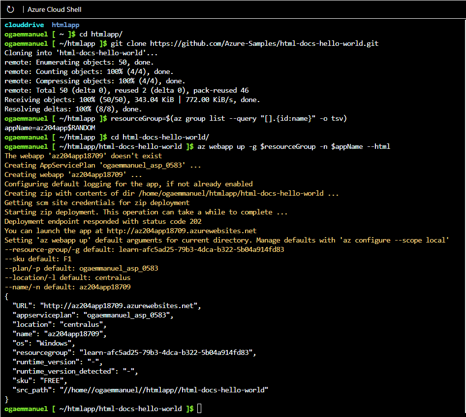
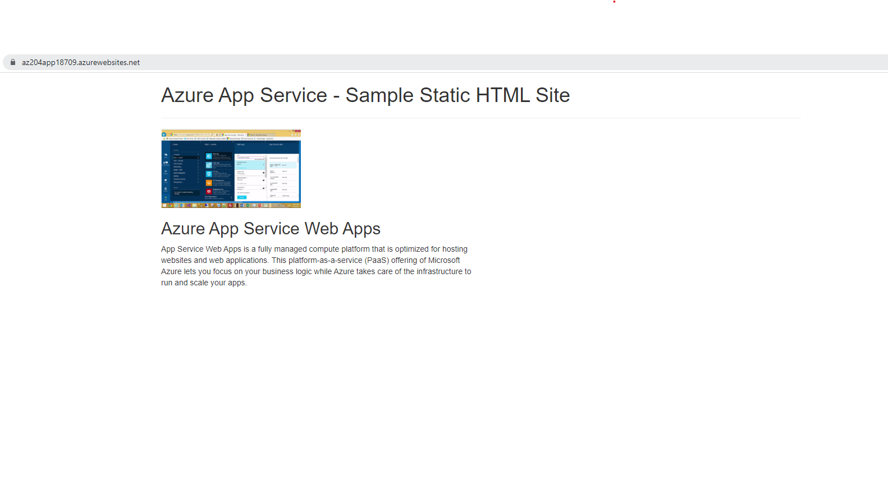
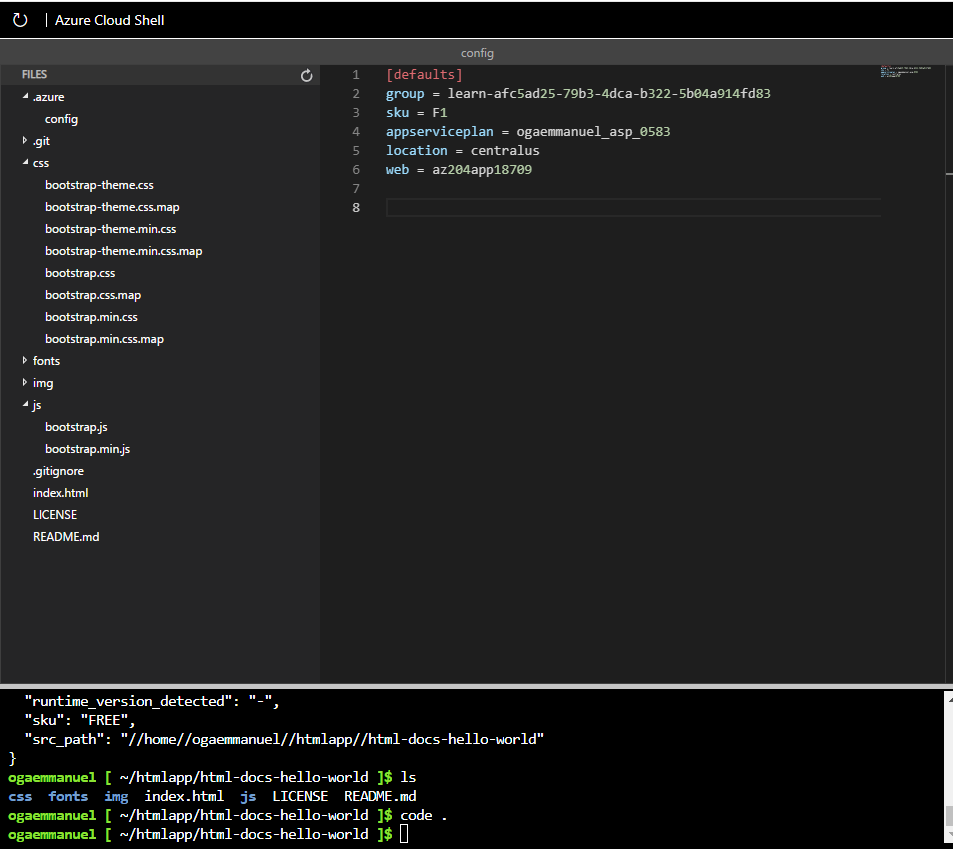

# Azure Developer Associate

## Module 1: Create Azure App Service Web Apps

_Objectives_

• Describe Azure App Service key components and value.
• Explain how Azure App Service manages authentication and authorization.
• Identify methods to control inbound and outbound traffic to your web app.
• Deploy an app to App Service using Azure CLI commands.

**Azure App Service:** Azure App service is a HTTP-based web service for deploying REST APIs, Mobile back end. It can be develop in .NET, .NET Core, PHP, Ruby, Nodejs, Python, or Java with ease on both Windows and Linux based environments. 

**Built-in auto Scale:** Azure App service provides the ability to scale up/down or in/out. You can scale the resources of the underlying machine hosting web app up/down. Scale in/out is the to increase or decrease the number of machine instances that are running your web app.

**Continuous Integration/Deployment:** Azure portal provides supports for CI/CD with Azure DevOps, GitHub, GitLab, Bitbucket,  FTP, or Local git on the development environment. All we do is to connect the web app with any of the sources above and App service can do the rest.

**App Service on Linux:** App service can also host web apps natively on Linux for supported application stack example Nodejs, PHP, Python, Ruby, Java, and .NET Core.

<br>

The languages, and their supported versions, are updated on a regular basis. You can retrieve the current list by using the following command in the Cloud Shell.
```
az webapp list-runtimes --linux
```
### App Service on Linux Limitations
- Apps service on Linux is not supported on shared pricing tier.
- Windows and Linux app cannot be mix in the same App service plan
- Windows and Linux app service cannot be mix in the same resource group
- The portal shows only features that currently work with Linux apps.

**Azure App Service Plan:** Azure app service plan defines a set of compute resources for web app to run. The App service plan defines
	1. Number of VM
	2. Region(West US, East US etc)
	3. Size of VM instance(Small, Medium, Large)
	4. Pricing tier (Free, Shared, Basic, Standard, Premium, PremiumV3, Isolated)

**Deploy to App Service:** App service supports both automated and manual deployment.
- **Automated Deployment:** Automated deployment or CI is the process of pushing out new features or bug fix in a fast and repetitive pattern with minimal impact on end users. The sources supported by Azure App service are Azure DevOps, GitHub, BitBucket
- **Manual Deployment:** Options to deploy code manually to Azure are Git, CLI, Zip Deploy, FTP/s

### [Explore Authentication and Authorization in App Service](https://docs.microsoft.com/en-us/training/modules/introduction-to-azure-app-service/5-authentication-authorization-app-service)

Azure App Service provides built-in authentication and authorization support, so you can sign in users and access data by writing minimal or no code in your Web App, APIs, Mobile Backend, and also Function App.

### Discover App Service networking features

By default, apps hosted in App service are accessible directly through the internet and can reach only internet hosted endpoints. But for many application, you need to control the inbound and the outbound network traffic. There are two main deployment types for Azure App service. The multitenant public service hosted app service plans in the Free, shared, premium, premiumV2, and premiumV3. There is also single-tenant Azure App Service Environment(ASE) hosts isolated SKU App service plan directlyin your Azure virtual network.

### Multi-tenant App Service networking features
Azure App service is a distributed system. The role that handles incoming HTTP or HTTPS request is called **Front ends_. The role that hosts the customer workload is called _workers_. 

|Inbound features	|Outbound features|
| _ | _|
|App-assigned address|	Hybrid Connections|
|Access restrictions|	Gateway-required virtual network integration|
|Service endpoints|	Virtual network integration|
|Private endpoints	|

**Use Case**

|Inbound use case	|Feature|
|-|-|
|Support IP-based SSL needs for your app|	App-assigned address|
|Support unshared dedicated inbound address for your app|	App-assigned address|
|Restrict access to your app from a set of well-defined addresses	|Access restrictions|

### Outbound addresses
If you want to see all the addresses that your app might use in a scale unit, there's a property called possibleOutboundAddresses that will list them.

### Find outbound IPs
To find the outbound IP addresses currently used by your app in the Azure portal, click Properties in your app's left-hand navigation.

<br>

You can find the same information by running the following command in the Cloud Shell. They are listed in the Additional Outbound IP Addresses field.
```
az webapp show \
    --resource-group <group_name> \
    --name <app_name> \ 
    --query outboundIpAddresses \
    --output tsv
```

To find all possible outbound IP addresses for your app, regardless of pricing tiers, run the following command in the Cloud Shell.
```
az webapp show \
    --resource-group <group_name> \ 
    --name <app_name> \ 
    --query possibleOutboundIpAddresses \
    --output tsv
```

## [Create a static HTML web app by using Azure Cloud Shell](https://docs.microsoft.com/en-us/training/modules/introduction-to-azure-app-service/7-create-html-web-app?source=learn)

In this exercise, you'll deploy a basic HTML+CSS site to Azure App Service by using the Azure CLI **az webapp up** command. You'll then update the code and redeploy it by using the same command.

<br>

The **az webapp up** command makes it easy to create and update web apps. When executed it performs the following actions:

- Create a default resource group if one isn't specified.
- Create a default app service plan.
- Create an app with the specified name.
- Zip deploy files from the current working directory to the web app.

### Download the sample app
1. Create project directory and navifate into it
```
mkdir htmlapp

cd htmlapp
```
2. Run git command to to clone the repository
```
git clone https://github.com/Azure-Samples/html-docs-hello-world.git
```
3. Set variables to hold the resource group and app names by running the command
```
resourceGroup=$(az group list --query "[].{id:name}" -o tsv)
appName=az204app$RANDOM
```

### Create the web app
1. Change to the directory that contains the sample code and run the az webapp up command.

```
cd html-docs-hello-world

az webapp up -g $resourceGroup -n $appName --html
```
2. The command will display the following information

```
{
"app_url": "https://<myAppName>.azurewebsites.net",
"location": "westeurope",
"name": "<app_name>",
"os": "Windows",
"resourcegroup": "<resource_group_name>",
"serverfarm": "appsvc_asp_Windows_westeurope",
"sku": "FREE",
"src_path": "/home/<username>/demoHTML/html-docs-hello-world ",
< JSON data removed for brevity. >
}
```
3. Open a new tab in your browser and navigate to the app URL (https://myAppName.azurewebsites.net) and verify the app is running 

### Update and redeploy the app

1. You can update the code
2. Use the command **ctrl-s** to save
3. Redeploy the app with the same **az webapp up** command
```
az webapp up -g $resourceGroup -n $appName --html
```




## [Configure web app settings](https://docs.microsoft.com/en-us/training/modules/configure-web-app-settings/1-introduction)
_Objective_
- Create application settings that are bound to deployment slots.
- Explain the options for installing SSL/TLS certificates for your app.
- Enable diagnostic logging for your app to aid in monitoring and debugging.
- Create virtual app to directory mappings.

#### [Configure application settings](https://docs.microsoft.com/en-us/training/modules/configure-web-app-settings/2-configure-application-settings)

#### [Configure general settings](https://docs.microsoft.com/en-us/training/modules/configure-web-app-settings/3-configure-general-settings)

#### [Configure path mappings](https://docs.microsoft.com/en-us/training/modules/configure-web-app-settings/4-configure-path-mappings)

#### [Enable diagnostic logging](https://docs.microsoft.com/en-us/training/modules/configure-web-app-settings/5-enable-diagnostic-logging)

#### [Configure security certificates](https://docs.microsoft.com/en-us/training/modules/configure-web-app-settings/6-configure-security-certificates)
#### [Manage app features](https://docs.microsoft.com/en-us/training/modules/configure-web-app-settings/7-manage-app-features)
It uses a technique called feature flags(also known as feature toggles, feature switch and so on) to dynamically administer a feature's lifecycle.