# AUTOMATE INFRASTRUCTURE WITH IAC USING TERRAFORM PART 1

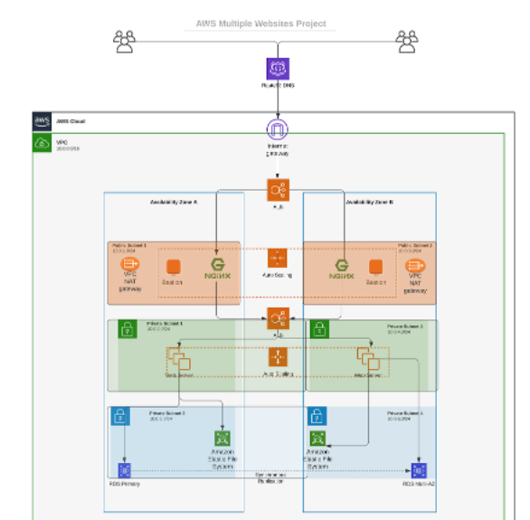

> ## Prerequisites before you begin writing Terraform code

- You must have completed Terraform course from the Learning dashboard
- Create an IAM user, name it _terraform_ (ensure that the user has only programatic access to your AWS account) and grant this user AdministratorAccess permissions.

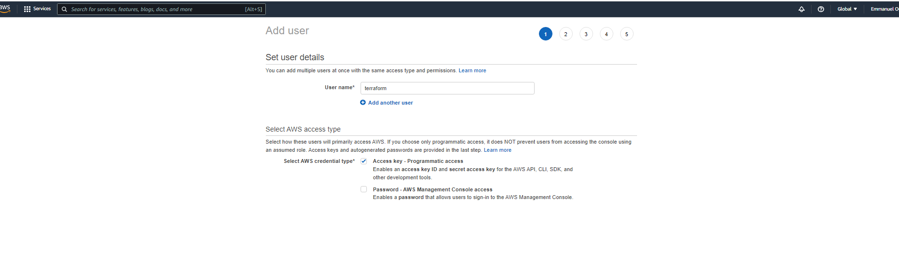

- Copy the secret access key and access key ID. Save them in a notepad temporarily.
- Configure programmatic access from your workstation to connect to AWS using the access keys copied above and a Python SDK (boto3). You must have [Python 3.6](https://www.python.org/downloads/) or higher on your workstation.

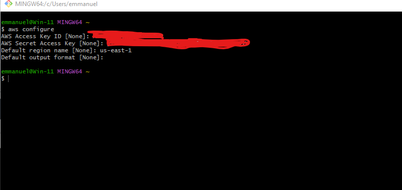

<br>

If you are on Windows, use gitbash, if you are on a Mac, you can simply open a terminal. Read [here](https://boto3.amazonaws.com/v1/documentation/api/latest/guide/quickstart.html) to configure the Python SDK properly.

<br>

For easier authentication configuration – use [AWS CLI](https://aws.amazon.com/cli/) with aws configure command.

- Create an [S3 bucket](https://docs.aws.amazon.com/AmazonS3/latest/userguide/Welcome.html) to store Terraform state file. You can name it something like **yourname-dev-terraform-bucket** (Note: S3 bucket names must be unique unique within a region partition, you can read about S3 bucken naming in this article). We will use this bucket from Project-17 onwards.
* On the AWS console, search for **Amazon S3**
* Click on **Create a bucket**
* Make sure the global region is selected
* Bucket name - **emmanuel-dev-terraform-bucket**
* Select the AWS region of your choice
* Bucket versioning - **Enable**
* Add tag 
  - key - **Name**
  - value - **emmanuel-dev-terraform-bucket**
* leave other settings as default and click **Create buket**

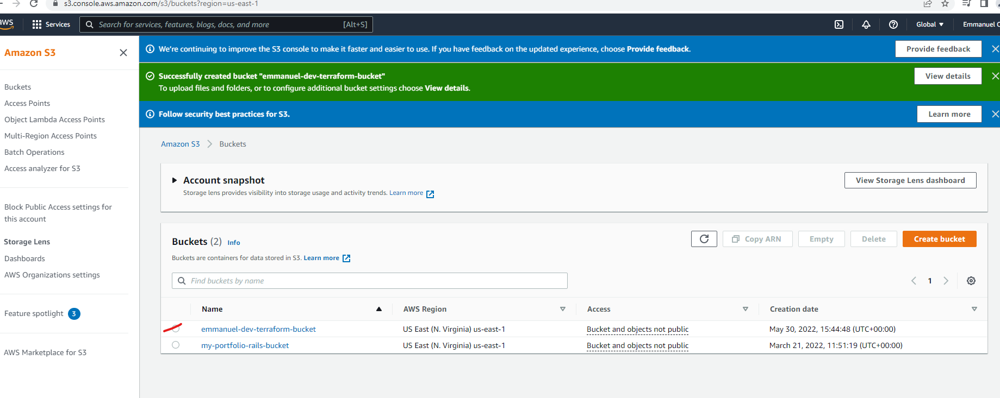

* Ensure your secret key and access key are configure
* Check that the bucket is configure without any issue
  - Open the terminal
  - Run the command

    ```
    aws s3 ls
    ```

  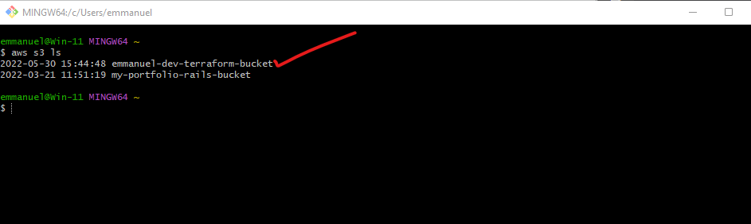
<br>

You shall see your previously created S3 bucket name – **yourname-dev-terraform-bucket**

> ## The secrets of writing quality Terraform code

The secret recipe of a successful Terraform projects consists of:

- Your understanding of your goal (desired AWS infrastructure end state)
- Your knowledge of the IaC technology used (in this case – Terraform)
- Your ability to effectively use up to date Terraform documentation [here](https://www.terraform.io/language)

<br>

As you go along completing this project, you will get familiar with [Terraform-specific terminology](https://www.terraform.io/docs/glossary), such as:
1. [Attribute](https://www.terraform.io/docs/glossary#attribute)
2. Resource
3. Interpolations
4. Argument
5. Providers
6. Provisioners
7. Input Variables
8. Output Variables
9. Module
10. Data Source
11. Local Values
12. Backend

<br>

Make sure you understand them and know when to use each of them.

<br>

Another concept you must know is [data type](https://en.wikipedia.org/wiki/Data_type). This is a general programing concept, it refers to how data represented in a programming language and defines how a compiler or interpreter can use the data. Common data types are:

- Integer
- Float
- String
- Boolean, etc.

_Best practices_

- - Ensure that every resource is tagged using multiple key-value pairs. You will see this in action as we go along.
Try to write reusable code, avoid hard coding values wherever possible. (For learning purpose, we will start by hard coding, but gradually refactor our work to follow best practices).

> ## VPC | SUBNETS | SECURITY GROUPS

_Let us create a directory structure_

Open your Visual Studio Code and:


<br>

**Note** - Install some terraform extensions
- Terraform configurtion language support
- HashiCorp Terraform

- Create a folder called **PBL**
- Create a file in the folder, name it **main.tf**

 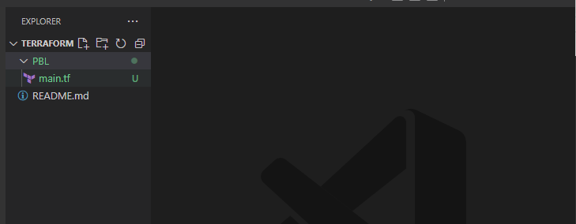

#### Provider and VPC resource section
_Set up Terraform CLI as per this [instruction](https://learn.hashicorp.com/tutorials/terraform/install-cli)._

- Add **AWS** as a provider, and a resource to create a VPC in the **main.tf** file.
- Provider block informs Terraform that we intend to build infrastructure within AWS.
- Resource block will create a VPC.

<br>

**Note** - The provider region must be the same as the **bucket** region created earlier, and you can change the configuration below to create your VPC in other region that is closer to you. The same applies to all configuration snippets that will follow.

```
provider "aws" {
  region = "eu-central-1"
}

# Create VPC
resource "aws_vpc" "main" {
  cidr_block                     = "172.16.0.0/16"
  enable_dns_support             = "true"
  enable_dns_hostnames           = "true"
  enable_classiclink             = "false"
  enable_classiclink_dns_support = "false"
}
```

 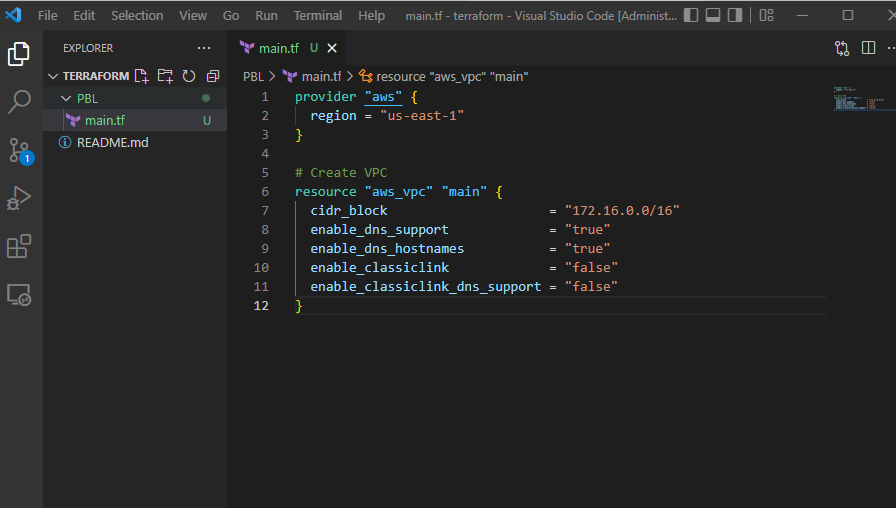

- The next thing we need to do, is to download necessary plugins for Terraform to work. These plugins are used by **providers** and **provisioners**. At this stage, we only have **provider** in our **main.tf** file. So, Terraform will just download plugin for AWS provider.
- Lets accomplish this with **terraform init** command as seen in the below demonstration.
```
# Install tree
sudo apt install tree
# Install pugins
terraform init
```

 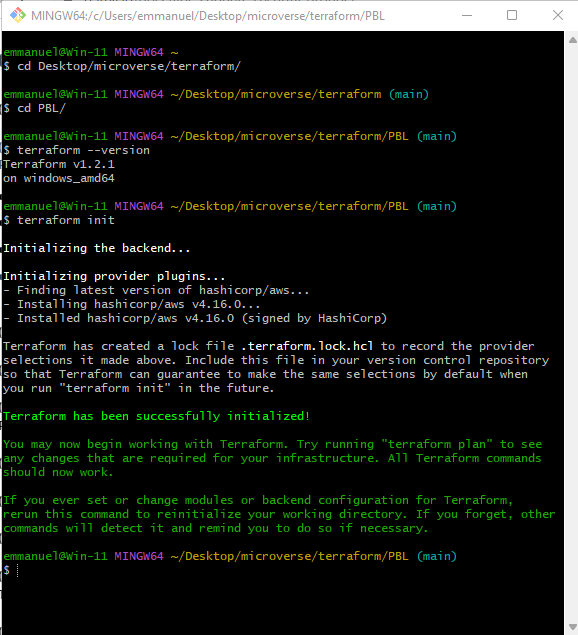

_Observations:_

Notice that a new directory has been created: **.terraform**\.... This is where Terraform keeps plugins. Generally, it is safe to delete this folder. It just means that you must execute **terraform init** again, to download them.

<br>

Moving on, let us create the only resource we just defined. **aws_vpc**. But before we do that, we should check to see what terraform intends to create before we tell it to go ahead and create it.

- Run 
```
terraform plan
```
 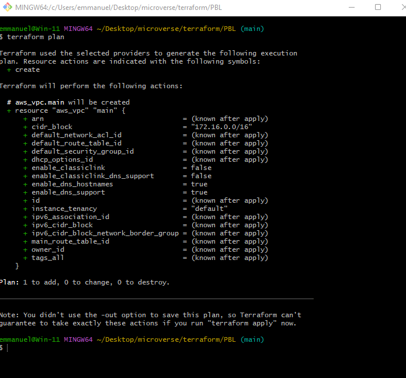

Then, if you are happy with changes planned, execute 
```
terraform apply
```

 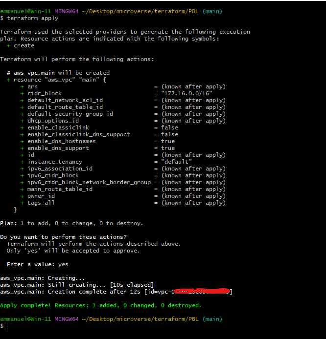

_Observations:_

<br>

1. A new file is created **terraform.tfstate** This is how Terraform keeps itself up to date with the exact state of the infrastructure. It reads this file to know what already exists, what should be added, or destroyed based on the entire terraform code that is being developed.
2. If you also observed closely, you would realise that another file gets created during planning and apply. But this file gets deleted immediately. **terraform.tfstate.lock.info** This is what Terraform uses to track, who is running its code against the infrastructure at any point in time. This is very important for teams working on the same Terraform repository at the same time. The lock prevents a user from executing Terraform configuration against the same infrastructure when another user is doing the same – it allows to avoid duplicates and conflicts.

<br>

Its content is usually like this. (We will discuss more about this later)

```
{
    "ID":"e5e5ad0e-9cc5-7af1-3547-77bb3ee0958b",
    "Operation":"OperationTypePlan","Info":"",
    "Who":"dare@Dare","Version":"0.13.4",
    "Created":"2020-10-28T19:19:28.261312Z",
    "Path":"terraform.tfstate"
}
```
It is a _json_ format file that stores information about a user: user’s _ID_, what operation he/she is doing, timestamp, and location of the _state_ file.

> #### Subnets resource section
According to our architectural design, we require 6 subnets:

1. 2 public
2. 2 private for webservers
3. 2 private for data layer

Let us create the first 2 public subnets.

<br>

Add below configuration to the main.tf file:

```
# Create public subnets1
    resource "aws_subnet" "public1" {
    vpc_id                     = aws_vpc.main.id
    cidr_block                 = "172.16.0.0/24"
    map_public_ip_on_launch    = true
    availability_zone          = "eu-central-1a"

}

# Create public subnet2
    resource "aws_subnet" "public2" {
    vpc_id                     = aws_vpc.main.id
    cidr_block                 = "172.16.1.0/24"
    map_public_ip_on_launch    = true
    availability_zone          = "eu-central-1b"
}
```

- We are creating 2 subnets, therefore declaring 2 resource blocks – one for each of the subnets.
- We are using the **vpc_id** argument to interpolate the value of the VPC id by setting it to aws_vpc.main.id. This way, Terraform knows inside which VPC to create the subnet.

<br>

Run 
```

# Format your code

terraform fmt

# Check if the configuration is valid
terraform validate

terraform plan 

terraform apply

```

 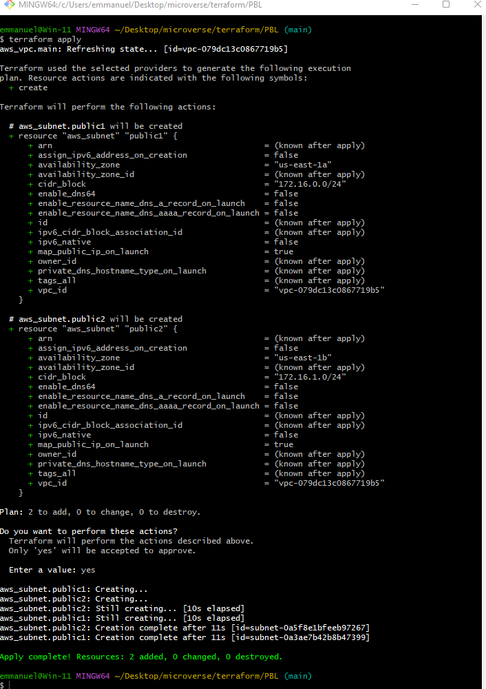

 <br>

 Check the AWS console and confirm the VPC is created

  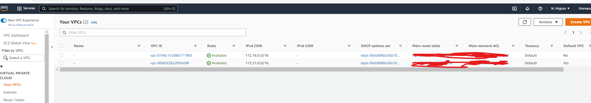

_Observations:_

- Hard coded values: Remember our best practice hint from the beginning? Both the **availability_zone** and **cidr_block** arguments are hard coded. We should always endeavour to make our work dynamic.
- Multiple Resource Blocks: Notice that we have declared multiple resource blocks for each subnet in the code. This is bad coding practice. We need to create a single resource block that can dynamically create resources without specifying multiple blocks. Imagine if we wanted to create 10 subnets, our code would look very clumsy. So, we need to optimize this by introducing a **count** argument.

<br>

Now let us improve our code by refactoring it.

<br>

First, destroy the current infrastructure. Since we are still in development, this is totally fine. Otherwise, DO NOT DESTROY an infrastructure that has been deployed to production.

<br>

To destroy whatever has been created run _terraform destroy command_, and type _yes_ after evaluating the plan.

  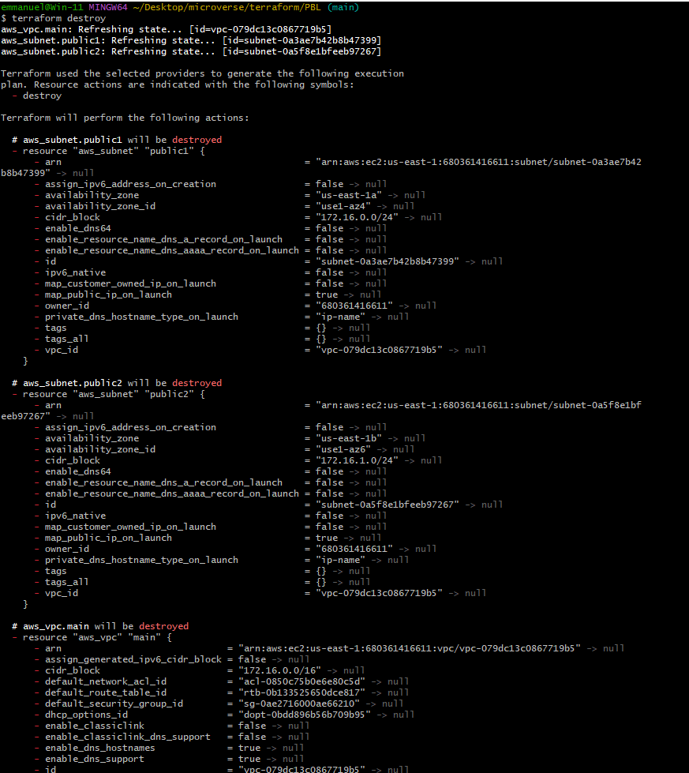

> #### FIXING THE PROBLEMS BY CODE REFACTORING

##### Fixing Hard Coded Values

We will introduce variables, and remove hard coding.

_Starting with the provider block, declare a variable named **region**, give it a default value, and update the provider section by referring to the declared variable._

```
    variable "region" {
        default = "eu-central-1"
    }

    provider "aws" {
        region = var.region
    }
```
_Do the same to **cidr** value in the **vpc** block, and all the other arguments._

```
variable "region" {
    default = "eu-central-1"
}

variable "vpc_cidr" {
    default = "172.16.0.0/16"
}

variable "enable_dns_support" {
    default = "true"
}

variable "enable_dns_hostnames" {
    default ="true" 
}

variable "enable_classiclink" {
    default = "false"
}

variable "enable_classiclink_dns_support" {
    default = "false"
}

provider "aws" {
region = var.region
}

# Create VPC
resource "aws_vpc" "main" {
cidr_block                     = var.vpc_cidr
enable_dns_support             = var.enable_dns_support 
enable_dns_hostnames           = var.enable_dns_support
enable_classiclink             = var.enable_classiclink
enable_classiclink_dns_support = var.enable_classiclink
}
```

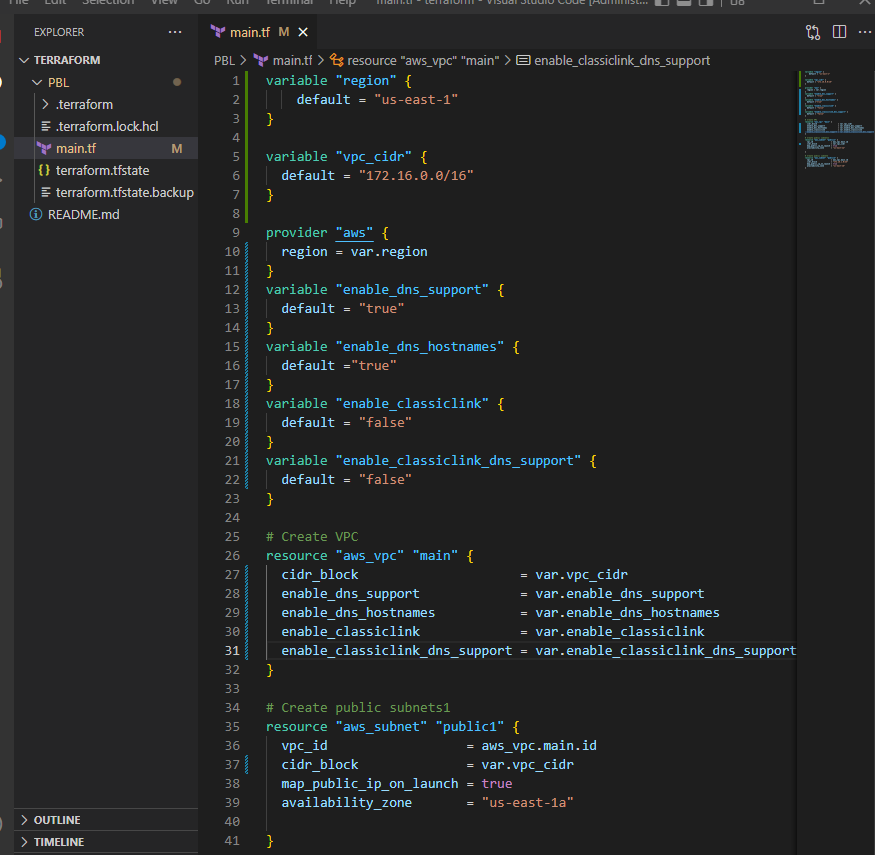

##### Fixing multiple resource blocks

This is where things become a little tricky. It’s not complex, we are just going to introduce some interesting concepts. Loops & Data sources

<br>

Terraform has a functionality that allows us to pull data which exposes information to us. For example, every region has Availability Zones (AZ). Different regions have from 2 to 4 Availability Zones. With over 20 geographic regions and over 70 AZs served by AWS, it is impossible to keep up with the latest information by hard coding the names of AZs. Hence, we will explore the use of Terraform’s Data Sources to fetch information outside of Terraform. In this case, from **AWS**

<br>

_Let us fetch Availability zones from AWS, and replace the hard coded value in the subnet’s **availability_zone** section._

```
# Get list of availability zones
data "aws_availability_zones" "available" {
state = "available"
}
```

To make use of this new **data** resource, we will need to introduce a **count** argument in the subnet block: Something like this.

```
# Create public subnet1
resource "aws_subnet" "public" { 
    count                   = 2
    vpc_id                  = aws_vpc.main.id
    cidr_block              = "172.16.1.0/24"
    map_public_ip_on_launch = true
    availability_zone       = data.aws_availability_zones.available.names[count.index]

}
```

Let us quickly understand what is going on here.

1. The _count_ tells us that we need 2 subnets. Therefore, Terraform will invoke a loop to create 2 subnets.
2. The _data_ resource will return a list object that contains a list of AZs. Internally, Terraform will receive the data like this

```
["eu-central-1a", "eu-central-1b"]
```

Each of them is an index, the first one is index 0, while the other is index 1. If the data returned had more than 2 records, then the index numbers would continue to increment.

<br>

Therefore, each time Terraform goes into a loop to create a subnet, it must be created in the retrieved AZ from the list. Each loop will need the index number to determine what AZ the subnet will be created. That is why we have **data.aws_availability_zones.available.names[count.index]** as the value for **availability_zone**. When the first loop runs, the first index will be **0**, therefore the AZ will be **eu-central-1a**. The pattern will repeat for the second loop.

<br>

But we still have a problem. If we run Terraform with this configuration, it may succeed for the first time, but by the time it goes into the second loop, it will fail because we still have **cidr_block** hard coded. The same cidr_block cannot be created twice within the same VPC. So, we have a little more work to do.

<br>

**Let’s make** _cidr_block_ **dynamic**.
We will introduce a function cidrsubnet() to make this happen. It accepts 3 parameters. Let us use it first by updating the configuration, then we will explore its internals.

<br>

We will introduce a function **cidrsubnet()** to make this happen. It accepts 3 parameters. Let us use it first by updating the configuration, then we will explore its internals.

```  
# Create public subnet1
resource "aws_subnet" "public" { 
    count                   = 2
    vpc_id                  = aws_vpc.main.id
    cidr_block              = cidrsubnet(var.vpc_cidr, 4 , count.index)
    map_public_ip_on_launch = true
    availability_zone       = data.aws_availability_zones.available.names[count.index]

}
```
A closer look at **cidrsubnet** – this function works like an algorithm to dynamically create a subnet CIDR per AZ. Regardless of the number of subnets created, it takes care of the cidr value per subnet.

<br>

Its parameters are **cidrsubnet(prefix, newbits, netnum)**

* The **prefix** parameter must be given in CIDR notation, same as for VPC.
* The **newbits** parameter is the number of additional bits with which to extend the prefix. For example, if given a prefix ending with /16 and a newbits value of 4, the resulting subnet address will have length /20
* The **netnum** parameter is a whole number that can be represented as a binary integer with no more than **newbits** binary digits, which will be used to populate the additional bits added to the prefix

<br>

You can experiment how this works by entering the **terraform console** and keep changing the figures to see the output.

- On the terminal, run **terraform console**
- type **cidrsubnet("172.16.0.0/16", 4, 0)**
- Hit enter
- See the output
- Keep change the numbers and see what happens.
- To get out of the console, type **exit**

 

**The final problem to solve is removing hard** _coded_ **count value**.

If we cannot hard code a value we want, then we will need a way to dynamically provide the value based on some input. Since the data resource returns all the AZs within a region, it makes sense to count the number of AZs returned and pass that number to the count argument.

<br>

To do this, we can introuduce **length()** function, which basically determines the length of a given list, map, or string.

<br>

Since **data.aws_availability_zones.available.names** returns a list like **["eu-central-1a", "eu-central-1b", "eu-central-1c"]** we can pass it into a **lenght** function and get number of the AZs.

<br>

length(["eu-central-1a", "eu-central-1b", "eu-central-1c"])

<br>

Open up **terraform console** and try it

<br>

Now we can simply update the public subnet block like this

```
# Create public subnet1
resource "aws_subnet" "public" { 
    count                   = length(data.aws_availability_zones.available.names)
    vpc_id                  = aws_vpc.main.id
    cidr_block              = cidrsubnet(var.vpc_cidr, 4 , count.index)
    map_public_ip_on_launch = true
    availability_zone       = data.aws_availability_zones.available.names[count.index]

}
```

_Observations:_

- What we have now, is sufficient to create the subnet resource required. But if you observe, it is not satisfying our business requirement of just 2 subnets. The length function will return number 3 to the count argument, but what we actually need is 2.

<br>

Now, let us fix this.

- Declare a variable to store the desired number of public subnets, and set the default value

```
variable "preferred_number_of_public_subnets" {
  default = 2
}

```

```
# Create public subnets
resource "aws_subnet" "public" {
  count  = var.preferred_number_of_public_subnets == null ? length(data.aws_availability_zones.available.names) : var.preferred_number_of_public_subnets   
  vpc_id = aws_vpc.main.id
  cidr_block              = cidrsubnet(var.vpc_cidr, 4 , count.index)
  map_public_ip_on_launch = true
  availability_zone       = data.aws_availability_zones.available.names[count.index]

}
```

Now lets break it down:

- The first part **var.preferred_number_of_public_subnets == null** checks if the value of the variable is set to **null** or has some value defined.
- The second part **?** and **length(data.aws_availability_zones.available.names)** means, if the first part is true, then use this. In other words, if preferred number of public subnets is **null** (Or not known) then set the value to the data returned by lenght function.
- The third part **:** and **var.preferred_number_of_public_subnets** means, if the first condition is false, i.e preferred number of public subnets is **not null** then set the value to whatever is definied in **var.preferred_number_of_public_subnets**

<br>

Now the entire configuration should now look like this

```
# Get list of availability zones
data "aws_availability_zones" "available" {
state = "available"
}

variable "region" {
      default = "eu-central-1"
}

variable "vpc_cidr" {
    default = "172.16.0.0/16"
}

variable "enable_dns_support" {
    default = "true"
}

variable "enable_dns_hostnames" {
    default ="true" 
}

variable "enable_classiclink" {
    default = "false"
}

variable "enable_classiclink_dns_support" {
    default = "false"
}

  variable "preferred_number_of_public_subnets" {
      default = 2
}

provider "aws" {
  region = var.region
}

# Create VPC
resource "aws_vpc" "main" {
  cidr_block                     = var.vpc_cidr
  enable_dns_support             = var.enable_dns_support 
  enable_dns_hostnames           = var.enable_dns_support
  enable_classiclink             = var.enable_classiclink
  enable_classiclink_dns_support = var.enable_classiclink

}

# Create public subnets
resource "aws_subnet" "public" {
  count  = var.preferred_number_of_public_subnets == null ? length(data.aws_availability_zones.available.names) : var.preferred_number_of_public_subnets   
  vpc_id = aws_vpc.main.id
  cidr_block              = cidrsubnet(var.vpc_cidr, 4 , count.index)
  map_public_ip_on_launch = true
  availability_zone       = data.aws_availability_zones.available.names[count.index]

}
```

**Note**: You should try changing the value of **preferred_number_of_public_subnets** variable to **null** and notice how many subnets get created.

> #### INTRODUCING VARIABLES.TF &AMP; TERRAFORM.TFVARS

Instead of havng a long lisf of variables in main.tf file, we can actually make our code a lot more readable and better structured by moving out some parts of the configuration content to other files.

- We will put all variable declarations in a separate file
- And provide non default values to each of them

1. Create a new file and name it **variables.tf**
2. Copy all the variable declarations into the new file.
3. Create another file, name it **terraform.tfvars**
4. Set values for each of the variables.
_Maint.tf_

```
# Get list of availability zones
data "aws_availability_zones" "available" {
state = "available"
}

provider "aws" {
  region = var.region
}

# Create VPC
resource "aws_vpc" "main" {
  cidr_block                     = var.vpc_cidr
  enable_dns_support             = var.enable_dns_support 
  enable_dns_hostnames           = var.enable_dns_support
  enable_classiclink             = var.enable_classiclink
  enable_classiclink_dns_support = var.enable_classiclink

}

# Create public subnets
resource "aws_subnet" "public" {
  count  = var.preferred_number_of_public_subnets == null ? length(data.aws_availability_zones.available.names) : var.preferred_number_of_public_subnets   
  vpc_id = aws_vpc.main.id
  cidr_block              = cidrsubnet(var.vpc_cidr, 4 , count.index)
  map_public_ip_on_launch = true
  availability_zone       = data.aws_availability_zones.available.names[count.index]
}
```

_variables.tf_

```
variable "region" {
      default = "eu-central-1"
}

variable "vpc_cidr" {
    default = "172.16.0.0/16"
}

variable "enable_dns_support" {
    default = "true"
}

variable "enable_dns_hostnames" {
    default ="true" 
}

variable "enable_classiclink" {
    default = "false"
}

variable "enable_classiclink_dns_support" {
    default = "false"
}

  variable "preferred_number_of_public_subnets" {
      default = null
}
```
_terraform.tfvars_

```
region = "eu-central-1"

vpc_cidr = "172.16.0.0/16" 

enable_dns_support = "true" 

enable_dns_hostnames = "true"  

enable_classiclink = "false" 

enable_classiclink_dns_support = "false" 

preferred_number_of_public_subnets = 2
```

You should also have this file structure in the PBL folder.

```
└── PBL
    ├── main.tf
    ├── terraform.tfstate
    ├── terraform.tfstate.backup
    ├── terraform.tfvars
    └── variables.tf
```

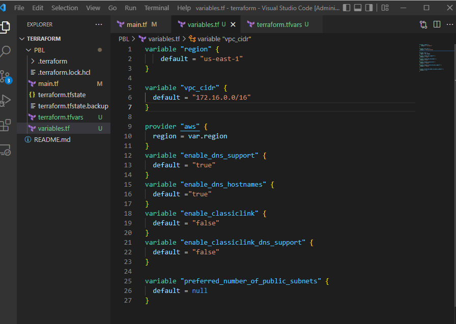

Run _terraform plan_ and ensure everything works


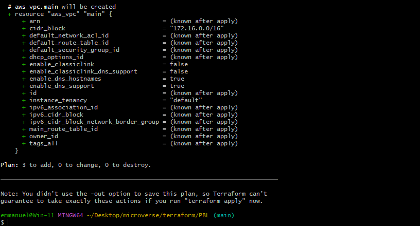
