# AUTOMATE INFRASTRUCTURE WITH IAC USING TERRAFORM. PART 3 – REFACTORING

Introducing Backend on [S3](https://docs.aws.amazon.com/AmazonS3/latest/userguide/Welcome.html)

<br>

Each Terraform configuration can specify a backend, which defines where and how operations are performed, where state snapshots are stored, etc.
Take a peek into what the states file looks like. It is basically where terraform stores all the state of the infrastructure in **json** format.

<br>

So far, we have been using the default backend, which is the **local backend** – it requires no configuration, and the states file is stored locally. This mode can be suitable for learning purposes, but it is not a robust solution, so it is better to store it in some more reliable and durable storage.

<br>

The second problem with storing this file locally is that, in a team of multiple DevOps engineers, other engineers will not have access to a state file stored locally on your computer.

<br>

To solve this, we will need to configure a backend where the state file can be accessed remotely other DevOps team members. There are plenty of different standard backends supported by Terraform that you can choose from. Since we are already using AWS – we can choose an [S3 bucket as a backend](https://www.terraform.io/language/settings/backends/s3).

<br>

Another useful option that is supported by S3 backend is [State Locking](https://www.terraform.io/language/state/locking) – it is used to lock your state for all operations that could write state. This prevents others from acquiring the lock and potentially corrupting your state. State Locking feature for S3 backend is optional and requires another AWS service – [DynamoDB](https://aws.amazon.com/dynamodb/).

_Here is our plan to Re-initialize Terraform to use S3 backend:_

1. Add S3 and DynamoDB resource blocks before deleting the local state file
2. Update terraform block to introduce backend and locking
3. Re-initialize terraform
4. Delete the local **tfstate** file and check the one in S3 bucket
5. Add **outputs**
6. **terraform apply**

- Add the following code to the **maint.tf** in the root directory

```
# Note: The bucket name may not work for you since buckets are unique globally in AWS, so you must give it a unique name.
resource "aws_s3_bucket" "terraform_state" {
  bucket = "dev-terraform-bucket"
  # Enable versioning so we can see the full revision history of our state files
  versioning {
    enabled = true
  }
  # Enable server-side encryption by default
  server_side_encryption_configuration {
    rule {
      apply_server_side_encryption_by_default {
        sse_algorithm = "AES256"
      }
    }
  }
}

resource "aws_dynamodb_table" "terraform_locks" {
  name         = "terraform-locks"
  billing_mode = "PAY_PER_REQUEST"
  hash_key     = "LockID"
  attribute {
    name = "LockID"
    type = "S"
  }
}
```

> #### REFACTOR YOUR PROJECT USING MODULES

_**QUICK TASK FOR YOU**: Break down your Terraform codes to have all resources in their respective modules. Combine resources of a similar type into directories within a ‘modules’ directory, for example, like this:_

```
- modules
  - ALB: For Apllication Load balancer and similar resources
  - EFS: For Elastic file system resources
  - RDS: For Databases resources
  - Autoscaling: For Autosacling and launch template resources
  - compute: For EC2 and rlated resources
  - VPC: For VPC and netowrking resources such as subnets, roles, e.t.c.
  - security: for creating security group resources
  ```

  _Each module shall contain following files:_

  ```
  - main.tf (or %resource_name%.tf) file(s) with resources blocks
- outputs.tf (optional, if you need to refer outputs from any of these resources in your root module)
- variables.tf (as we learned before - it is a good practice not to hard code the values and use variables)
```

It is also recommended to configure **providers** and **backends** sections in separate files but should be placed in the root module.

<br>

After you have given it a try, you can check out this repository for guidiance and erors fixing.

**IMPORTANT**: In the configuration sample from the repository, you can observe two examples of referencing the module:

<br>

Import module as a **source** and have access to its variables via **var** keyword:

```
module "VPC" {
  source = "./modules/VPC"
  region = var.region
  ...
```

> #### COMPLETE THE TERRAFORM CONFIGURATION

##### Create a new folder _modules_

_New folder structure_

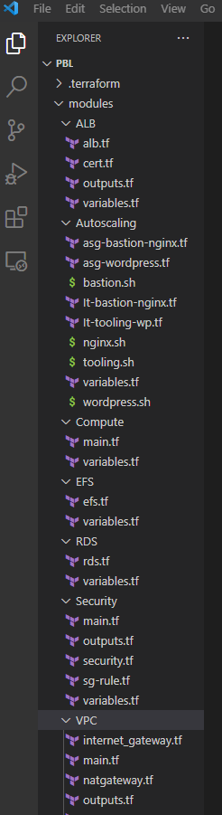
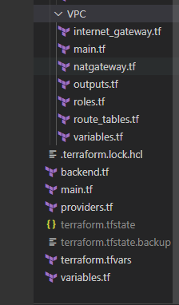

_Details of restucrured code and folder, see the repo for [project18](https://github.com/Emmy-github-webdev/pbl-terraform/tree/prj-18)_

###### Run the following commands to create the resources

```
# Check the validity of the code should there be any error
terraform validate

# Check terraform plan
terraform plan

# create tha plans
terraform apply --auto-approve
```

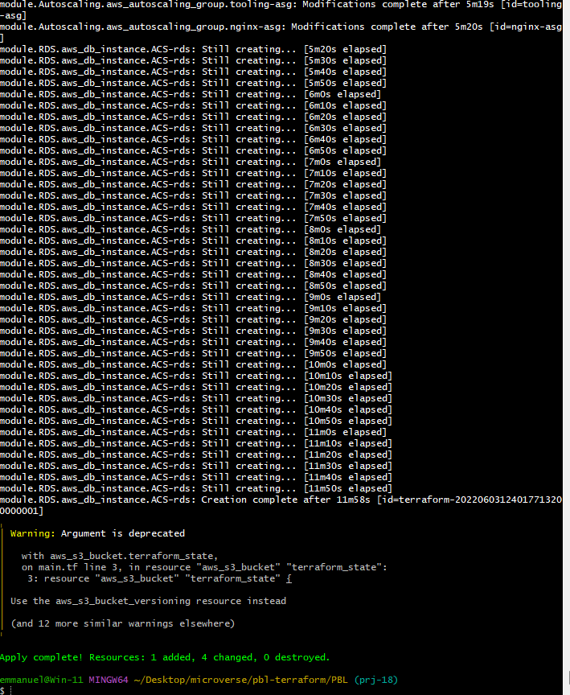

###### See the resources created below

_EC2 Instance_

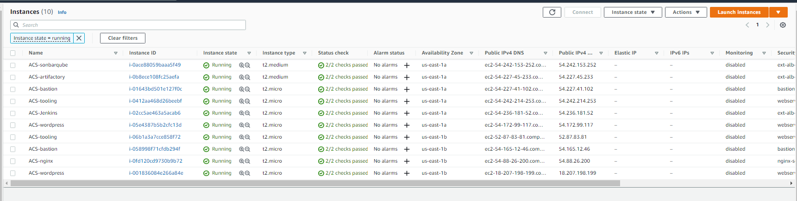

_Security group_

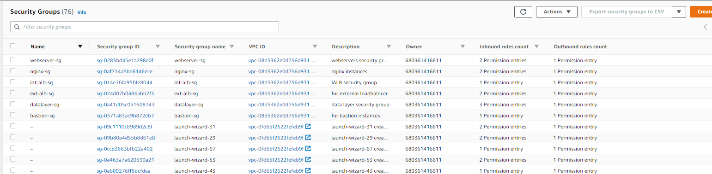

_Elastic IP_

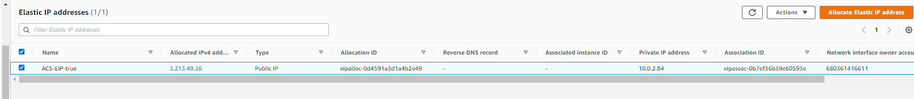

_Load balancer_

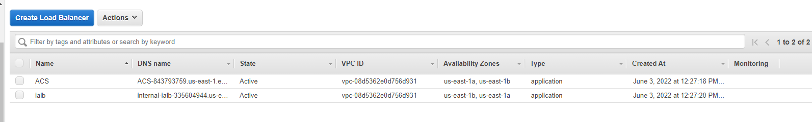

_Target group_

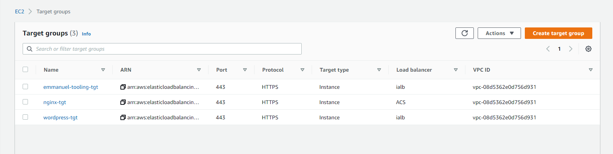

_Auto scaling_

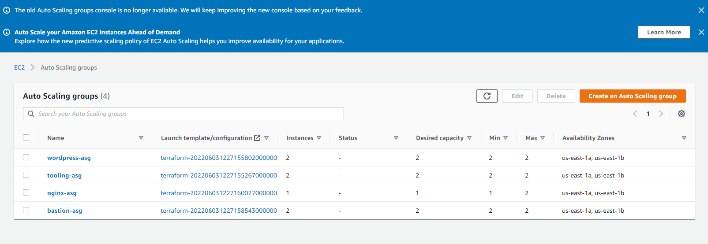

_Tags_


_DynamoDB_

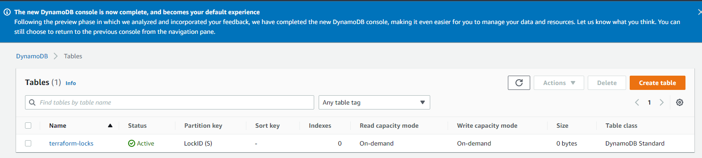

> ##### Configure S3 Backend

_Create a file and name it **backend.tf**. Add the below code._

```
terraform {
  backend "s3" {
    bucket         = "dev-terraform-bucket"
    key            = "global/s3/terraform.tfstate"
    region         = "eu-central-1"
    dynamodb_table = "terraform-locks"
    encrypt        = true
  }
}
```

```
terraform init
terraform plan

```

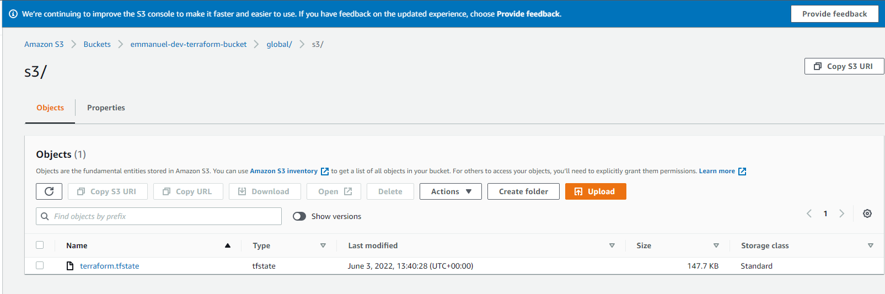

> ##### Destroy the resources

- Go to the backend.tf and comment out the code
- Run the command

```
terraform init -migrate-state

terraform destroy --auto-approve
```
