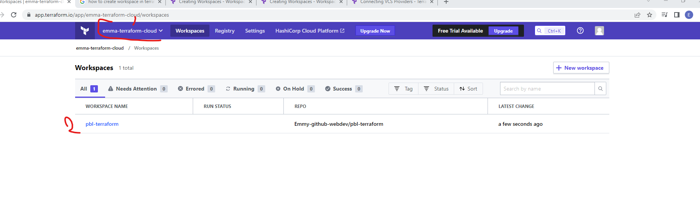
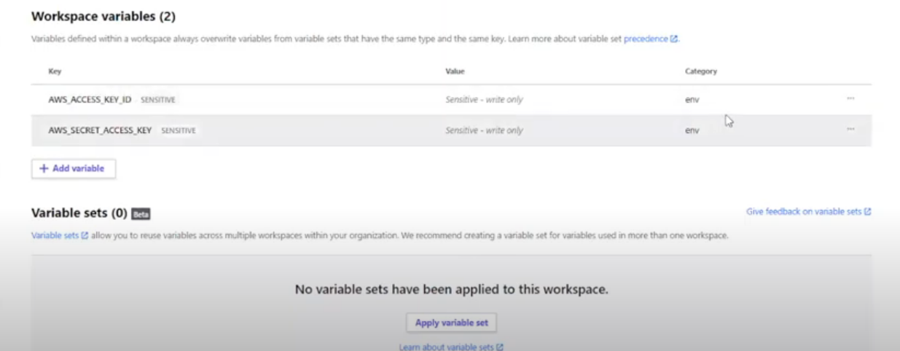
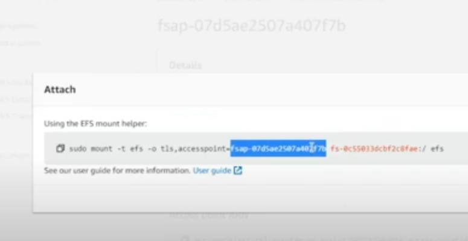
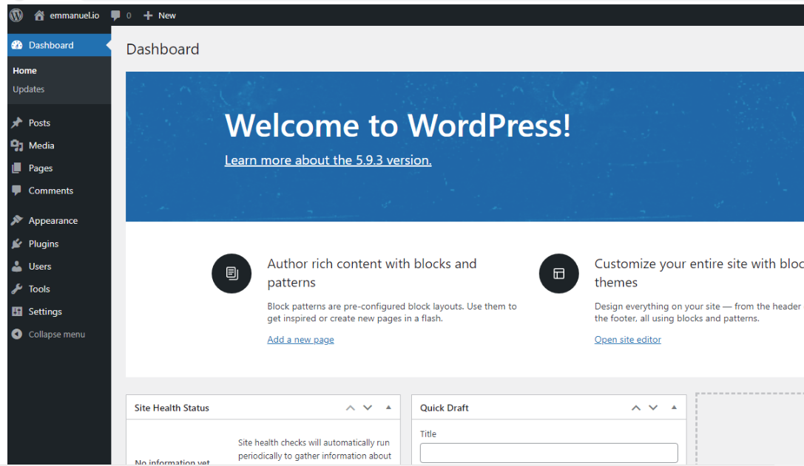

# Automate Infrastructure With IaC using Terraform. Part 4 – Terraform Cloud

_What Terraform Cloud is and why use it_

[Terraform Cloud](https://cloud.hashicorp.com/products/terraform) is a managed service that provides you with Terraform CLI to provision infrastructure, either on demand or in response to various events.

> #### Migrate your .tf codes to Terraform Cloud
Le us explore how we can migrate our codes to Terraform Cloud and manage our AWS infrastructure from there:

1. Create a Terraform Cloud account. Follow [this link](https://app.terraform.io/signup/account), create a new account, verify your email and you are ready to start
<br>

Most of the features are free, but if you want to explore the difference between free and paid plans – you can check it on [this page](https://www.hashicorp.com/products/terraform/pricing)

2. Create an organization - Select "Start from scratch", choose a name for your organization and create it.

3. Configure a workspace - Before we begin to configure our workspace – watch [this part of the video](https://www.youtube.com/watch?v=m3PlM4erixY&t=287s) to better understand the difference between _version control workflow_, _CLI-driven workflow_ and _API-driven workflow_ and other configurations that we are going to implement.

<br>

We will use _version control workflow_ as the most common and recommended way to run Terraform commands triggered from our git repository.

<br>

Create a new repository in your GitHub and call it _terraform-cloud_, push your Terraform codes developed in the previous projects to the repository.

<br>

Choose _version control workflow_ and you will be promped to connect your GitHub account to your workspace – follow the prompt and add your newly created repository to the workspace.

<br>

Move on to "Configure settings", provide a description for your workspace and leave all the rest settings default, click "Create workspace".



4. Configure variables

<br>

Terraform Cloud supports two types of variables: environment variables and Terraform variables. Either type can be marked as sensitive, which prevents them from being displayed in the Terraform Cloud web UI and makes them write-only.

<br>

Set two environment variables: **AWS_ACCESS_KEY_ID** and **AWS_SECRET_ACCESS_KEY**, set the values that you used in [Project 16](https://readthedocs.com/cas/login?service=https%3A%2F%2Fexpert-pbl.darey.io%2Fen%2Flatest%2Fproject16.html%3Fnext%3Dhttps%253A%252F%252Fexpert-pbl.darey.io%252Fen%252Flatest%252Fproject16.html). These credentials will be used to provision your AWS infrastructure by Terraform Cloud.



<br>

After you have set these 2 environment variables – yout Terraform Cloud is all set to apply the codes from GitHub and create all necessary AWS resources.

<br>

5. Now it is time to run our Terrafrom scripts, but in our previous project which was [project 18](https://www.darey.io/docs/automate-infrastructure-with-iac-using-terraform-part-3-refactoring/), we talked about using Packer to build our images, and Ansible to configure the infrastructure, so for that we are going to make few changes to our our existing [respository](https://github.com/darey-devops/PBL-project-18) from Project 18.

<br>

The files that would be Addedd is;

<br>

- AMI: for building packer images
- Ansible: for Ansible scripts to configure the infrastucture

<br>

- [packer](https://learn.hashicorp.com/tutorials/packer/get-started-install-cli)
- [Ansible](https://docs.ansible.com/ansible/latest/installation_guide/intro_installation.html)

Before you proceed ensure you have the following tools installed on your local machine;

<br>

Repository use for this project is [pbl-terraform](https://github.com/Emmy-github-webdev/pbl-terraform/tree/prj-19/PBL)

```
# format the packer code
packer fmt

# Initialize packer if all the packer codes are written in one filw

packer init

# Connect your IAM account to the computer

Aws configure
```

### Build images using packer

##### Build AMI for Bastion


```
pbl/ami> packer build bastion.pkr.hcl

```

##### Build AMI for Nginx


```
pbl/ami> packer build nginx.pkr.hcl

```

##### Build AMI for Ubuntu


```
pbl/ami> packer build ubuntu.pkr.hcl

```

##### Build AMI for Web


```
pbl/ami> packer build web.pkr.hcl

```

### confirm the AMIs in the console

### update terrafrom script with new ami IDs generated from packer build
- Go to the AMI created in the AWS console
- Select the bastion AMI
- In the detal page, copy the **AMI ID**
- Go back to the visual studio code, in the **terraform => terraform.auto.tfvars => ami-bastion => Add the AMI-ID**

_Do the same for **Nginx**, **ubuntu**, **web** AMI_

### run terraform script

- Push the changes to GitHub
- Merge with the main branch
- Check the plan in Terraform cloud
- If you are okay, run the apply in the terraform cloud to create the resources

### update ansible script with values from teraform output
- [Install and Enable OpenSSH on Ubuntu 20.04](https://linuxhint.com/how-to-install-and-enable-openssh-on-ubuntu/)
- Go to the AWS console
- Copy the public address of the **Bastion** instance
- Connect to Bastion via Visual studio code
- [Install aws command](https://www.fosstechnix.com/how-to-install-aws-cli-on-linux/)
- Clone [project 19](https://github.com/Emmy-github-webdev/pbl-terraform/tree/prj-19) repository
- Run **AWS configure** on the Bastion instance
- Confirm Bastion can connect to AWS console

```
aws s3 ls
```

- Change directory to Ansible directory and run, and confirm the ansible can pull the Ip addrtesses for playbook to run

```
ansible-inventory -i inventory/aws_ec2.yml --graph
```

#### RDS endpoints for wordpress and tooling
- Go to the AWS Console -> RDS -> Connectivity and security
- Copy the **Endpoint**
- Go back to Vs code -> Ansible/roles/tooling/tasks/setup-db.yml. Update the **regexp: '^mysql.tooling.svc.cluster.local', line: "terraform-2021111611530321750000000c.cdqpbjkethv0.us-east-1.rds.amazonaws.com"** in the _name: Input tooling credentials_ and _name: create database_

```
- name: Input tooling credentials
  ansible.builtin.replace:
    path: /var/www/html/functions.php
    regexp: "{{ item.regexp }}"
    replace: "{{ item.line }}"
  loop:
    - { regexp: '^mysql.tooling.svc.cluster.local', line: "terraform-2021111611530321750000000c.cdqpbjkethv0.us-east-1.rds.amazonaws.com" }
    - { regexp: '^admin', line: "david" }
    - { regexp: '^tooling', line: "toolingdb" }
    - { regexp: '^admin', line: "devopspblproject" }
```

- Go back to Vs code -> Ansible/roles/wordpress/tasks/setup-db.yml Update the **regexp: '^localhost', line: "terraform-2021111611530321750000000c.cdqpbjkethv0.us-east-1.rds.amazonaws.com"** in the _name: Input wordpress credentials_ and _name: create database_
#### Database name, password and username for wordpress and tooling
Ensure the database credentials are the same
#### Access point ID for wordpress and tooling
- Go to the AWS Console -> EFS -> Access point for wordpress -> Attach -> Copy fs-app for wordpress
 
- Go back to Vs code -> Ansible/roles/wordpress/tasks/main.yml 
- Update the fsap in **Name: mounting share(s)**
- Go to the AWS Console -> EFS -> Access point for wordpress -> Attach -> Copy fs for wordpress
- Update the fs in **Name: mounting share(s)**

**Note**: Repeat the same step for tolling

#### Internal load balancee DNS for nginx reverse proxy
- Go to the AWS Console -> Load Balancer -> Description
- Copy the **DNS Name**
- Back to the VS code -> Ansible folder/roles/nginx/templates/nginx.conf.j2. Update the loadbalancer in **proxy_pass**

```
location / {
            proxy_set_header             Host $host;
            proxy_pass                   https://internal-ialb-506677692.us-east-1.elb.amazonaws.com/; 
           }
```
- Ensure the role path in **ansible.cfg** is correct
- Export ansible.cfg path
```
- Right click the ansible.cfg and copy the path
- export the path
export ANSIBLE_CONFIG=the ansible.config path
```
- Run ansible-playbook

```
ansible-playbook -i inventory/aws_ec2.yml playbooks/site.yml
```

On the browser, run the service name for both tooling and wordpress


<br>

