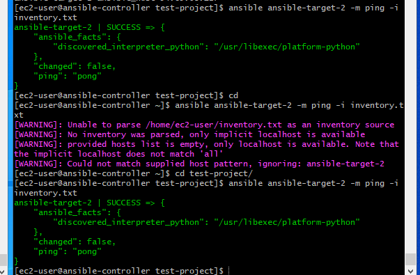

# Ansible

[project 11 resources](https://www.youtube.com/watch?v=uuhhOhWTrrs)
- Ansible is a popular IT automation engine that automates task that are either cubersome or repetitive or complex like configuration managment, clould provisioning, software deployment, and intra-service orchestration.
> Benefits of Ansible in DevOps is to response and scale in pace with the demand.

> Do we need Ansible? Why
- Ansible is very useful and you would appreciate it with the example when there are 4 or 5 web servers to be configured and deployed, and when there are more than 4 database servers to be configured and deployed. There are applications in the web servers and it connects the database servers at the backend. Now the traditional situation demands that you separately configure these servers and manage them.

- However, these servers will have various application updates. Even a system admin cannot handle if there are more servers and their configurations will not be identical. These tasks are complex to do and to manage the number of servers without putting a lot of effort into system admin as well as by developers who are developing the applications. Just imagine other servers which the organization has such as DNS, NTP, AD, Email, etc 

- This is where Ansible comes into the picture. Infrastructure automation and orchestrations can be done by Ansible. All the similar servers can be handled and managed in one go by Ansible.

> Setup Lab

- Create three Machines (Using RedHat on AWS EC2 Instances): ansible-controller, ansible-target-1, ansible-target-2

#######################################################################
#### Not Mandatory
- Connect to your vms using SSH
- Rename the hostname: sudo vi /etc/hostname
- In the open file, type the name you want to give the host. Eg Ansible-controller. 
- Another place to modify is /etc/host file:  sudo vi /etc/hosts
- Edit the host name eg: Ansible-controller

- Restart your system: shutdown now -r
- Repeat the same step for Ansible-target-1, Ansible-target-2
############################################################################
### Install Ansible on the Ansible-controller
- sudo yum update
- sudo yum install ansible
- Verify that Ansible is installed: ansible --version

## Ansible Inventory

- Ansible is agentless because it can connect to multiple servers using SSH for linux and powershell for Windows. Ansible can start managing remote machines immediately without any agent software installed.

- The information about this target systems are stored in the inventory file. If you do not create inventory file, Ansible will store it in the default location /etc/ansible/hosts 
### Inventroy parameters are
* ansible_host - To specify the Address of the server
* ansible_connection - ssh/winrm/localhost
* ansible_port - 22/5986
* ansible_user - root/administrator
* ansible_ssh_pass - Password
* Example: 
- web ansible_host=server1.example.com ansible_connection=ssh ansible_user=root
- db ansible_host=server2.example.com ansible_connection=winrm ansible_user=admin
- mail ansible_host=server3.example.com ansible_connection=ssh ansible_user=p@#
- web2 ansible_host=server4.example.com ansible_connection=winrm

> Demo - Ansible Inventory
### Configure SSH Connection on the server
- Ansible-controller> cd .ssh
- Ansible-controller .ssh> ls 
- There should be two files: Authorized-keys and known_hosts
- cat known_hosts - to view the content
- cat authorized-key - to view the content
### To generate a key for ssh connection
- Ansible-controller .ssh> ssh-keygen
- Ansible-controller .ssh> ls
- There should be id_rsa, id_rsa.pub
cat id_rsa.pub
### Copy the key in the id_rsa.pub to the client machine
- sudo vi id_rsa.pub
- Copy the key
### On the client machine
- Connect to the client machine
- Ansible-target-1> cd .ssh
- Ansible-target-1 .ssh> ls
- There should be authorized_keys
- Ansible-target-1 .ssh> sudo vi authorized_keys
- Paste the key from the id_rsa.pub above to this location and save
### Test connectivity 
- Ansible-controller> ssh target_server_IP address
### Test connectivity to Ansible
- Ansible-controller> create a folder called "test-project"
- Ansible-controller> cd test-project
- Ansible-controller test-project> cat > inventory.txt 
- Press enter key
- Type: Ansible-target-1 ansible_host=Ansible-target-1IP_address ansibl_ssh_pass=password
- Press enter key
- Ansible-controller test-project> cat  inventory.txt - To read the inventory fie
- Ansible-controller test-project> ansible Ansible-target-1 -m ping -i inventory.txt - To ping ansible on the target machine and verify the ansible controller can communitace with terget machine

### Modify inventory file
- Ansible-controller test-project> vi inventory.txt
-   Add information about target 2 as shown below
- Ansible-target-2 ansible_host=Ansible-target-1IP_address ansibl_ssh_pass=password
- save
### Test ping to Ansible-target-2 
- Ansible-controller test-project> cat > inventory.txt 
- Press enter key
- Type: ansible-target-2 ansible_host=Ansible-target-1IP_address ansibl_ssh_pass=password
- ansible-controller test-project> cat  inventory.txt - To read the inventory fie
- ansible-controller test-project> ansible ansible-target-2 -m ping -i inventory.txt - To ping ansible on the target machine and verify the ansible controller can communitace with terget machine

### Introduction to YAML

- YAML is a data serialization language that is often used for writing configuration files. Depending on whom you ask, YAML stands for yet another markup language or YAML ain’t markup language (a recursive acronym), which emphasizes that YAML is for data, not documents

### What is YAML used for?
- One of the most common uses for YAML is to create configuration files. It's recommended that configuration files be written in YAML rather than JSON, even though they can be used interchangeably in most cases, because YAML has better readability and is more user-friendly.  

- In addition to its use in Ansible, YAML is used for Kubernetes resources and deployments. 

- A benefit of using YAML is that YAML files can be added to source control, such as Github, so that changes can be tracked and audited. 

### YAML Syntax
##### Key value pair
> Fruit: Apple
> Vegetable: Carrot
> Liquid: Water
> Meat: Chicken

##### Array/Lists
> Fruits:
   - Orange
   - Apple
   - Banana

> Vegetables:
   - Carrot
   - Cauliflower
   - Tomato

##### Dictonary/MAP
>Banana:
  - Calories: 105
  - fat: 0.4g
  - Carbs: 27g

> Grapes:
   - Calories: 62
   - Fat: 0.3g
   - Carbs: 16g

### Ansible Playbook

- Ways of accessing ansible are using ansible command as shown above, and ansible-playbook command 

- An ansible playbook is a blue print of automation task.
[Resources](https://www.redhat.com/en/topics/automation/what-is-an-ansible-playbook)
[Ansible Playbook Documentation](https://docs.ansible.com/ansible/latest/cli/ansible-playbook.html)

> Create a playbook.yaml file
- ansible-controller test-project > vi playbook-pingtest.yaml
- Add dash (-) to the first line
- Populate the file with the data in the diagram below

- save

- ansible-controller test-project > cat playbook-pingtest.yaml
- ansible-controller test-project> ansible-playbook playbook-pingtest.yaml -i inventory.txt
- Enter

### Ansible Modules
- Modules are categories into various groups based on their functionality

- System modules are the action to be perform at the system level like creating users and group, modifying user

- Command modules are used to execute command or script on host. \it is called task plugin or library plugins which are used from the command line or playbook task

[Ansible Modules Documentastion](https://docs.ansible.com/ansible/2.9/modules/list_of_all_modules.html)

### Ansible Variables
- Variables are used to store information that varies with each host

