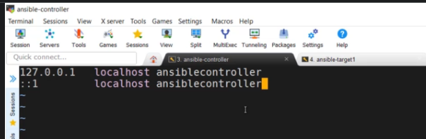

# Ansible

- Ansible is a popular IT automation engine that automates task that are either cubersome or repetitive or complex like configuration managment, clould provisioning, software deployment, and intra-service orchestration.
> Benefits of Ansible in DevOps is to response and scale in pace with the demand.

> Do we need Ansible? Why
- Ansible is very useful and you would appreciate it with the example when there are 4 or 5 web servers to be configured and deployed, and when there are more than 4 database servers to be configured and deployed. There are applications in the web servers and it connects the database servers at the backend. Now the traditional situation demands that you separately configure these servers and manage them.

- However, these servers will have various application updates. Even a system admin cannot handle if there are more servers and their configurations will not be identical. These tasks are complex to do and to manage the number of servers without putting a lot of effort into system admin as well as by developers who are developing the applications. Just imagine other servers which the organization has such as DNS, NTP, AD, Email, etc 

- This is where Ansible comes into the picture. Infrastructure automation and orchestrations can be done by Ansible. All the similar servers can be handled and managed in one go by Ansible.

> Setup Lab

- Create three Machines (Using RedHat on AWS EC2 Instances): Ansible-controller, Ansible-target-1, Ansible-target-2
- Connect to your vms using SSH
- Rename the hostname: sudo vi /etc/hostname
- In the open file, type the name you want to give the host. Eg Ansible-controller. 
- Another place to modify is /etc/host file:  sudo vi /etc/hosts
- Edit the host name eg: Ansible-controller

- Restart your system: shutdown now -r
- Repeat the same step for Ansible-target-1, Ansible-target-2

> Install Ansible on the Ansible-controller
- sudo yum install ansible
- Verify that Ansible is installed: ansible --version