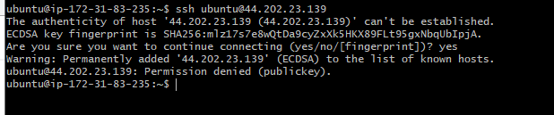

# AUX PROJECT 1: SHELL SCRIPTING

- [Resources](https://www.techrepublic.com/article/how-to-create-users-and-groups-in-linux-from-the-command-line/#:~:text=1%20How%20to%20create%20users%20and%20groups%20in,were%20concerned%20that%20managing%20users%20on%20Linux%20)

> In this project, I need to onboard 20 new Linux users onto a server. Create a shell script that reads a csv file that contains the first name of the users to be onboarded.

* Create the project folder called Shell
- mkdir Shell
- cd Shell
* Create a csv file name names.csv
- touch names.csv
- vim names.csv
- Insert some random names into it. (One name per line)

* Create each user on the server, and add to an existing group called developers

- Check if the group exists - getent group | grep developers
- Add user - sudo useradd -m Emmanuel -p PASSWORD
- Add a group - sudo groupadd developers
- Add user to a group - sudo usermod -a -G developers Emmanuel
- Verify users that are members of the group - grep developers /etc/group

- Alternatively, install members to use member command
- install member - sudo apt-get install members
- Verify members - members developers
* For each user's SSH configuration, create an authorized_keys file and add ensure it has the public key for your current user
- switch user =- su Emmanuel
- change directory to .ssh - cd ~/.ssh
- Create a file for public key - touch id_rsa.pub
- Open the file and paste the public key - vi id_rsa.pub
- ssh-rsa AAAAB3NzaC1yc2EAAAADAQABAAABgQCzKZyicHxIkklSrNlxsJyyTrcIdBIt84Z0cQb3R4k0jH53kxkaT5hP8tfWTe62LXi7vV86fY+SX7TBNM76XGCbw/6vrMGegm6J1x2i1AiLNwq5nqTjOGn0AIwku4IlCCLAB7tdfRyVuCarmBlwny3lzRyybIUAWXR/D6vpN09MsDILbKdhay+Q/p9OUBMSLPqXdY/QIh/Oe3rVv1lwY3AohNfq7V3tO88zKswfA5iiexNiSYX1myT0OrX8cBE771j9quoNZhQgaLI1mIMtAvnHQChrn9k2nUaO/BMBCQGol5XzGv1ado7hgoVPoluIUD+FGNo/pH4zcmDLICH6drXY/C9MESnkMUPLFxBXKO/OitApY71vRao9nAhAwpVMsy6FqiOb5uawhvhoHYIHTV/f4EtagVagRMP2PxYMYR6jykIV4MPJTkCm+lGhTyMlRu+qRQjdLn8AAtHf4aEV8dIkoGh088DI7eA/4o0wz4OV4upH5ewSFS+5IHmRECEW5Nc=
- Create a file for Private key - touch id_rsa
- Open the file and paste the private key - vi id_rsa
- Test and ensure that user can connect to the server using the private and public key - ssh ubuntu@44.202.23.139

