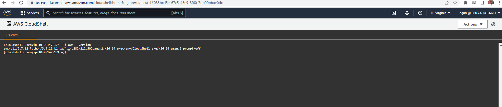

# IAM: Users and Groups

IAM is identity and access management. It is a global service because in IAM we will create and group our users into groups

 

**Least Privilege Principle -** means don't give more permission than a needs.

### Create IAM User and Group

- _Create IAM User_
* On the **AWS Console**, search for **IAM**
* Under the **IAM** dashboard, click on **Users**
* Click on **Add User**
* Under **Select AWS access type**, select 
  - Password - AWS Management Console access
  - Console password - custom password
  - Required password reset - uncheck (This depends)
* Under permission, **Add User to a group** (If the group did not exist already) click **Create a group**. 
- Name the group as **Admin**. Any user associated with this group will inherit the permission.
* Click next and add **Tag**
* click **Create user**

# IAM: Password Policy

- Strong password  - Higher security for account
- In AWS, you can setup a password policy:
  * Ser a minimum password length
  * Require specific character type
    - includeing uppercase
    - lower case letters
    - number
    - non-alphanumeric character
- Allow all IAM users to change their own password
- Trquired users to change their password after some time (Password expiration)
- Prevent password re-use

# IAM: MFA device options in AWS

1. Virtual MFA device
- Google Uthenticator (Phone only)
- Authy (multi-device)

2. Universal 2nd Factor (U2F) security key
- Yubikey by Yubico (3rd party)

3. Hardware key Fob MFA Device
- Provided by Gemalto (3rd party)

4. Hardware key Fob MFA Device for AWS GovCloud (US)
- Provided by SurePassID (3rd party)

# How can users access in AWS
1. AWS Management Console (Protected by password)
2. AWS CLI (Protected by access key)
AWS Software Developer Kit (SDK) - protected by Access key

# AWS CloudShell: Region Availability

It is not yet available in all regions, and you can find the region list [here](https://docs.aws.amazon.com/cloudshell/latest/userguide/faq-list.html#regions-available)

 

Currently, AWS CloudShell is available in the following AWS Regions:

* US East (Ohio)

* US East (N. Virginia)

* US West (Oregon)

* Asia Pacific (Mumbai)

* Asia Pacific (Sydney)

* Asia Pacific (Tokyo)

* Europe (Frankfurt)

* Europe (Ireland)

Please switch to one of these regions if you want to do the next (optional) hands-on.

# IAM Security Tools

1. IAM Credentials Report (Account-level)
2. IAM Access Advisor (User-level)