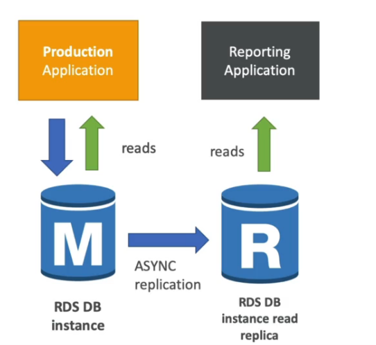
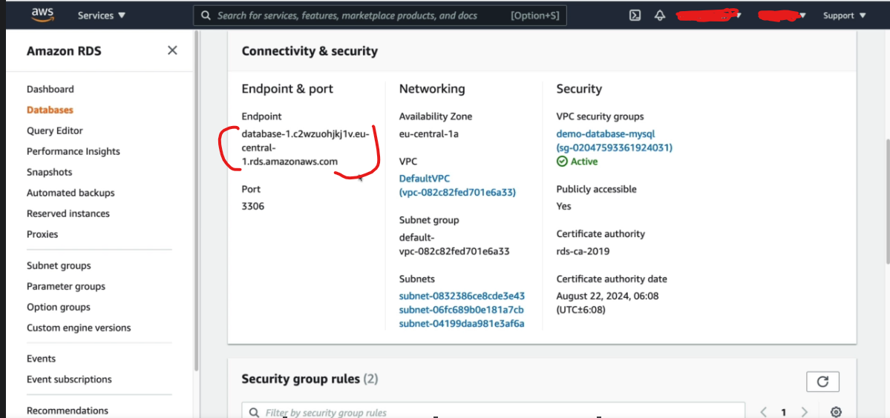
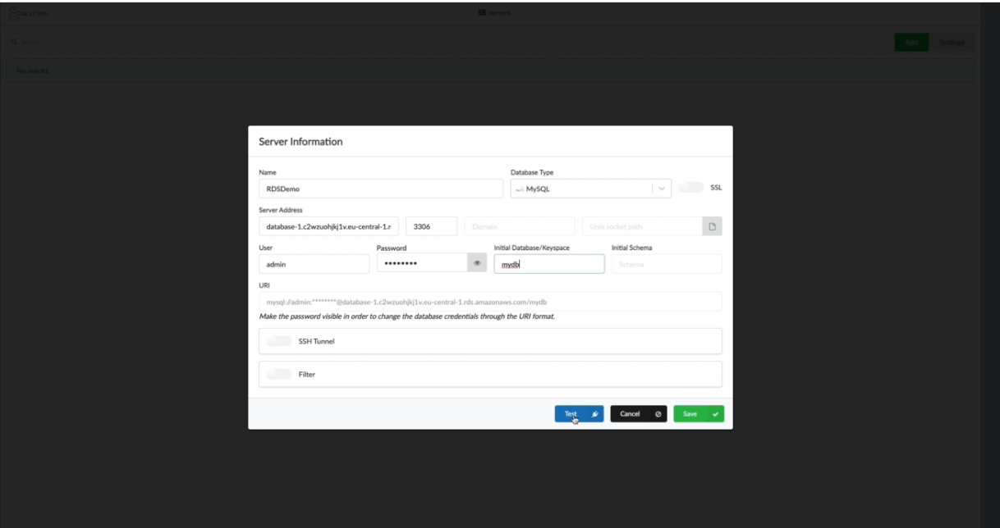

# AWS RDS Overview

- RDS stand for relational databse service. It managed DB service for DB use SQL as a query language.

- It allows you to create database in the cloud that are managed by AWS
1. Postgress
2. MySQL
3. MariaDB
4. Oracle
5. MS SQL
6. Aurora (AWS Proprietary)

### Advantages of using RDS VS deploying DB on EC2

RDS is a managed service:
1. It support automated provisioning, OS patching
2. Continuous backups and restore to specific timestamp
3. Monitoring dashboard
4. Read replica for improved read performance
5. Mult AZ setup for DR (Disaster Recovery)
6. Scaling capability (vertical and horizaonatl)
7. Storage backed by EBS (gp2 or ioI)

- RDS Read Replica for read scalability upto 5 Read Repicas within AZ, Cross AZ or Cross Region. Replication is asynchronous so reads are eventually consistent.

 

To use replicas **Applications must update the connection string to leverage read replicas**

### RDS Read Replicas - Use Cases

- you have a production database that is taking on normal load
- you want to run a repoting application to run some analytics
- You create a Read Replica to run the new workload thers
- The production application is unafected
- Read replicas are used for SELECT (=read) only kind of statements (not INSERT, UPDATE, DELETE)

RDS - How to change from single-AZ to Multi-AZ: You do not need to stop the DB. Just click on modify for the databases and follow happenings internally.

## RDS Hands on 

- On the **AWS console**, search for RDS -> Create database
- Choose **a database creation method**
- Under configure, choose **engine option**
- Select the version
- Under template, choose the template of your choice
- Under setting, type database instance identifier e.g **Database-1**
- Credential setting - provide the 
  * the master username
  * master password and confirmed
- On DB instance class
  * select DB instance class
  * enable previous generation class
- Under storage
  * Select storage type
  * Allocated storage
- Enable auto scaling
- Specify **Maximum storage autoscaling**
- Under availability and durability
  * select **Create a standby instance (recommended for production)**. If not for production, choose **Do not create a standby instance**
- Under **Connectivity**
  * select the VPC
  * Select Subnet group
  * select public access to **Yes**
- Under VPC security group
  * select existing or create a new vpc security group
  * Select database port number
- Under Database authentication
  * select a database authentication option
- Under additional configuration, you
  * Enter Initial database name - e.g **mydb**
  * Update the rest information as required. Else leave as default
- Create database.
- In the database **security group**, ensure anywhere IPV4 is set.

#### [Download Sqlectron](https://sqlectron.github.io/)
- Click the link and download the **gui** version you want
- Go to the database and copy the endpoint.

- Connect to the database using the database endpoint on the sqlectron

- Click at test to confirm everything is fine
- If the connection is fine, click on save

#### Create Replica database
- On the RDS console, click on **Database**
- Click create replica
- On the create read replica DB instance
  * fill all the neded information and create

