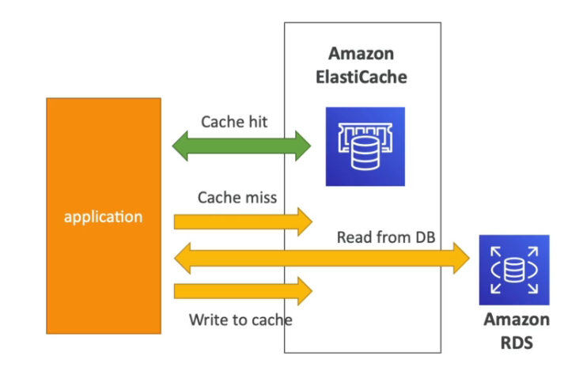
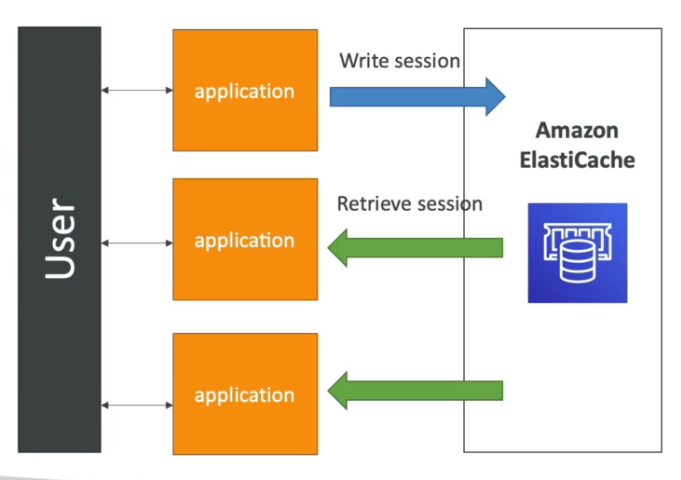
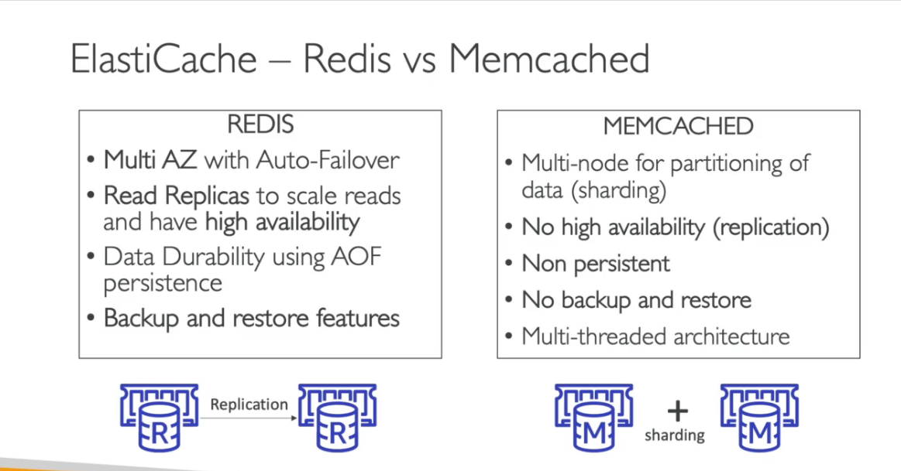
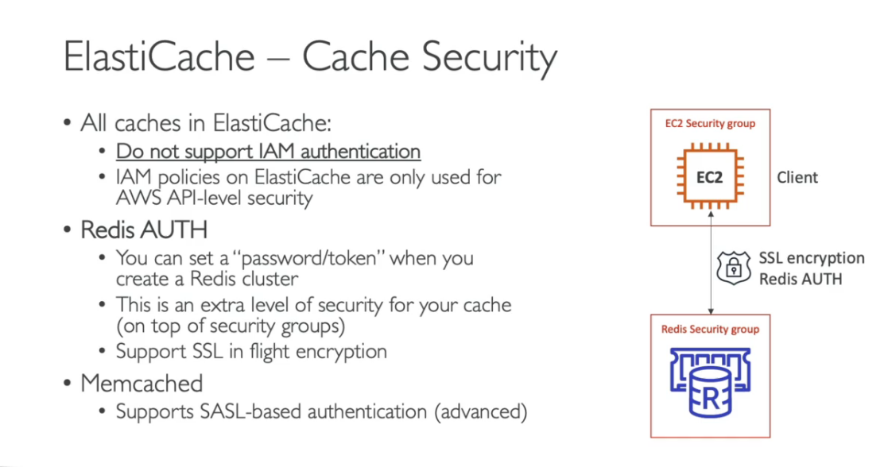
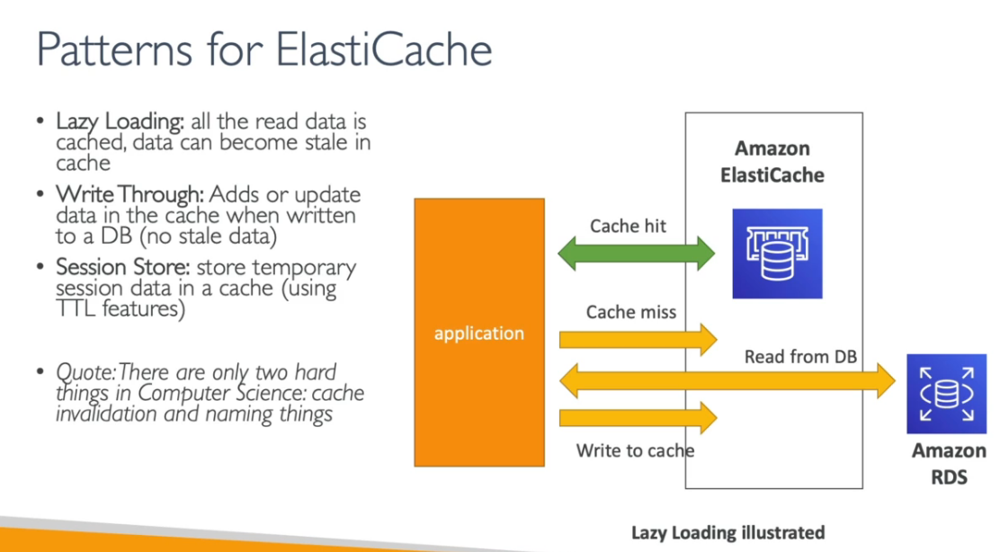
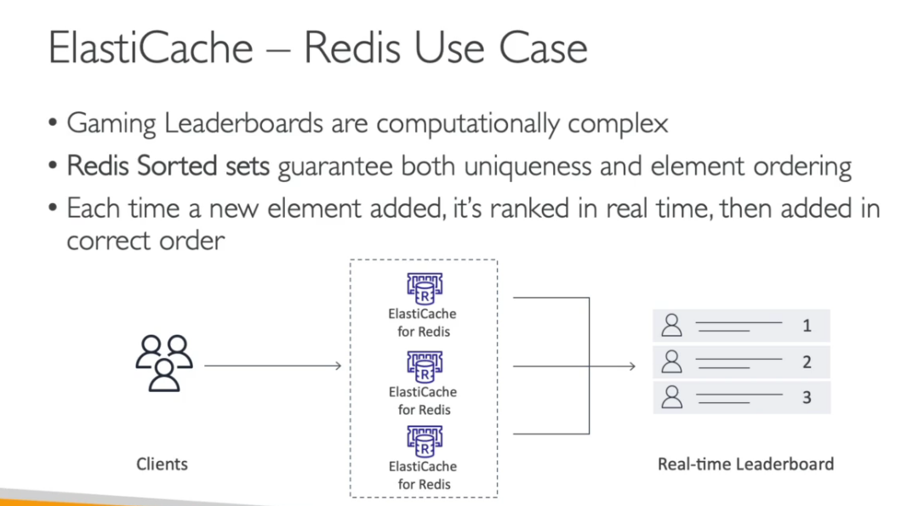
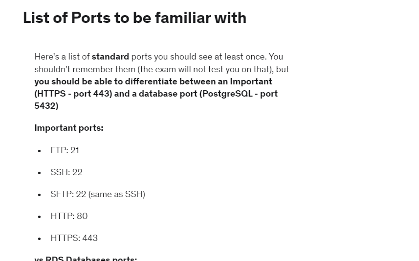
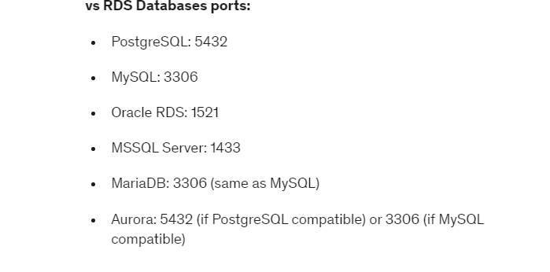

# AWS ElastiCache Overview

The same way RDS is to get managed Relational Databases, ElastiCache is to get managed Redis and Memcached. Caches are in-memory databases with really high performance, low latency. It makes application stateless.

 

Using ElastiCache involoves heavy application code changes.

#### ElastiCache Solution Architecture - DB Cache

- Application queries ElastiCache, if not available, get from RDS and store in the ElastiCache.

- Helps relieve load in RDS

- Cache must have aninvalidation strategy to make sure only the most current data is used in there.

#### ElastiCache Solution Architecture - User Session Store

- User logs into any of the application
- The application writes the session data into ElasticCache
- The user hits another instance of our application
- The instance retrieves the data and the user is already logged in.

### ElastiCache Hand on

- On the AWS console, search for **ElastiCache**
- Click **ElastiCache** and create
- On the getting started page, click on **Create cluster** and select **Create Redis cluster**
- On the cluster setting
  * Choose a cluster creation method - **Configure and create a new cluster**
  * Chose the cluster mode (Disable is free)
  * Cluster info - name (e.g Redis-Demo), Description
  * Choose location
  * Cluster settings, choose the needed information
- Subnet group
  * Name - **e.g my-first-subnet-group**
  * Choose the VPC
- Next
- Provide the needed information on the advance page
- Next
- Review and create

