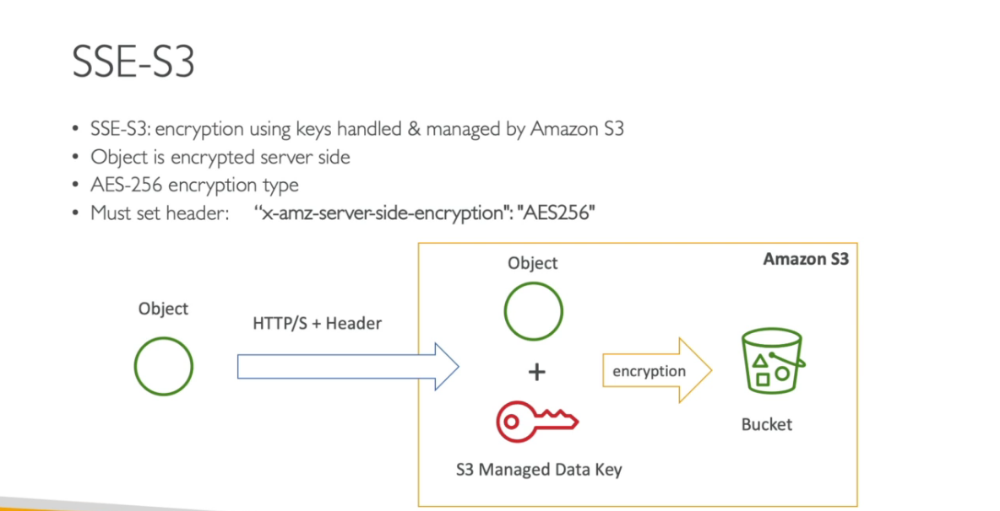

# Amazon S3 - Bucket

Amazon S3 allows people to store objects (files) in buckets (directories)

### Amazon S3 - Versioning
You can version your files in Amazon S3. It is enabled at bucket level. 

### S3 Encryption for Objects
There are four methods of encrypting objects in S3
- SSE-S3: encrypts S3 objects using keys handled and managed by AWS

- SSE-KMS: leverage  AWS Key management service to manage 
encryption keys

- SSE-C: When you want to manage your own encryption keys

- Client side ecryption

### Encrtption in Transit (SSL/TLS)
Amazon S3 exposes 
  - HTTP endpoint: non encrypted
  - HTTPS endpoints: encryption in flight

 
HTTPS is recommended and most clients would use the HTTPS endpoint by default
- HTTPS is mandatory for SSE-C
- Encryption in flight is also called SSL/TLS

### S3 Websites

### S3 Hands on 

1. On the **AWS Console**, search for S3
2. Click on create bucket
3. On the **Bucket name**, add a global unique name
4. Choose a region
5. Click on create
#### Versioning Hands on
6.  Enable Versioning
  - On the **Bucket**, click properties and **Edit**
  - On the bucket versioning, choose either **suspend** or **Enable**
  - On the object, turn on the toggle for **List versions**
#### Encryption- Hands on
7. On the object, go to the properties  and navigate to **Server-side encryption settings**
- Alternatively, you can set this when uploading a file
- click on file upload
- Expand the advanced settings
- On the Server-side encryption settings, select the appropriate settings
#### S3 Bucket Policy Hands on
8. On the S3 Bucket, click on **Permission**
 - Navigate to **bucket policy** and click on **Edit**
 - Select policy generator
  * On **Select policy type** - select S3 Bucket Policy
  * On Add statement
    - Effect- Deny
    - Principal - *
    - Actions - **put** object for file upload
    - Amazon Reaource Name(ARN) - Copy the ARN name from bucket policy edit page and paste here with _/*_ at the end
  * Add Conditions (Optional)
   - Condition - Null
   - Key - s3-X-amz-server-side-encryption
   - value- true
   - Add statement
   - Repeat for another condition
     * Add Conditions (Optional)
   - Condition - StringNotEquals
   - Key - s3-X-amz-server-side-encryption
   - value- AES256
   - Add statement
  * Click generate policy
- Copy the generated policy and paste in Bucket policy edit console
- Save

#### Make a Bucket a static websites

1. On the bucket, click on object
- Upload sn index.html file
- Click on the property tab and navigate to static website hosting
- Click on edit and enable 
- Select static website
- Provide index.html and error.html file
- Save
- Scroll down and the bucket website URL is there

#### To enable public access to the bucket
- Click on the permission tab
- Edit public access (bucket settings)
- Go to the bucket policy that will allow public access
 * On the S3 Bucket, click on **Permission**
 - Navigate to **bucket policy** and click on **Edit**
 - Select policy generator
  * On **Select policy type** - select S3 Bucket Policy
  * On Add statement
    - Effect- Allow
    - Principal - *
    - Actions - **get** object for public access
    - Amazon Reaource Name(ARN) - Copy the ARN name from bucket policy edit page and paste here with _/*_ at the end
   - Add statement
  * Click generate policy
- Copy the generated policy and paste in Bucket policy edit console
- Save

### CORS

### Enable CORS

