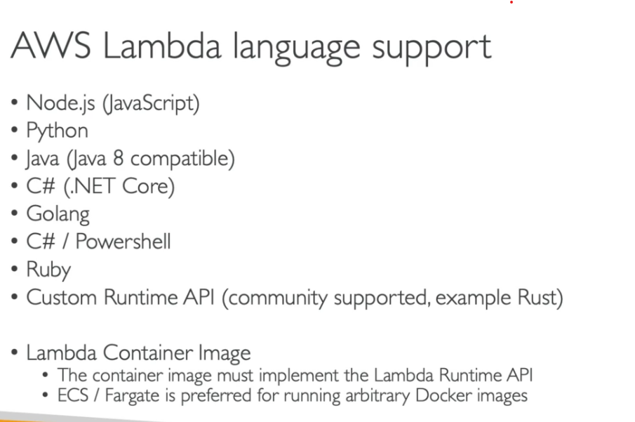
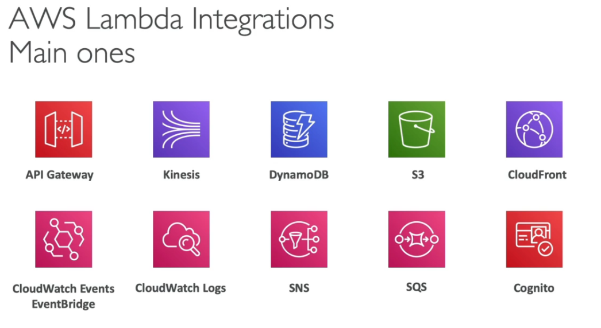

# Serverless

Serverless in AWS includes
1. AWS Lambda
2. DynamoDB
3. AWS Cognito
4. AWS API Gateway
5. Amazon S3
6. AWS SNS, SQS
7. AWS Kinesis Data Firehose
8. Aurora Serverless
9. Step Functions
10. Fargate

### AWS Lambda

AWS Lambda is a serverless, event-driven compute service that lets you run code for virtually any type of application or backend service without provisioning or managing servers. You can trigger Lambda from over 200 AWS services and software as a service (SaaS) applications, and only pay for what you use.

### [Lambda Hands-on](https://docs.aws.amazon.com/lambda/latest/dg/lambda-nodejs.html)