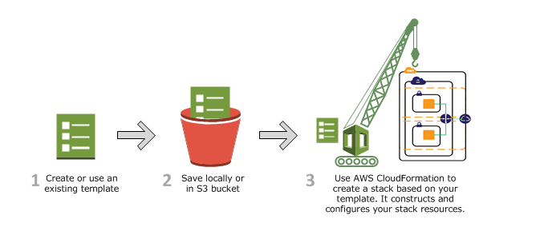

# [What is ClodFormation?](https://docs.aws.amazon.com/AWSCloudFormation/latest/UserGuide/Welcome.html)

AWS cloudFormation provides users with a simple way to create and mange a collection of Amazon web service (AWS) resources by provisioning and updating them in a predictable way. AWS CloudFormation enables you to manage your complete infrastructure or AWS resources in a text file. In simple terms, it allows you to create and model your infrastructure and applications without having to perform actions manually.

 

AWS CloudFormation enables you to manage your complete infrastructure or AWS resources in a text file, or template. A collection of AWS resources is called a stack. AWS resources can be created or updated by using a stack.

 

All the resources you require in an application can be deployed easily using templates. Also, you can reuse your templates to replicate your infrastructure in multiple environments. To make templates reusable, use the parameters, mappings and conditions sections in the template so that you can customize your stacks when you create them.

- Create a new template or use an existing CloudFormation template using the JSON or YAML format.
- Save your code template locally or in an S3 bucket.
- Use AWS CloudFormation to build a stack on your template.
- AWS CloudFormation constructs and configures the stack resources that you have specified in your template.

### AWS CloudFormation Concepts

An AWS cloudFormation template is a formated text file in JSON or YAML language tht describes your AWS infrastructure. To create, view and modify templates, you can use AWS CloudFormation Designer or any text editor tool. An AWS CloudFormation template consists of nine main objects:

1. **Format version**: Format version defines the capability of a template.
2. **Description**: Any comments about your template can be specified in the description.
3. **Metadata**: Metadata can be used in the template to provide further information using JSON or YAML objects. 

4. **Parameters**: Templates can be customized using parameters. Each time you create or update your stack, parameters help you give your template custom values at runtime.
 
5. **Mappings**: Mapping enables you to map keys to a corresponding named value that you specify in a conditional parameter. Also, you can retrieve values in a map by using the “Fn:: FindInMap” intrinsic function.
 
6. **Conditions**: In a template, conditions define whether certain resources are created or when resource properties are assigned to a value during stack creation or updating. Conditions can be used when you want to reuse the templates by creating resources in different contexts. You can use intrinsic functions to define conditions.

7. **Transform**: Transform builds a simple declarative language for AWS CloudFormation and enables reuse of template components. Here, you can declare a single transform or multiple trantransform.png)

8. **Resources**: Using this section, you can declare the AWS resource that you want to create and specify in the stack, such as an Amazon S3 bucket or AWS Lambda. 

9. **Output**: In a template, the output section describes the output values that you can import into other stacks or the values that are returned when you view your own stack properties. For example, for an S3 bucket name, you can declare an output and use the “Description-stacks” command from the AWS CloudFormation service to make the bucket name easier to find.

### AWS CloudFormation - Template Resource Attributes

Attributes allow you add to a resource, to control additional behavior and relationships between your templates.
1. CreationPolicy
2. DeletionPolicy
3. DependsOn
4. Metadata
5. UpdatePolicy

### Infrastructure as Code - IaC

IaC is the process of provisioning and managing computer datacenter using code.

Important of cloudformation

Stack is a regional support. Stack created in one region cannot be access in another reghion. StackSet is the collection of stacks across region.

### DEMO

1. Long your AWS console and search for **Cloudformation**
2. Click on **Create stack**
3. Under **Prerequsite - Prepare template** select **Template is ready** if you already have your template saved locally or in s3 bucket or **Use a sample template** if you do not have template created. 
4. Click next
5. On the specify stack details, provide
 - stack name
6. On parameters provide
 - instance type - t2.micro
 - keyName
 - SSHLocation - 0.0.0.0/0 to enable public access
7. click next
8. On the Configure stack options
 - Enter tag
9. Permission 
 - Select the IAM policy
 10. next, review and create

[cloudformation sample template](https://github.com/awslabs/aws-cloudformation-templates)

### AWS CloudFormation concepts
_Templates:_ A CloudFormation template is a JSON or YAML formatted text file. You can save these files with any extension, such as .json, .yaml, .template, or .txt. CloudFormation uses these templates as blueprints for building your AWS resources
_Stacks:_ Stack is the collection of resources as a single unit.
_Change sets:_ If you need to make changes to the running resources in a stack, you update the stack. Before making changes to your resources, you can generate a change set, which is a summary of your proposed changes. Change sets allow you to see how your changes might impact your running resources, especially for critical resources, before implementing them.

### How does AWS CloudFormation work?

### Updating a stack with change sets
When you need to update your stack's resources, you can modify the stack's template. You don't need to create a new stack and delete the old one. To update a stack, create a change set by submitting a modified version of the original stack template, different input parameter values, or both. CloudFormation compares the modified template with the original template and generates a change set. The change set lists the proposed changes. After reviewing the changes, you can start the change set to update your stack or you can create a new change set. The following diagram summarizes the workflow for updating a stack.

### Hands on CloudFormation
Check the JSON and Yaml files.

1. For example, if you created a stack with the **ec2.json** or **ec2.yaml** template, CloudFormation provisions an instance with an ami-0ff8a91507f77f867 AMI ID, t2.micro instance type, testkey key pair name, and an Amazon EBS volume.

2. You can also specify multiple resources in a single template and configure these resources to work together. For example, you can modify the previous template to include an Elastic IP address (EIP) and associate it with the Amazon EC2 instance, as shown in the **eip-ec2.json** and **eip-ec2.yaml** files.

3. The sample template in **wordpressblog.json** and **wordpressblog.yaml** files creates a basic WordPress blog that uses a single Amazon EC2 instance with a local MySQL database for storage. The template also creates an Amazon EC2 security group to control firewall settings for the Amazon EC2 instance.
**Step 1: Pick a template** 
The sample template in **wordpressblog.json** and **wordpressblog.yaml** files
**Step 2: Make sure you have prepared any required items for the stack**
**Step 3: Create the stack**
1. Sign in to the AWS Management Console and open the AWS CloudFormation console at https://console.aws.amazon.com/cloudformation.

2. If this is a new CloudFormation account, choose **Create New Stack**. Otherwise, choose Create Stack.

3. In the **Template** section, select **Specify an Amazon S3 Template URL** to type or paste the URL for the sample WordPress template, and then choose Next:

https://s3.us-west-2.amazonaws.com/cloudformation-templates-us-west-2/WordPress_Single_Instance.template
4. In the **Specify Details** section, enter a stack name in the **Name** field. For this example, use MyWPTestStack. The stack name can't contain spaces.

5. On the **Specify Parameters** page, you'll recognize the parameters from the Parameters section of the template. You must provide values for all parameters that don't have default values, including **DBUser**, **DBPassword**, **DBRootPassword**, and **KeyName**. In the **KeyName** field, enter the name of a valid Amazon EC2 pair in the same region you are creating the stack.

6. Choose **Next**.

7. In this scenario, we won't add any tags. Choose **Next**. Tags, which are key-value pairs, can help you identify your stacks. For more information, see Adding tags to your CloudFormation stack.

**Step 4: Monitor the progress of stack creation**
To view the events for the stack

1. On the CloudFormation console, select the stack MyWPTestStack in the list.

2. In the stack details pane, choose the Events tab.

The console automatically refreshes the event list with the most recent events every 60 seconds.
**Step 5: Use your stack resources**
To complete the WordPress installation

1. On the Outputs tab, in the WebsiteURL row, choose the link in the Value column.

The WebsiteURL output value is the URL of the installation script for the WordPress website that you created with the stack.

2. On the web page for the WordPress installation, follow the on-screen instructions to complete the WordPress installation. For more information about installing WordPress, see https://wordpress.org/support/article/how-to-install-wordpress/.

After you complete the installation and log in, you are directed to the dashboard where you can set additional options for your WordPress blog. Then, you can start writing posts for your blog that you successfully created by using a CloudFormation template.
**Step 6: Clean up**
To delete the stack and its resources

1. From the CloudFormation console, select the MyWPTestStack stack.

2. Choose Delete Stack.

3. In the confirmation message that appears, choose Yes, Delete.

The status for MyWPTestStack changes to DELETE_IN_PROGRESS. In the same way you monitored the creation of the stack, you can monitor its deletion by using the Event tab. When CloudFormation completes the deletion of the stack, it removes the stack from the list.