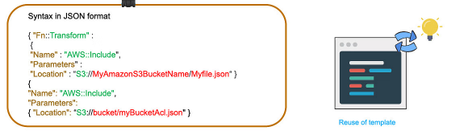

# What is ClodFormation?

AWS cloudFormation provides users with a simple way to create and mange a collection of Amazon web service (AWS) resources by provisioning and updating them in a predictable way. AWS CloudFormation enables you to manage your complete infrastructure or AWS resources in a text file. In simple terms, it allows you to create and model your infrastructure and applications without having to perform actions manually.

 

AWS CloudFormation enables you to manage your complete infrastructure or AWS resources in a text file, or template. A collection of AWS resources is called a stack. AWS resources can be created or updated by using a stack.

 

All the resources you require in an application can be deployed easily using templates. Also, you can reuse your templates to replicate your infrastructure in multiple environments. To make templates reusable, use the parameters, mappings and conditions sections in the template so that you can customize your stacks when you create them.

- Create a new template or use an existing CloudFormation template using the JSON or YAML format.
- Save your code template locally or in an S3 bucket.
- Use AWS CloudFormation to build a stack on your template.
- AWS CloudFormation constructs and configures the stack resources that you have specified in your template.

### AWS CloudFormation Concepts

An AWS cloudFormation template is a formated text file in JSON or YAML language tht describes your AWS infrastructure. To create, view and modify templates, you can use AWS CloudFormation Designer or any text editor tool. An AWS CloudFormation template consists of nine main objects:

1. **Format version**: Format version defines the capability of a template.
2. **Description**: Any comments about your template can be specified in the description.
3. **Metadata**: Metadata can be used in the template to provide further information using JSON or YAML objects. 

4. **Parameters**: Templates can be customized using parameters. Each time you create or update your stack, parameters help you give your template custom values at runtime.
 
5. **Mappings**: Mapping enables you to map keys to a corresponding named value that you specify in a conditional parameter. Also, you can retrieve values in a map by using the “Fn:: FindInMap” intrinsic function.
 
6. **Conditions**: In a template, conditions define whether certain resources are created or when resource properties are assigned to a value during stack creation or updating. Conditions can be used when you want to reuse the templates by creating resources in different contexts. You can use intrinsic functions to define conditions.

7. **Transform**: Transform builds a simple declarative language for AWS CloudFormation and enables reuse of template components. Here, you can declare a single transform or multiple trantransform.png)

8. **Resources**: Using this section, you can declare the AWS resource that you want to create and specify in the stack, such as an Amazon S3 bucket or AWS Lambda. 

9. **Output**: In a template, the output section describes the output values that you can import into other stacks or the values that are returned when you view your own stack properties. For example, for an S3 bucket name, you can declare an output and use the “Description-stacks” command from the AWS CloudFormation service to make the bucket name easier to find.

### AWS CloudFormation - Template Resource Attributes

Attributes allow you add to a resource, to control additional behavior and relationships between your templates.
1. CreationPolicy
2. DeletionPolicy
3. DependsOn
4. Metadata
5. UpdatePolicy

### Infrastructure as Code - IaC

IaC is the process of provisioning and managing computer datacenter using code.

Important of cloudformation

Stack is a regional support. Stack created in one region cannot be access in another reghion. StackSet is the collection of stacks across region.

### DEMO

1. Long your AWS console and search for **Cloudformation**
2. Click on **Create stack**
3. Under **Prerequsite - Prepare template** select **Template is ready** if you already have your template saved locally or in s3 bucket or **Use a sample template** if you do not have template created. 
4. Click next
5. On the specify stack details, provide
 - stack name
6. On parameters provide
 - instance type - t2.micro
 - keyName
 - SSHLocation - 0.0.0.0/0 to enable public access
7. click next
8. On the Configure stack options
 - Enter tag
9. Permission 
 - Select the IAM policy
 10. next, review and create