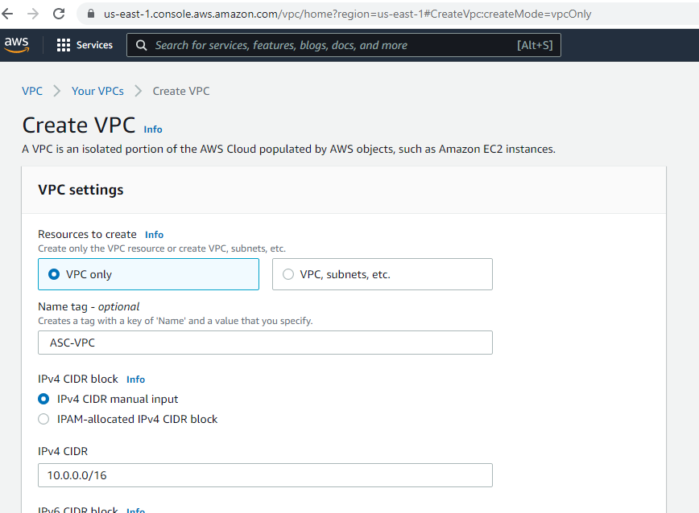
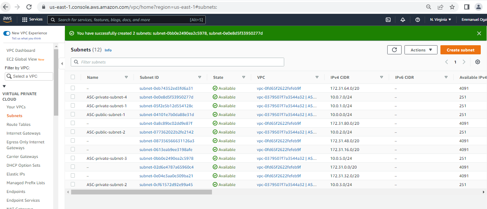

### AWS CLOUD SOLUTION FOR 2 COMPANY WEBSITES USING A REVERSE PROXY TECHNOLOGY


> SET UP A VIRTUAL PRIVATE NETWORK (VPC)

1. Create a [VPC](https://docs.aws.amazon.com/vpc/latest/userguide/what-is-amazon-vpc.html) 
  - name - asc-vpc
  - ipv4 CIDR block - 10.0.0.0/16
  - click ceate

  

  

2. Edit DNS hostname
   - Click on action from the VPC created and select "Edit DNS hostname"
   - Click enable
   - Save changes

     

3. Create [Internet gateway](https://docs.aws.amazon.com/vpc/latest/userguide/VPC_Internet_Gateway.html)
  - Under the **Virtual Private Cloud** click internet gateway
  - Click internet gateway
  - name - ACS-igw
  - Click create internet gateway

 

  - Click on attach to a VPC
  - Select the VPC created above 
  - Click attached

 

4. Create a route table and associate it with public subnets
- Use [IP Info to create subnet](https://ipinfo.io/ips)
- Click on 10.0.0.0/8
- Click on 10.0.0.0/16
- Note for safty: Set even numbers of the ip address to public network, old numbers to private network

 

_Public Network_
- Under the **Virtual Private Cloud** click subnet
- create subnet
- Select the vpc we created
- subnet - "ASC-public-subnet-1"
- Availability zone - "US East 1a"
- IPV4 CIDR bloc - 10.0.0.0/24
- Click **Add new subnet** to add the second public subnet 
subnet - "ASC-public-subnet-2"
- Availability zone - "US East 1b"
- IPV4 CIDR bloc - 10.0.2.0/24
- Click create subnet
_Private Network_
- Click create subnet
- subnet - "ASC-private-subnet-1"
- Availability zone - "US East 1a"
- IPV4 CIDR bloc - 10.0.1.0/24
- Click **Add new subnet** to add the second private subnet 
subnet - "ASC-private-subnet-2"
- Availability zone - "US East 1b"
- IPV4 CIDR bloc - 10.0.3.0/24
- Click **Add new subnet** to add the third private subnet 
subnet - "ASC-private-subnet-3"
- Availability zone - "US East 1a"
- IPV4 CIDR bloc - 10.0.5.0/24
- Click **Add new subnet** to add the fourth public subnet 
subnet - "ASC-private-subnet-4"
- Availability zone - "US East 1b"
- IPV4 CIDR bloc - 10.0.7.0/24
- Create

 

5. Create a route table and associate it with public, and private subnets
- Under the **Virtual Private Cloud** click Route tables
- Create route table
_public route table_
- name - "ASC-public-rtb"
- VPC - Select the vpc created
- click on create

 

_public route table_
- click on the ACS-public-rtb
- click on subnet association tab
- edit subnet association
- Select all the public subnets
- click associate


_private route table_
- click on the ACS-private-rtb
- click on subnet association tab
- edit subnet association
- Select all the private subnets
- click associate


6. Edit a route in public route table, and associate it with the Internet Gateway. (This is what allows a public subnet to be accesisble from the Internet)
- Select the ASC-public-rtb
- On the action drop down, select edit route table
- click on add route
- Destination - 0.0.0.0/0
- Target - Internet gateway - Select the internet gateway created
- save


7. Create 3 [Elastic IPs](https://docs.aws.amazon.com/AWSEC2/latest/UserGuide/elastic-ip-addresses-eip.html)

- Under the **Virtual Private Cloud** click elastic IP
- Click allocate elastic ip
- Under tags
- name - name
- value - asc-nat
- click allocate
- Under the **Virtual Private Cloud** Nat Gateway
- Create NAT gateway
- name - ACS-NAT-Gateway
- Subnet - Select public subnet 1 or 2
- Elastic IP allocation ID - Select the elastic Ip created "ACS-NAT"
- Create


- On the route table, Select the ASC-private-rtb
- On the action drop down, select edit route table
- click on add route
- Destination - 0.0.0.0/0
- Target - NAt Gateway- Select the NAT Gateway created
- save


8. Create a Security Group
- Under the **Security** select Security group
- click create security group
_for Application Load Balancer: ALB will be available from the Internet_
- security group name- ASC-ext-ALB
- VPC - select ACS-VPC
- Add rule
 * inbounds rules (http, https with port port 80, 443, and anywhere IP respectively)
- add tag
 * name - name
 * value - ASC-ext-ALB
 - create

 

 _for Bastion Servers: Access to the Bastion servers should be allowed only from workstations that need to SSH into the bastion servers. Hence, you can use your workstation public IP address. To get this information, simply go to your terminal and type curl www.canhazip.com_

 - security group name- ASC-bastion
- VPC - select ACS-VPC
- Add rule
 * inbounds rules (ssh, port 22, source - my Ip)
- add tag
 * name - name
 * value - ASC-bastion
 - create

 

 _for Nginx Servers: Access to Nginx should only be allowed from a Application Load balancer (ALB). At this point, we have not created a load balancer, therefore we will update the rules later. For now, just create it and put some dummy records as a place holder._

- security group name- ASC-nginx-reverse-proxy
- VPC - select vpc
- Add rule (http, https,ssh, port 80, 443, 22, source -  ASC-ext-ALB, ASC-ext-ALB, ASC-bastion respectivel)
 * inbounds rules 
 * http, 80, ASC-ext-ALB
 * https, 443, ASC-ext-ALB
 * ssh, 22, ASC-bastion
- add tag
 * name - name
 * value - ACS-nginx-reverse-proxy
 - create

 

 _For internal load balancer_


- security group name- ASC-int-alb
- VPC - select vpc
- Add rule (http, https, port 80, 443, source -  ACS-nginx-reverse-proxy, ACS-nginx-reverse-proxy, respectivel)
 * inbounds rules 
 * http, 80, ACS-nginx-reverse-proxy
 * https, 443, ACS-nginx-reverse-proxy
- add tag
 * name - name
 * value - ACS-int-alb
 - create

  

_for Webservers: Access to Webservers should only be allowed from the Nginx servers. Since we do not have the servers created yet, just put some dummy records as a place holder, we will update it later._

- security group name- ASC-webserver
- VPC - select vpc
- Add rule 
 * inbounds rules 
 * http, 80, ASC-int-alb
 * https, 443, ASC-int-alb
 * ssh, 22,  ASC-bastion
- add tag
 * name - name
 * value - ASC-webserver
 - create

   

_for Data Layer: Access to the Data layer, which is comprised of Amazon Relational Database Service (RDS) and Amazon Elastic File System (EFS) must be carefully desinged – only webservers should be able to connect to RDS, while Nginx and Webservers will have access to EFS Mountpoint._

- security group name- ASC-datalayer
- VPC - select vpc
- Add rule 
 * inbounds rules 
 * mysql/Aurora, 3306, ASC-webserver
 * nfs, 2049, ASC-webserver
 * mysql, 3306,  ASC-bastion
- add tag
 * name - name
 * value - ASC-datalayer
 - create

> TLS Certificates From [Amazon Certificate Manager (ACM)](https://aws.amazon.com/certificate-manager/)
- Confirm you already have domain and the DNS records are properly set
- Go to AWS certificate manager (ACM)
- Request for a public cetificate
- On the domain name, use wildcard- _*.domain.com_ where domain name is your domain name
- Next
- On theselect validation method, choose "DNS validation"
- Next
- On tag - name - name, value - ACS-cert
- review
- conform and request
- expand the validation
- click on create in Route 53

> [Amazon Elastic file system](https://us-east-1.console.aws.amazon.com/efs?region=us-east-1#/get-started)
- Create file system
- name - ACS-file-system
- VPC - Select your VPC
- select customize
- add tag
- tag key - name
- value - ACS-file-system
- next
- On the nextwor, select _private_subnet-1_, _private_subnet-2_
- Change the security group to datalayer _ACS-datalayer_

- On file system policy, choose default
- next
- review and create

> Access point
- Click on the file system created above
- select access points
- create access point

_for wordpress_
- name - worldpress
- Root directory path - /wordpress
- on POSIX user
* User ID - 0
* Group ID - 0
- On root directory creation permission
* Owner user ID - 0
* Owner group ID - 0
* POSIX permission for apply to the root directory path - 0755
- Add tag
* name - name
* value - wordpress-ap
- Create access point

_for tooling_
- name - tooling
- Root directory path - /tooling
- on POSIX user
* User ID - 0
* Group ID - 0
- On root directory creation permission
* Owner user ID - 0
* Owner group ID - 0
* POSIX permission for apply to the root directory path - 0755
- Add tag
* name - name
* value - tooling-ap
- Create access point

> [Amazon RDS](https://aws.amazon.com/rds/?trk=c0fcea17-fb6a-4c27-ad98-192318a276ff&sc_channel=ps&sc_campaign=acquisition&sc_medium=ACQ-P|PS-GO|Brand|Desktop|SU|Database|Solution|US|EN|Text&s_kwcid=AL!4422!3!548665196298!e!!g!!amazon%20relational%20db&ef_id=EAIaIQobChMIybH9rPD59wIVoG5vBB2OpAKCEAAYASABEgIRZPD_BwE:G:s&s_kwcid=AL!4422!3!548665196298!e!!g!!amazon%20relational%20db)

1. Install [AWS Key Management Service](https://aws.amazon.com/kms/)

- Click on create key
- Select Symmentric
- Leave the advance part at default
- Click next
- On the **Add labels**
  * Alias - ACS-rds
  * Add description
  * Add tags, name - name, tag value - ACS-rds-key
- next
- On the **Define key useage permission**
  * Select your name
  * Leave the rest as default
- Click finish

2. Create subnet group
- On the **RDS console** search for _Subnet group_
- click _create DB Subnet group_
- name - ACS-rds-subnet
- Add description
- Choose the VPC created above
- On **Add subnets**
- Choose your avaliability zone created earlier (us-east-1a, us-east-1b)
- For subnet, choose all the private subnets created earlier
- create/Finish

3. Back to **RDS Console** to create database
- Click create database
- On **Choose a database creation method**, select **MySQL**
- Go with the latest version
- For template - Select free tier for learning purpose
- DB Instance identifier - ACS-database
- Credential settings
 * master username - ACSadmin
 * Master password - passpword
- Connectivity
  * VPC - select our VPC (ACS-VPC)
_ VPC Security Group
  * Choose existing 
  * Existing VPC Security group - ACS-Datalayer(Created earlier)
- Availability zone - Choose either availability zone
- Initial database name - test
- Create database

> #### Proceed With Compute Resources

You will need to set up and configure compute resources inside your VPC. The recources related to compute are:

- [EC2 Instances](https://www.amazonaws.cn/en/ec2/instance-types/)
- [Launch Templates](https://docs.aws.amazon.com/autoscaling/ec2/userguide/launch-templates.html)
- [Target Groups](https://docs.aws.amazon.com/elasticloadbalancing/latest/application/load-balancer-target-groups.html)
- [Autoscaling Groups](https://docs.aws.amazon.com/autoscaling/ec2/userguide/auto-scaling-groups.html)
- [TLS Certificates](https://en.wikipedia.org/wiki/Transport_Layer_Security)
- [Application Load Balancer (ALB)](https://docs.aws.amazon.com/elasticloadbalancing/latest/application/introduction.html)

1. Spin up 3 RedHat AMI with all traffic open
 - Name the machines **webserver**, **bastion**, **nginx** respectively

 2. Connect to the **Bastion** AMI
 - Change to super user 
 ```
 sudo su -
 ```
 _Install the following_

 ```
yum install -y https://dl.fedoraproject.org/pub/epel/epel-release-latest-8.noarch.rpm 

yum install -y dnf-utils http://rpms.remirepo.net/enterprise/remi-release-8.rpm 

yum install wget vim python3 telnet htop git mysql net-tools chrony -y 

systemctl start chronyd 

systemctl enable chronyd
 ```


3. Connect to the **Nginx** AMI
- Change to super user 
```
sudo su -
```
- Install the following

```
yum install -y https://dl.fedoraproject.org/pub/epel/epel-release-latest-8.noarch.rpm

yum install -y dnf-utils http://rpms.remirepo.net/enterprise/remi-release-8.rpm

yum install wget vim python3 telnet htop git mysql net-tools chrony -y

systemctl start chronyd

systemctl enable chronyd
```

_configure selinux policies for the webservers and nginx servers_

```
setsebool -P httpd_can_network_connect=1
setsebool -P httpd_can_network_connect_db=1
setsebool -P httpd_execmem=1
setsebool -P httpd_use_nfs 1
```
_[install amazon efs utils for mounting the target on the Elastic file system](https://docs.aws.amazon.com/efs/latest/ug/installing-amazon-efs-utils.html#installing-other-distro)_

```
git clone https://github.com/aws/efs-utils

cd efs-utils

yum install -y make

yum install -y rpm-build

make rpm 

yum install -y  ./build/amazon-efs-utils*rpm
```

_[seting up self-signed certificate for the nginx instance](https://www.digitalocean.com/community/tutorials/how-to-create-a-self-signed-ssl-certificate-for-nginx-on-centos-7)_

```
sudo mkdir /etc/ssl/private

sudo chmod 700 /etc/ssl/private

openssl req -x509 -nodes -days 365 -newkey rsa:2048 -keyout /etc/ssl/private/ACS.key -out /etc/ssl/certs/ACS.crt

sudo openssl dhparam -out /etc/ssl/certs/dhparam.pem 2048
```
4. Set Up Compute Resources for Webservers

- Change to super user 
```
sudo su -
```
- Install the following

```
yum install -y https://dl.fedoraproject.org/pub/epel/epel-release-latest-8.noarch.rpm

yum install -y dnf-utils http://rpms.remirepo.net/enterprise/remi-release-8.rpm

yum install wget vim python3 telnet htop git mysql net-tools chrony -y

systemctl start chronyd

systemctl enable chronyd
```

_[install amazon efs utils for mounting the target on the Elastic file system](https://docs.aws.amazon.com/efs/latest/ug/installing-amazon-efs-utils.html#installing-other-distro)_

```
git clone https://github.com/aws/efs-utils

cd efs-utils

yum install -y make

yum install -y rpm-build

make rpm 

yum install -y  ./build/amazon-efs-utils*rpm

yum install -y mod_ssl

openssl req -newkey rsa:2048 -nodes -keyout /etc/pki/tls/private/ACS.key -x509 -days 365 -out /etc/pki/tls/certs/ACS.crt

vi /etc/httpd/conf.d/ssl.conf

# change sslCertificateFile /etc/phi/tls/certs/localhost.crt tp /etc/phi/tls/certs/ASC.crt

# change sslCertificateFile /etc/phi/tls/private/localhost.key to /etc/phi/tls/private/ASC.key
```

> Create AMI for each of the EC2 Instances

_Webserver_

- On the EC2 instances console, 
- Select the instance (Webserver)
- click on the **Action** dropdown
- Click Image and template
- On **Create Image** page
  * Image name - ACS-webserver-ami
  * Add Tags - key - name, Value - ACS-webserver-ami
- Create image

_Bastion_

- On the EC2 instances console, 
- Select the instance (Bastion)
- click on the **Action** dropdown
- Click Image and template
- On **Create Image** page
  * Image name - ACS-bastion-ami
  * Add Tags - key - name, Value - ACS-bastion-ami
- Create image

_Nginx_

- On the EC2 instances console, 
- Select the instance (nginx)
- click on the **Action** dropdown
- Click Image and template
- On **Create Image** page
  * Image name - ACS-nginx-ami
  * Add Tags - key - name, Value - ACS-nginx-ami
- Create image

> Images
- Go to the **Image** console
- Click on **AMIs**
- The images created above should display here

> Create Target Group
- Navigate to **Load balancing**  and select **Target Groups**
- Click create **Target Groups**
_For Nginx_
- Choose a target type - Choose **Instances**
- Target group name - ACS-nginx-target
- Protocol - Https 443
- VPC - ACS-VPC created earlier
- On **Health Checks**
  * Health check path - /healthstatus
- On **Tags**
  * key - name
  * value - ACS-nginx-target
- Next
- Create target group


_For wordpress_
- Choose a target type - Choose **Instances**
- Target group name - ACS-wordpress-target
- Protocol - Https 443
- VPC - ACS-VPC created earlier
- On **Health Checks**
  * Health check path - /healthstatus
- On **Tags**
  * key - name
  * value - ACS-wordpress-target
- Next
- Create target group


_For tooling_
- Choose a target type - Choose **Instances**
- Target group name - ACS-tooling-target
- Protocol - Https 443
- VPC - ACS-VPC created earlier
- On **Health Checks**
  * Health check path - /healthstatus
- On **Tags**
  * key - name
  * value - ACS-tooling-target
- Next
- Create target group

> Create Load balancer
- Navigate to **Load balancing**  and select **Load Balancer**
- Click **Create load balancer**
- Create **HTTP HTTPS**

_For Internet facing (External) Load Balancer_

- Step 1. Configure Load balancer
  * name - ACS-ext-ALB
  * Scheme - Internat facing
  * Load balancer Protocol - HTTPS (Secure HTTP)
  * Availability zone
    - VPC - ACS-VPC
    - Availability Zones 
      * US-east-1a - Select **Public subnet 1**, 
      * US-east-1b - select **Public subnet 2**
  * Add tags
    - Key - name
    - Value - ACS-ext-ALB
  * Next
- Step 2. Configure security settings
  * Certificate type - Choose a certificate from ACM (Recommended)
  * Certificate name - Certificated created should show up or choose
  * Next
- Step 3. Configure security group
  * Assign a security group - Select an existing security group
  * From the list of security groups, select all external load balancer
- Next

- Step 4. Configure security Routing
  * Target group
    - Target group - Existing target group
    - Name - ACS-nginx-target
  * next

- Step 5.Register Targets
  * next
- Step 6. Review
  * Create
  * Close

_For Internal facing Load Balancer_


- Step 1. Configure Load balancer
  * name - ACS-int-ALB
  * Scheme - Internat facing
  * Load balancer Protocol - HTTPS (Secure HTTP)
  * Availability zone
    - VPC - ACS-VPC
    - Availability Zones 
      * US-east-1a - Select **Private subnet 1**, 
      * US-east-1b - select **Private subnet 2**
  * Add tags
    - Key - name
    - Value - ACS-int-ALB
  * Next
- Step 2. Configure security settings
  * Certificate type - Choose a certificate from ACM (Recommended)
  * Certificate name - Certificated created should show up or choose
  * Next
- Step 3. Configure security group
  * Assign a security group - Select an existing security group
  * From the list of security groups, select all internal load balancer
- Next

- Step 4. Configure security Routing
  * Target group
    - Target group - Existing target group
    - Name - ACS-wordpress-target
  * next

- Step 5.Register Targets
  * next
- Step 6. Review
  * Create
  * Close

- Select the **ASC-int-ALB**
- Click **Listners** tab
- View and edit mode
- Click on **+** sign to create a rule for caching tooling request
- Insert rule
_Under **If (all match)**_
- Click **Insert rule**
- Click **Add condition**
- select **Host header**
- Under the tooling header, select your domain names **oche.link**, **www.oche.link** 
_Under **THEN**_
- select ACS-tooling-target

- Save

> Launch Template
- Navigate to instances console and select **Launch Template**
_For Bastion Template_
- Click **Create Launch Template**
- Create Launch template
  * Launch template name and description
    * Launch template name - ACS-bastion-template
  * Amazon machine image(AMI)
    * Choose **ASC-bastion-ami**
  * Instance type
    * Choose **t2.micro**
  * Key pair (Login)
    * Key pair name - **"Select the .pem key generated**
  * Network Setting
    * Choose **VPC**
  * Add Tag
    * key - name
    * Value -  ACS-bastion-template
  * Network interfaces
    * subnet - Choose either **public subnet 1** or **public subnet 2**
    * Security groups - Choose **ASC-Bastion**
    * Auto-assign public IP - Enable
  * User data
    * Copy and paste the following code
    ```
    #!/bin/bash 
    yum install -y mysql 
    yum install -y git tmux 
    yum install -y ansible
    ```
  * Create launch template

  _For Nginx Template_
- Click **Create Launch Template**
- Create Launch template
  * Launch template name and description
    * Launch template name - ACS-nginx-template
  * Amazon machine image(AMI)
    * Choose **ASC-nginx-ami**
  * Instance type
    * Choose **t2.micro**
  * Key pair (Login)
    * Key pair name - **"Select the .pem key generated**
  * Network Setting
    * Choose **VPC**
  * Add Tag
    * key - name
    * Value -  ACS-nginx-template
  * Network interfaces
    * subnet - Choose either **public subnet 1** or **public subnet 2**
    * Security groups - Choose **ASC-nginx**
    * Auto-assign public IP - Enable
  * User data
    * Copy and paste the following code
    ```
    #!/bin/bash
    yum install -y nginx
    systemctl start nginx
    systemctl enable nginx
    git clone https://github.com/Emmy-github-webdev/ACS-project-config.git
    mv /ACS-project-config/reverse.conf /etc/nginx/
    mv /etc/nginx/nginx.conf /etc/nginx/nginx.conf-distro
    cd /etc/nginx/
    touch nginx.conf
    sed -n 'w nginx.conf' reverse.conf
    systemctl restart nginx
    rm -rf reverse.conf
    rm -rf /ACS-project-config
    ```
  * Create launch template

- Navigate to load balancers, and select ACS-int-ALB
- Click on the decription tab
- Copy the DNS Name
- Add the DNS name to reverse config file **line 743** _proxy-pass_

```
user nginx;
worker_processes auto;
error_log /var/log/nginx/error.log;
pid /run/nginx.pid;

# Load dynamic modules. See /usr/share/doc/nginx/README.dynamic.
include /usr/share/nginx/modules/*.conf;

events {
    worker_connections 1024;
}

http {
    log_format  main  '$remote_addr - $remote_user [$time_local] "$request" '
                      '$status $body_bytes_sent "$http_referer" '
                      '"$http_user_agent" "$http_x_forwarded_for"';

    access_log  /var/log/nginx/access.log  main;

    sendfile            on;
    tcp_nopush          on;
    tcp_nodelay         on;
    keepalive_timeout   65;
    types_hash_max_size 2048;

    
    default_type        application/octet-stream;

    # Load modular configuration files from the /etc/nginx/conf.d directory.
    # See http://nginx.org/en/docs/ngx_core_module.html#include
    # for more information.
    include /etc/nginx/conf.d/*.conf;

     server {
        listen       80;
        listen       443 http2 ssl;
        listen       [::]:443 http2 ssl;
        root          /var/www/html;
        server_name  *.oche.link;
        
        
        ssl_certificate /etc/ssl/certs/ACS.crt;
        ssl_certificate_key /etc/ssl/private/ACS.key;
        ssl_dhparam /etc/ssl/certs/dhparam.pem;

      

        location /healthstatus {
        access_log off;
        return 200;
       }
    
         
        location / {
            proxy_set_header             Host $host;
            proxy_pass                   https://internal-ACS-int-ALB-869121596.us-east-1.elb.amazonaws.com/; 
           }
    }
}

```

  _For wordpress Template_
- Click **Create Launch Template**
- Create Launch template
  * Launch template name and description
    * Launch template name - ACS-wordpress-template
  * Amazon machine image(AMI)
    * Choose **ASC-wordpress-ami**
  * Instance type
    * Choose **t2.micro**
  * Key pair (Login)
    * Key pair name - **"Select the .pem key generated**
  * Network Setting
    * Choose **VPC**
  * Add Tag
    * key - name
    * Value -  ACS-wordpress-template
  * Network interfaces
    * subnet - Choose either **private subnet 1** or **private subnet 2**
    * Security groups - Choose **ASC-wordpress**
    * Auto-assign public IP - disable
  
  - Navigate to **Elastic File system**
    * click on the access point
    * Click on wordpress access point
    * Click on attach
    * Copy the command excluding the efs,
    Past it to replace _sudo mount -t efs -o tls,accesspoint=fsap-0f9364679383ffbc0 fs-8b501d3f:/_ in the user data below
  - Navigate to **RDS**
    * select DB Instances
    * Click on the acs-database
    * Copy the endpoint, past it to replace _sed -i "s/localhost/acs-database.cdqpbjkethv0.us-east-1.rds.amazonaws.com_ in the code block below
  * User data
    * Copy and paste the following code
    ```
    #!/bin/bash
    mkdir /var/www/
    sudo mount -t efs -o tls,accesspoint=fsap-0f9364679383ffbc0 fs-8b501d3f:/ /var/www/
    yum install -y httpd 
    systemctl start httpd
    systemctl enable httpd
    yum module reset php -y
    yum module enable php:remi-7.4 -y
    yum install -y php php-common php-mbstring php-opcache php-intl php-xml php-gd php-curl php-mysqlnd php-fpm php-json
    systemctl start php-fpm
    systemctl enable php-fpm
    wget http://wordpress.org/latest.tar.gz
    tar xzvf latest.tar.gz
    rm -rf latest.tar.gz
    cp wordpress/wp-config-sample.php wordpress/wp-config.php
    mkdir /var/www/html/
    cp -R /wordpress/* /var/www/html/
    cd /var/www/html/
    touch healthstatus
    sed -i "s/localhost/acs-database.cdqpbjkethv0.us-east-1.rds.amazonaws.com/g" wp-config.php 
    sed -i "s/username_here/ACSadmin/g" wp-config.php 
    sed -i "s/password_here/admin12345/g" wp-config.php 
    sed -i "s/database_name_here/wordpressdb/g" wp-config.php 
    chcon -t httpd_sys_rw_content_t /var/www/html/ -R
    systemctl restart httpd
    ```
  * Create launch template

    _For tooling Template_
- Click **Create Launch Template**
- Create Launch template
  * Launch template name and description
    * Launch template name - ACS-tooling-template
  * Amazon machine image(AMI)
    * Choose **ASC-tooling-ami**
  * Instance type
    * Choose **t2.micro**
  * Key pair (Login)
    * Key pair name - **"Select the .pem key generated**
  * Network Setting
    * Choose **VPC**
  * Add Tag
    * key - name
    * Value -  ACS-tooling-template
  * Network interfaces
    * subnet - Choose either **private subnet 1** or **private subnet 2**
    * Security groups - Choose **ASC-wordpress**
    * Auto-assign public IP - disable
    - Navigate to **Elastic File system**
    * click on the access point
    * Click on tooling access point
    * Click on attach
    * Copy the command excluding the efs,
    Past it to replace _    sudo mount -t efs -o tls,accesspoint=fsap-01c13a4019ca59dbe fs-8b501d3f:/_ in the user data below
  * User data
    * Copy and paste the following code
    ```
    #!/bin/bash
    mkdir /var/www/
    sudo mount -t efs -o tls,accesspoint=fsap-01c13a4019ca59dbe fs-8b501d3f:/ /var/www/
    yum install -y httpd 
    systemctl start httpd
    systemctl enable httpd
    yum module reset php -y
    yum module enable php:remi-7.4 -y
    yum install -y php php-common php-mbstring php-opcache php-intl php-xml php-gd php-curl php-mysqlnd php-fpm php-json
    systemctl start php-fpm
    systemctl enable php-fpm
    git clone https://github.com/Livingstone95/tooling-1.git
    mkdir /var/www/html
    cp -R /tooling-1/html/*  /var/www/html/
    cd /tooling-1
    mysql -h acs-database.cdqpbjkethv0.us-east-1.rds.amazonaws.com -u ACSadmin -p toolingdb < tooling-db.sql
    cd /var/www/html/
    touch healthstatus
    sed -i "s/$db = mysqli_connect('mysql.tooling.svc.cluster.local', 'admin', 'admin', 'tooling');/$db = mysqli_connect('acs-database.cdqpbjkethv0.us-east-1.rds.amazonaws.com', 'ACSadmin', 'admin12345', 'toolingdb');/g" functions.php
    chcon -t httpd_sys_rw_content_t /var/www/html/ -R
    systemctl restart httpd
    ```
  * Create launch template

> [Amazon EC2 Auto scaling](https://aws.amazon.com/ec2/autoscaling/)

_For bastion_
- click create auto scaling
- Step 1 - Choose launch template for configuration
  * name - ACS-bastion
  * Launch Template - ACS-bastion-template
- next
- Step 2 - Configure settings
  * Instance purchase option - Adhere to launch template
  * Network
    - VPC - ACS-VPC
    - Subnets - public subnet 1 and 2
- Next
- Step 3 - Configure advanced option
  * Health checks - choose ELB
- Next
- step 4 - Configure group size and scaling policies
  * Scaling policies - Target tracking scaling policy
  * Target value - 90
- next
- step 5 - Add Notification 
  * Click add notification
  * Create a topic and and name if none exist already
- next
- Setp 6 - Add Tags
  * Key - name
  * Value - ACS-Bastion
- Next
- step 7 - Review
- Create auto scaling rule


_For nginx_
- click create auto scaling
- Step 1 - Choose launch template for configuration
  * name - ACS-nginx
  * Launch Template - ACS-nginx-template
- next
- Step 2 - Configure settings
  * Load balancer - attach to an existing load balancer
  * attach to an existing load balancer
    - Choose from your load balancer
    - select **ACS-nginx-target| HTTPs**
  * Instance purchase option - Adhere to launch template
  * Network
    - VPC - ACS-VPC
    - Subnets - public subnet 1 and 2
- Next
- Step 3 - Configure advanced option
  * Health checks - choose ELB
- Next
- step 4 - Configure group size and scaling policies
  * Scaling policies - Target tracking scaling policy
  * Target value - 90
- next
- step 5 - Add Notification 
  * Click add notification - ASC Notification
  * Create a topic and and name if none exist already
- next
- Setp 6 - Add Tags
  * Key - name
  * Value - ACS-nginx
- Next
- step 7 - Review
- Create auto scaling rule

> Create wordpress Database
- Connect to bastion instance
- Specify the rds endpoint as the host
  - Go to RDS -> Database -> acs-database 
  - Click on the connectivity and security tab
  - Copy the Endpoint link
  - replace it in the endpoint in the command below
```
mysql -h RDS Endpoint Link -u ACSadmin -p
>Mysql > Create database wordpressdb
Mysql > create database toolingDB
```

_For wordpress_
- click create auto scaling
- Step 1 - Choose launch template for configuration
  * name - ACS-wordpress_
  * Launch Template - ACS-wordpress-template
- next
- Step 2 - Configure settings
  * Load balancer - attach to an existing load balancer
  * attach to an existing load balancer
    - Choose from your load balancer
    - select **ACS-wordpress-target| HTTPs**
  * Instance purchase option - Adhere to launch template
  * Network
    - VPC - ACS-VPC
    - Subnets - private subnet 1 and 2
- Next
- Step 3 - Configure advanced option
  * Health checks - choose ELB
- Next
- step 4 - Configure group size and scaling policies
  * Scaling policies - Target tracking scaling policy
  * Target value - 90
- next
- step 5 - Add Notification 
  * Click add notification - ASC Notification
  * Create a topic and and name if none exist already
- next
- Setp 6 - Add Tags
  * Key - name
  * Value - ACS-wordpress
- Next
- step 7 - Review
- Create auto scaling rule


_For tooling_
- click create auto scaling
- Step 1 - Choose launch template for configuration
  * name - ACS-tooling
  * Launch Template - ACS-tooling-template
- next
- Step 2 - Configure settings
  * Load balancer - attach to an existing load balancer
  * attach to an existing load balancer
    - Choose from your load balancer
    - select **ACS-tooling-target| HTTPs**
  * Instance purchase option - Adhere to launch template
  * Network
    - VPC - ACS-VPC
    - Subnets - private subnet 1 and 2
- Next
- Step 3 - Configure advanced option
  * Health checks - choose ELB
- Next
- step 4 - Configure group size and scaling policies
  * Scaling policies - Target tracking scaling policy
  * Target value - 90
- next
- step 5 - Add Notification 
  * Click add notification - ASC Notification
  * Create a topic and and name if none exist already
- next
- Setp 6 - Add Tags
  * Key - name
  * Value - ACS-tooling
- Next
- step 7 - Review
- Create auto scaling rule

> Route 53
- Navigate to your domain name
- Create record
  * record name - tooling
  * Record type - A- Routers traffic to an IPV4 address and ..
  * Route traffic to - Alias to application and claasic load balancer, US East(N.Virgina[us-east-1]) depending on your region, choose the external load balancer

- Add another record for tooling
   * record name - www.tooling
  * Record type - A- Routers traffic to an IPV4 address and ..
  * Route traffic to - Alias to application and claasic load balancer, US East(N.Virgina[us-east-1]) depending on your region, choose the external load balancer

- Add another record for wordpress
   * record name - wordpress
  * Record type - A- Routers traffic to an IPV4 address and ..
  * Route traffic to - Alias to application and claasic load balancer, US East(N.Virgina[us-east-1]) depending on your region, choose the external load balancer

  - Add another record for wordpress
   * record name - www.wordpress
  * Record type - A- Routers traffic to an IPV4 address and ..
  * Route traffic to - Alias to application and claasic load balancer, US East(N.Virgina[us-east-1]) depending on your region, choose the external load balancer
<br>


<br>

