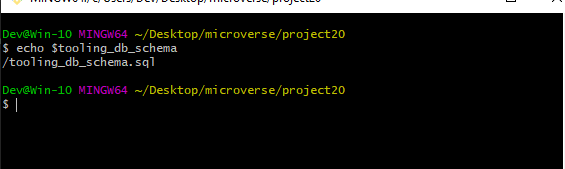

# MIGRATION TO THE СLOUD WITH CONTAINERIZATION. PART 1 – DOCKER &AMP; DOCKER COMPOSE

#### Problem
Imagine what if you need to deploy many small applications (it can be web front-end, web-backend, processing jobs, monitoring, logging solutions, etc.) and some of the applications will require various OS and runtimes of different versions and conflicting dependencies – in such case you would need to spin up serves for each group of applications with the exact OS/runtime/dependencies requirements. When it scales out to tens/hundreds and even thousands of applications (e.g., when we talk of microservice architecture), this approach becomes very tedious and challenging to maintain.

#### Solution

In this project, we will learn how to solve this problem and practice the technology that revolutionized application distribution and deployment back in 2013! We are talking of Containers and imply [Docker](https://en.wikipedia.org/wiki/Docker_(software)). Even though there are other application containerization technologies, Docker is the standard and the default choice for shipping your app in a container!

#### Install Docker and prepare for migration to the Cloud

First, we need to install [Docker Engine](https://docs.docker.com/engine/), which is a client-server application that contains:

1. A server with a long-running daemon process dockerd.
2. APIs that specify interfaces that programs can use to talk to and instruct the Docker daemon.
3. A command-line interface (CLI) client docker.

<br>
You can learn how to install Docker Engine on your PC [here](https://docs.docker.com/engine/install/)

<br>

_Remember our Tooling website? It is a PHP-based web solution backed by a MySQL database – all technologies you are already familiar with and which you shall be comfortable using by now.

_So, let us migrate the Tooling Web Application from a VM-based solution into a containerized one._

##### MySQL in container

Let us start assembling our application from the Database layer – we will use a pre-built MySQL database container, configure it, and make sure it is ready to receive requests from our PHP application.

1. ##### Step 1: Pull MySQL Docker Image from [Docker Hub Registry](https://hub.docker.com/)

<br>

Start by pulling the appropriate [Docker image for MySQL](https://hub.docker.com/_/mysql). You can download a specific version or opt for the latest release, as seen in the following command:

```
docker pull mysql/mysql-server:latest
```


If you are interested in a particular version of MySQL, replace latest with the version number. Visit Docker Hub to check other tags [here](https://hub.docker.com/r/mysql/mysql-cluster/tags)

<br>

List the images to check that you have downloaded them successfully:

```
docker image ls
```


2. ##### Step 2: Deploy the MySQL Container to your Docker Engine

- Once you have the image, move on to deploying a new MySQL container with:

```
docker run --name <container_name> -e MYSQL_ROOT_PASSWORD=<my-secret-pw> -d mysql/mysql-server:latest
```

- Replace **container_name** with the name of your choice. If you do not provide a name, Docker will generate a random one
- The -d option instructs Docker to run the container as a service in the background
- Replace **my-secret-pw** with your chosen password
- In the command above, we used the latest version tag. This tag may differ according to the image you downloaded


- Then, check to see if the MySQL container is running: Assuming the container name specified is **mysql-server**

```
docker ps -a
```


#### CONNECTING TO THE MYSQL DOCKER CONTAINER

3. ##### Step 3: Connecting to the MySQL Docker Container

_We can either connect directly to the container running the MySQL server or use a second container as a MySQL client. Let us see what the first option looks like._

**Approach 1**

<br>

Connecting directly to the container running the MySQL server:

```
$ docker exec -it mysql bash

or

$ docker exec -it mysql mysql -uroot -p
```
<br>

Provide the root password when prompted. With that, you’ve connected the MySQL client to the server.

<br>

Finally, change the server root password to protect your database. Exit the the shell with exit command

<br>

##### Flags used

- **exec** used to execute a command from bash itself
- **-it** makes the execution interactive and allocate a pseudo-TTY
- **bash** this is a unix shell and its used as an entry-point to interact with our container
- **mysql** The second **mysql** in the command "docker exec -it mysql mysql -uroot -p" serves as the entry point to interact with mysql container just like bash or sh
- **-u** mysql username
- **-p** mysql password

<br>

**Approach 2**

<br>

At this stage you are now able to create a docker container but we will need to add a network. So, stop and remove the previous mysql docker container.

```
docker ps -a
docker stop mysql 
docker rm mysql or <container ID> 04a34f46fb98
```


_First, create a network:_

```
 $ docker network create --subnet=172.18.0.0/24 tooling_app_network
 ```

 

 <br>

 Creating a custom network is not necessary because even if we do not create a network, Docker will use the default network for all the containers you run. By default, the network we created above is of **DRIVER Bridge**. So, also, it is the default network. You can verify this by running the **docker network ls** command.

<br>

But there are use cases where this is necessary. For example, if there is a requirement to control the **cidr** range of the containers running the entire application stack. This will be an ideal situation to create a network and specify the **--subnet**

<br>

For clarity’s sake, we will create a network with a subnet dedicated for our project and use it for both MySQL and the application so that they can connect.

<br>

##### Run the MySQL Server container using the created network.

<br>

First, let us create an environment variable to store the root password:

<br>

```
$ export MYSQL_PW= 
```
 

verify the environment variable is created

```
echo $MYSQL_PW
```

 

 ##### pull the image and run the container, all in one command like below:

 ```
  $ docker run --network tooling_app_network -h mysqlserverhost --name=mysql-server -e MYSQL_ROOT_PASSWORD=$MYSQL_PW  -d mysql/mysql-server:latest 
  ```

   


_Flags used_

- **-d** runs the container in detached mode
- **--network** connects a container to a network
- **-h** specifies a hostname

<br>

If the image is not found locally, it will be downloaded from the registry.

<br>

Verify the container is running:

```
 $ docker ps -a 
 ```

 

 As you already know, it is best practice not to connect to the MySQL server remotely using the root user. Therefore, we will create an **SQL** script that will create a user we can use to connect remotely.

 <br>

 Create a file and name it **create_user.sql** and add the below code in the file:

```
 $ CREATE USER ''@'%' IDENTIFIED BY ''; GRANT ALL PRIVILEGES ON * . * TO ''@'%'; 
```


##### Run the script:

Ensure you are in the directory **create_user.sql** file is located or declare a path

```
docker exec -i mysql-server mysql -uroot -p$MYSQL_PW < create_user.sql
```


#### Connecting to the MySQL server from a second container running the MySQL client utility

The good thing about this approach is that you do not have to install any client tool on your laptop, and you do not need to connect directly to the container running the MySQL server.

<br>

Run the MySQL Client Container:

```
 $ docker run --network tooling_app_network --name mysql-client -it --rm mysql mysql -h mysqlserverhost -u  -p
 ```
 ###### Flags used:

- **--name** gives the container a name
- **-it** runs in interactive mode and Allocate a pseudo-TTY
- **--rm** automatically removes the container when it exits
- **--network** connects a container to a network
- **-h** a MySQL flag specifying the MySQL server Container hostname
- **-u** user created from the SQL script
- **admin** username-for-user-created-from-the-SQL-script-create_user.sql
- **-p** password specified for the user created from the SQL script


#### Prepare database schema

Now you need to prepare a database schema so that the Tooling application can connect to it.

1. Clone the Tooling-app repository from here

```
 git clone https://github.com/darey-devops/tooling.git
 ```
2. On your terminal, export the location of the SQL file

```
export tooling_db_schema=/tooling_db_schema.sql 
```


<br>

You can find the ***tooling_db_schema.sql** in the **tooling/html/tooling_db_schema.sql** folder of cloned repo

<br>

Verify that the path is exported



3. Use the SQL script to create the database and prepare the schema. With the **docker exec** command, you can execute a command in a running container.

```
 docker exec -i mysql-server mysql -uroot -p$MYSQL_PW < $tooling_db_schema
```


4. Update the **.env** file with connection details to the database

<br>

The **.env** file is located in the html **tooling/html/.env** folder but not visible in terminal. you can use vi or nano

```
sudo vi .env

MYSQL_IP=mysqlserverhost
MYSQL_USER=username
MYSQL_PASS=client-secrete-password
MYSQL_DBNAME=toolingdb
```
<br>

_Flags used_:

- **MYSQL_IP** mysql ip address "leave as mysqlserverhost"
- **MYSQL_USER** mysql username for user export as environment variable
- **MYSQL_PASS** mysql password for the user exported as environment varaible
- **MYSQL_DBNAME** mysql databse name "toolingdb"