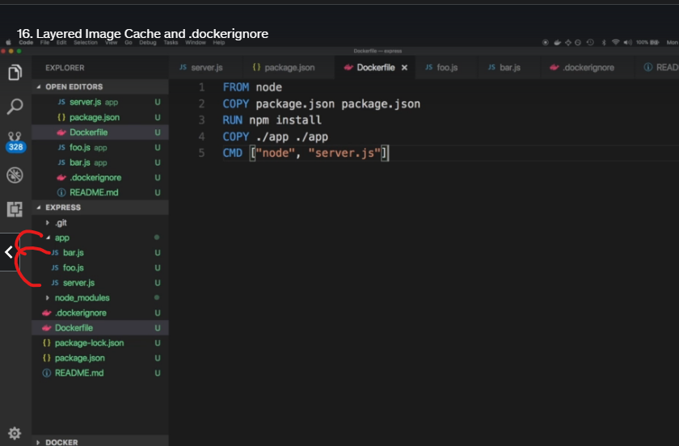

### Build an express.js image

1. _Create project directory and docker image_
- Create a folder **docker**
- Change directory to **docker** folder
```
mkdir docker
cd docker
docker $ mkdir express
docker $ cd express
docker/express $ touch Dockerfile
docker/express $ touch package.json
docker/express $ touch server.js
```
2. Open it in visual code editor
_Add the code below to **server.js** file_
```
const express = require('express);
const app = express();
const HOST = '0.0.0.0';
const PORT = 80;

app.get('/', (req, res) => {
  res.send('Hello world');
});

app.listen(PORT, HOST);

console.log(`Running on http://${HOST}:${PORT}`);
```

_Add the code below to **package.json** file_

```
{
  "dependencies": {
    "express": "^4.16.1"
  }
}
```

_Add the code below to **Dockerfile** file_

```
FROM node
COPY . .
RUN npm install
CMD ["node", "server.js"]

```

_Build the image_

```
docker build . -t emma/express
docker image ls
```

3. _Create container_

```
docker run --name=express -p=3002:80 emma/express

# Run the local port on the browser
```

4. _List containers_

```
docker container ls

# Remove the container
docker rm -f container ID
```
#### Layer Image Cache and .dockerignore

1. ##### Add README.md file

```
An express.js Docker container
```

2. Ensure you have .git initialized. 

```
git init
```

3. Install node_module directory

```
npm install
```

4. Add .dockerignore file

```
touch .dockerignore

# Add the following

README.md
node_modules/
.git/
```
5. Update the Dockerfile

```
FROM node
COPY package.json package.json
RUN npm install
COPY ./app ./app
CMD ["node", "app/server.js"]

```



6. Rebild the container

```
docker image ls

# Remove the previous container
docker rm -rf express
# Rebuild the container

docker build . -t emma/express

docker image ls
```

7. Run the container

```
docker run -d -p=3002:80 --name=express emma/express

# Run the app on the browser

localhost:3002
```