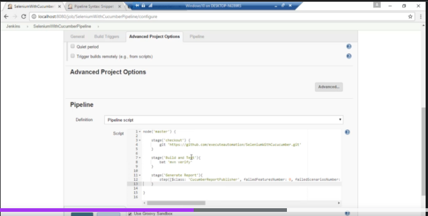

## Jenkins
- Jenkins is a self-contained, open source automation server which can be used to automate all sorts of tasks such as building, testing, and deploying software.

### Is Jenkins is like TFS?
- Well, yes in many ways, since jenkins is a continuous integration tools, but still lacks many other areas where TFS (Team Foundation Server) is much more broader than jenkins, since TFS is more of a 
> Version Control System
> Requirement Management System
> Project Management System
> Automated build management system
> Testing and release management system
> All, the above is otherwise called as Application Lifecycle Management System

### Software Pre-requisite

- We need the following softwares installed before getting started with jenkins 2.0
> JAVA (latest is good)
> Jenkins war file
- Supporting Tools
> Maven
> Nunit
> Nuget
> Git

### Install Jenkins
- Go to https://jenkins.io to download jenkins [Step by Step](https://www.jenkins.io/doc/book/installing/)
- Install [JAVA](https://java.com/en/download/windows_manual.jsp), [Step by Step](https://phoenixnap.com/kb/install-java-windows)
- Go to the location Jenkins.war was downloaded and open with commad prompt
- Type: > Java -jar jenkins.war
- Press enter key
- Note: there will be a password generated for you during the installation. Copy the password and save it for future use.
- On the browser type: localhost:8080 to start the jenkins
On the getting started page, unlock jenkins with the password copied from the step above
- Click continue and select install plugins
- When installation is completed, refresh the page
- Fill create first admin user page
- Save and finish

### Configure Jenkins for Build + Deploy + Test
> Click on Manage Jenkins 
- Select Configure global security
- Set it as you desire
- Go back to Manage jinkins and select Global Tool Configuration
- Set it as you desire
- Go back to Manage jinkins and select Configure System

### Download common tools used for Jenkins
- Install the required tools maven, nunit, nuget, git using chocolatey which is software management automation for Windows 10
- Go to [chocolatey](https://chocolatey.org/)
- Click on download chocolatey now
- Open Powershell on Windows 10
- Run Get-ExecutionPolicy to check if it is restricted.
- If the executionPoilcy is restricted, run Set-ExecutionPolicy RemoteSigned
- Run Get-ExecutionPolicy to check if it has been removed.
- Copy the command to install chocolatey on the machine: Set-ExecutionPolicy Bypass -Scope Process -Force; [System.Net.ServicePointManager]::SecurityProtocol = [System.Net.ServicePointManager]::SecurityProtocol -bor 3072; iex ((New-Object System.Net.WebClient).DownloadString('https://community.chocolatey.org/install.ps1'))
- After installation is complete, go to the chocolatey page and click on packages
- On the search, type git
- Copy the choco command to install git and run on the pwershell
- Repaet the steps for all the tools

### Building project with maven

> Building project with Maven commandline interface (Manual)

- The github to use for this project is https://github.com/executeautomation

- For java, let us cucumberbasic repo: https://github.com/executeautomation/cucumberbasic
- clone the repo
- Open the project directory with command line and type: mvn
- Clean the project: mvn clean
- Compile the project: mvn compile
- At the completion of compilation: a "target" folder will be created containing the class file

> Creating and working with Freestyle project using Jenkins
- On the Jenkins portal, click create new job
- Add item name: BasicEAFreestyle
- Select a freestyle project
- Click okay to create the job for us
- Select Source code management
- Select git and add the repo url
- Select Build Environment tab
- Under Build, select "Invoke to-level Maven targets"
- In the Goals type: compile
- Save
- On the Jenkins page, select Build now
- If the build fails, restart your machine
- Rebuild again.
- Console output can help with logs to check error

### Creating Pipeline project using Jenkins
- In the Jenkins portal, create a new item E.g "SeleniumWithCucumberPipeline"
- Select pipeline and cliclk ok to create pipeline project
- Go back to the Jenkins portal and click the SeleniumWithCucumberPipeline
- Under Advanced Project Options tab, go to Pipeline part
- Under the pipeline, click Pipeline syntax
- In the syntax, select git in the sample step
- Add the clone url of https://github.com/executeautomation/SeleniumWithCucucumber in the Repository URL
- Click Generate pipeline script
- copy the script and let go back to the advanced project options
- Pipeline definition, select Pipeline script
- Paste the script syntax and to the script 
- Go back to the Pipeline syntax snipet
- If you do not see maven in the sample step, select windows batch script
- In the batch script, type mvn verify
- Generate Pipeline script and copy it to paste in the Pipeline script
- Go back to the Pipeline syntax snipet
- Select node Allocate node in the sample step
- In the label type: master
- Generate pipeline script and copy it to paste in the Pipeline script
- save
- Click build now

### Creating Pipeline project Reporting using Jenkins
- Go to the Jenkins portal, click manage Jenkins
- Go to manage plugins
- click the available tab
- Search for cucumber reports
- Select cucumber reports
- Click install and restart
- Log out and login for the changes to take effect
- After login, go to the SeleniumWithCucumberPipeline configure
- Go back to the Pipeline syntax snipet
- In the sample step, select step: General Build Step
- Build Step, select Cucumber reports
- Generate Pipeline scripts and copy it to paste in the Pipeline script
- Rebuild the pipeline
- After the complition, there should be cucumber report.
- Click on it to see the reports

### Creating staging in Pipeline project
- On the SeleniumWithCucumberPipeline jenkins portal
- Go back to the Pipeline syntax snipet
- In the sample step, select stage stage
- Enter stage name: checkout
- Generate Pipeline scripts and copy it to paste in the Pipeline script

- save and rebuild

## Working with Jenkins for .Net based application
> Creating Freestyle project for .Net application
- Install Dotnet 4.5 on the machine
- Repo to use: https://github.com/executeautomation/SeleniumNUnitParam
- Required tools are MSBuild, Nuget, Nunit on the device using chocolatey
- Go to manage plugins
- click the available tab
- Install MSBuild plugin
- Re-login
- Use chocolatey to install MsBuild(Microsoft-Build-tool) on the machine
- In the configuration tool, under MSBuild provide the MSBuild Name
- Go to the program file and copy the MSBuild path: e.g c:\program files (x86\14.0\bin\MSBuild), paste it on the path to MSBuild
- save
- Create a new item e.g DotNetFreestyle
- Select FreeStyle project
- Ok
- Under the source control, Select Git and add the repo clone url
- Under Build Trigger,In the Build Add build step, select Build a visual studio project of solution using MSBuild
- In the Build Environment, specify the msbuild version(MSBuildLocal, MSBuildGlobal or default)
- In the MSBuild Build File, paste the solution file name form the project file. In this case is SeleniumNUnitParam.sln
- Save

> Creating Pipeline project for .Net application
- In the Jenkins portal, create a new item called DotnetPipeline
- Select Pipeline 
- Go to the Advanced Project Options
- Click Pipeline Syntax
- Follow the same step in Java above

### Configuring Email Notification with Jenkins
- Install docker for Windows - [Docker](https://docs.docker.com/desktop/windows/install/)
- Run the command on Powershell:  docker pull djfarrlly/maildev

