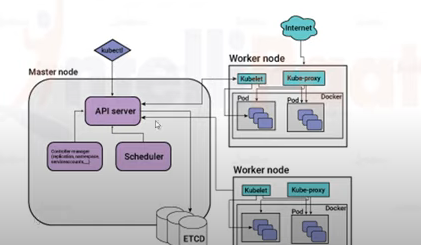

[Resource 1](https://www.youtube.com/watch?v=mdb_wWaKXK8)

1. What is **kubernetes**?

 

**Kubernetes** is a container orchestration tool that is uded for automating the tasks of managing, monitoring, scaling, and deploying containerized applications. It creates groups of containers that can be logically discovered and managed for easy operations on containers.

2. What is the difference between **Kubernetes** and **Docker Swarm**

 

**Docker Swarm** is the default container orchestration tool that come with Docker. Docker Swarm can only orchestrate simple Docker container. While **Kubernetes** offer support for larger demand production environment.
- Docker Swarm can't do auto-scaling
- Docker Swarm doesn't have a GUI
- Docker can deploy rolling updates but can't deploy automatic rollbacks
Docker requires 3rd party tools like **ELK** stack for logging and monitoring, while kubernetes has integrated tools for the same.

3. What is **Heapster**?

 

The Heapster is used for cluster monitoring and event data aggregation.

4. What is **Kubelet**?

 

The **Kubelet** is a service agent that controls and maintains a set of _pods_ by watching for pod specs through the kubernetes API server. The kubelet runs on each node and enables communication between the master and slave nodes.

5. What is **Kubectl**

 

**Kubectl** is a kubernetes command-line tool that is used for deploying and managing applications on kubernetes. It is especially useful for inspecting the cluster resources, and for creating, updating and deleting the components.

6. What are the different services within kubernetes?

 

Different types of Kubernetes services are
- **Cluster IP services**: It is the default type, but it provides internal access only.
- **Node Port service**: It allocates a specific node port which needs to be opened on the firewall. So long as external users can reach the nodes' IP addresses, they can reache the service.
- External name
- **Load Balancer service**: It expose the service externally

7. How to set a static IP for Kubernetes load balancer?

 

Kubernetes master assigns a new IP address. we can set a static IP for Kubernetes load balancer by changing the DNS record whenever Kubernetes Master assigns a nes IP address.

8. What is **ETCD**?

 

Kubernestes uses etcd as a distributed key-value store for all its data, including metadata and configuration data, and allows nodes in kubernetes clusters to read and write data.

9. How do you deploy a feature with zero downtime in Kubernates?

 

In Kubernetes you can define the update strategy in deployments, you should put Rolling Update as a strategy to ensure no down time.

10. What is the difference between **replication controllers** and **replica set**

 

Replication controllers are obsolete now in the latest version of Kubernetes. The only difference between replication controllers and replica sets is the selectors. Replication controllers don't have selectors in their spec.

11. WHat is **Kube-proxy**?

 

The kube-proxy runs on each of the nodes. Kube-proxy is responsible for directing traffic to the right container based on IP and the ports number of incoming requests.

12. What is **Headless service**?

 

Headless service is similar to that of a 'Normal' services but does not have a clusterIP. This service enables you to directly reach the pods without the need of accessing it through a proxy.

13. What is **PVC**?

 

**PVC*** stands for Persistent Volume Claim. It is storage requested by Kubernetes for pods. The user does not require to know thw underlying provisioning. The claim should be created in the same namespace where the pod is created.

14. Tell us about the different components of Kubernetes architecture

 

15. If you have to pass a sensitive in your cluster, how would you do it?

We can pass sensitive information in Kubernetes using secrets. Secrets can be created through yaml and text files.

16. WHat is sematext Docker Agent?

 

Sematext Docker agent is a log collection agent with events and metrics. It runs as small container in each Docker host. These agents gather metrics, events, and logs for all cluster nodes and conatiners