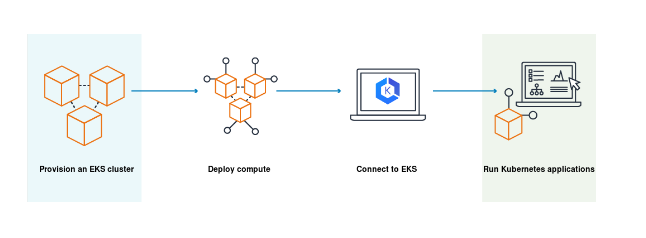

[Kubernetes](https://docs.aws.amazon.com/eks/latest/userguide/getting-started.html)

Kubernetes also known as K8s is an open-source system for automating deployment, scaling, and management of containerized application.
### How does Amazon EKS work?


### [Installing or Updating Kubectl](https://docs.aws.amazon.com/eks/latest/userguide/install-kubectl.html)

Kubectl is a command line tool that you can use to communicate with kubernetes API server.

Determine whether you already have **kubectl** installed on your device.
```
kubectl version | grep Client | cut -d : -f 5
```
### [Installing or updating eksctl](https://docs.aws.amazon.com/eks/latest/userguide/eksctl.html)

eksctl is a command line tool use for creating and managing Kubernetes clusters in AWS Eks.

### [Create Cluster using eksctl](https://docs.aws.amazon.com/eks/latest/userguide/getting-started-eksctl.html)
Node types includes
1. **Fargate-Linux-** Select this type of node if you want to run Linux applications on AWS Fargate. Fargate is a serverless compute engine that allow you deploy kubernetes pod without managing the EC2 instances.
2. **managed nodes**
3. **Windows self managed**
4. **Bottlerocket nodes**