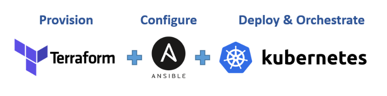
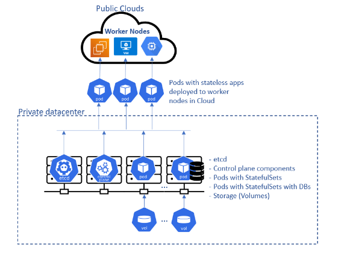

# DEPLOYING APPLICATIONS INTO KUBERNETES CLUSTER

Within this project we are going to learn and see in action following:

<br>

1. Deployment of software applications using [YAML](https://en.wikipedia.org/wiki/YAML) manifest files with following K8s objects:
- Pods
- ReplicaSets
- Deployments
- StatefulSets
- Services (ClusterIP, NodeIP, Loadbalancer)
- Configmaps
- Volumes
- PersistentVolumes
- PersistentVolumeClaims

2. Difference between stateful and stateless applications
- Deploy MySQL as a StatefulSet and explain why

3. Limitations of using manifests directly to deploy on K8s
- Working with [Helm](https://helm.sh/) templates, its components and the most important parts – semantic versioning
- Converting all the _.yaml_ templates into a helm chart

4. Deploying more tools with Helm charts on AWS Elastic [Kubernetes Service (EKS)](https://aws.amazon.com/eks/)

* Jenkins
  - MySQL
  - Ingress Controllers (Nginx)
* Cert-Manager
* Ingress for Jenkins
* Ingress for the actual application

5. Deploy Monitoring Tools
- Prometheus
- Grafana
6. Hybrid CI/CD by combining different tools such as: [Gitlab CICD](https://docs.gitlab.com/ee/ci/), Jenkins. And, you will also be introduced to concepts around [GitOps](https://www.weave.works/technologies/gitops/) using [Weaveworks Flux](https://www.weave.works/oss/flux/).

### Choosing the right Kubernetes cluster set up

When it comes to using a Kubernetes cluster, there is a number of options available depending on the ultimate use of it. For example, if you just need a cluster for development or learning, you can use lightweight tools like [Minikube](https://minikube.sigs.kubernetes.io/docs/start/), or [k3s](https://k3s.io/). These tools can run on your workstation without heavy system requirements. Obviously, there is limit to the amount of workload you can deploy there for testing purposes, but it works exactly like any other Kubernetes cluster.

<br>

On the other hand, if you need something more robust, suitable for a production workload and with more advanced capabilities such as horizontal scaling of the worker nodes, then you can consider building own Kubernetes cluster from scratch just as you did in [Project 21](https://expert-pbl.darey.io/en/latest/project21.html). If you have been able to automate the entire bootstrap using Ansible, you can easily spin up your nodes with Terraform, and configure the cluster with your Ansible configuration scripts.

<br>

It it a great combination of tools responsible for different parts of your applications:
- **Terraform** for infrastructure provisioning
- **Ansible** for cluster master and worker nodes configuration
- **Kubernetes** for deploying your containerized application and orchestrating the deployment



<br>

Other options will be to leverage a [Managed Service](https://www.adept.co.uk/the-benefits-of-cloud-managed-services-for-business/) Kubernetes cluster from public cloud providers such as: [AWS EKS](https://aws.amazon.com/eks/), [Microsoft AKS](https://azure.microsoft.com/en-gb/services/kubernetes-service), or Google Cloud Platform GKE. There are so many more options out there. Regardless of whichever one you choose, the experience is usually very similar.

Most organisations choose Managed Service options for obvious reasons such as:

1. Less administrative overheads
2. Reduced cost of ownership
3. Improved Security
4. Seamless support
5. Periodical updates to a stable and well-tested version
6. Faster cluster spin up

<br>

However, there is usually strong reasons why organisations with very strict compliance and security concerns choose to build their own Kubernetes clusters. Most of the companies that go this route will mostly use on-premises data centres. When there is need to store data privately due to its sensitive nature, companies will rather not use a public cloud provider. Because, if they do, they have no idea of the physical location of the data centre in which their data is being persisted. Banks and Governments are typical examples of this.

<br>

Some setup options can combine both public and private cloud together. For example, the master nodes, _etcd_ clusters, and some worker nodes that run [stateful](https://www.techtarget.com/whatis/definition/stateful-app) applications can be configured in private datacentres, while worker nodes that require heavy computations and [stateless](https://www.redhat.com/en/topics/cloud-native-apps/stateful-vs-stateless) applications can run in public clouds. This kind of hybrid architecture is ideal to satisfy compliance, while also benefiting from other public cloud capabilities.



### Deploying the Tooling app using Kubernetes objects

In this section, you will begin to write configuration files for Kubernetes objects (they are usually referred as **manifests**) in the form of files with **yaml** syntax and deploy them using **kubectl** console. But first, let us understand what a Kubernetes object is.

<br>

**Kubernetes objects** are persistent entities in the Kubernetes system. Kubernetes uses these entities to represent the state of your cluster. Specifically, they can describe:

<br>

What containerized applications are running (and on which nodes)
The resources available to those applications
The policies around how those applications behave, such as restart policies, upgrades, and fault-tolerance

These objects are **"record of intent"** – once you create the object, the Kubernetes system will constantly work to ensure that the object exists. By creating an object, you are effectively telling the Kubernetes system what you want your cluster’s workload to look like; this is your cluster’s desired state.

<br>

To work with Kubernetes objects – whether to create, modify, or delete them – you will need to use the Kubernetes API. When you use the kubectl command-line interface, for example, the CLI makes the necessary Kubernetes API calls for you. It is also possible to use curl to directly interact with the Kubernetes API, or it can be as part of developing a program in different programming languages. That will require some advance knowledge. You can [read more about client libraries](https://kubernetes.io/docs/reference/using-api/client-libraries/) to get an idea on how that works.

### UNDERSTANDING THE CONCEPT

Let us try to understand a bit more about how the service object is able to route traffic to the Pod.

<br>

If you run the below command:

```
kubectl get service nginx-service -o wide
```
You will get the output similar to this::
```
NAME            TYPE        CLUSTER-IP      EXTERNAL-IP   PORT(S)   AGE   SELECTOR
nginx-service   ClusterIP   10.100.71.130   <none>        80/TCP    4d    app=nginx-pod
```

As you already know, the service’s type is **ClusterIP**, and in the above output, it has the IP address of **10.100.71.130** – This IP works just like an internal loadbalancer. It accepts requests and forwards it to an IP address of any Pod that has the respective **selector label**. In this case, it is **app=nginx-pod**. If there is more than one Pod with that label, service will distribute the traffic to all theese pofs in a Round [Robin fashion](https://en.wikipedia.org/wiki/Round-robin_scheduling).

<br>

Now, let us have a look at what the Pod looks like:
```
kubectl get pod nginx-pod --show-labels
```

#### Output:

```
NAME        READY   STATUS    RESTARTS   AGE   LABELS
nginx-pod   1/1     Running   0          31m   app=nginx-pod
```
**Notice that the IP address of the Pod, is NOT the IP address of the server it is running on. Kubernetes, through the implementation of network plugins assigns virtual IP adrresses to each Pod.**

```
kubectl get pod nginx-pod -o wide
```

#### Output:
```
NAME        READY   STATUS    RESTARTS   AGE   IP               NODE                                              NOMINATED NODE   READINESS GATES
nginx-pod   1/1     Running   0          57m   172.50.197.236   ip-172-50-197-215.eu-central-1.compute.internal   <none>           <none>
```

Therefore, Service with IP **10.100.71.130** takes request and forwards to Pod with IP **172.50.197.236**

<br>

#### Self Side Task:
1. Build the Tooling app **Dockerfile** and push it to Dockerhub registry
2. Write a Pod and a Service manifests, ensure that you can access the Tooling app’s frontend using port-forwarding feature.