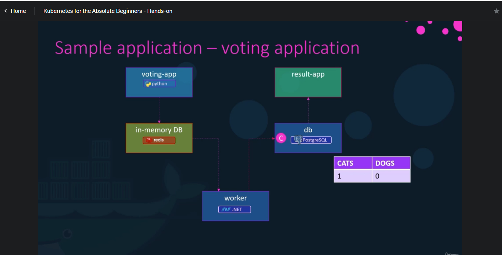
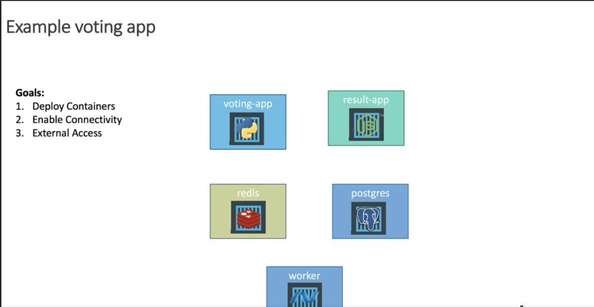
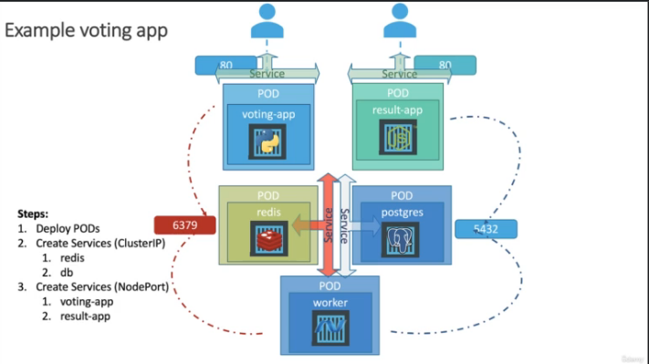
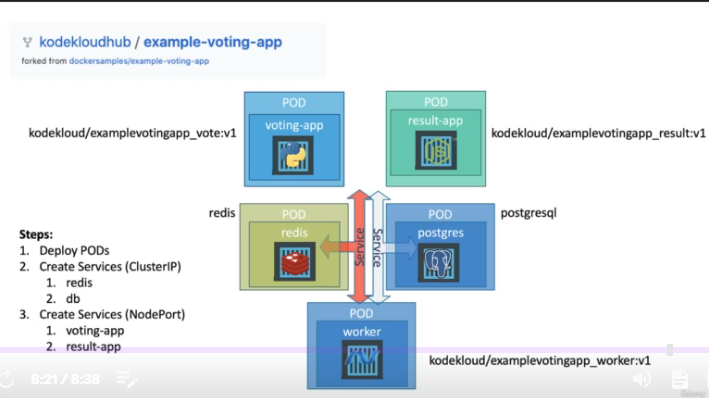

# Simple Application - Voting application on Docker



_Note:_ Assume everything has been built and available on docker image

1. **Data Layer**

```
# Run Redis instance
docker run -d --name=redis redis

# Run postgress
docker run -d --name=db postgres:9.4
```

2. **Application Image**

```
docker run -d --name=vote -p 5000:80 voting-app
```

3. **Result wep App**

```
docker run -d --name=result -p 5001:80 result-app
```

4. **Worker**

```
docker run -d --name=worker worker
```

<br>

This this point, the application will not work yet becauses the containers are not linked together

#### Links 

The link is a command line option which can be  used to connect containers together.

**Note** - The voting app depends on the Redis, result app depends on the db, worker depends on both Redis and DB.

```
docker run -d --name=vote -p 5000:80  --link redis:redis voting-app

docker run -d --name=result -p 5001:80 --link db:db result-app

docker run -d --name=worker --link db:db --link redis:redis worker
```

# Simple Application - Voting application on Kubernete

_Goals_
<br>



_Steps_

<br>



_Docker Images_
<br>




#### [Demo  - Deploying Microservices Application on Kubernetes](https://github.com/Emmy-github-webdev/microverse-on-kubernetes/tree/voting-app)

1. Create five pods
- postgres-pod
- redis-pod
- result-app-pod
- voting-app-pod
- worker-pod
2. Create four services
- Redis service
- Postgres service
- Voting app service
- Result app service

3. Run the following commands

```
# Create voting app pod and service
kubectl create -f voting-app-pod.yaml
kubectl create -f voting-app-service.yaml

# View the pods and services
kubectl get pods, svc
# Get the service URL
minikube service voting-service --url
# Launch the URL on the browser
# Create all the pods and services using the above commands
# Delete all the Pods in the cluster
```

4. Create four deploy file for all the five pods
- postgres-deploy
- redis-deploy
- result-app-deploy
- voting-app-deploy
- worker-deploy

_Note_ - Check the [repo](https://github.com/Emmy-github-webdev/microverse-on-kubernetes/tree/voting-app)

5. Run the following command

```
# Create voting app deploy and service
kubectl create -f voting-app-deploy.yaml
kubectl create -f voting-app-service.yaml

# View the deploy and services
kubectl get deployment, svc
# Get the service URL
minikube service voting-service --url
# Launch the URL on the browser
# Create all the deploymentss and services using the above commands
# Delete all the Pods in the cluster
```

## To scale up 
```
kubectl scale deoloyment voting-app-deploy --replicas=3
```

