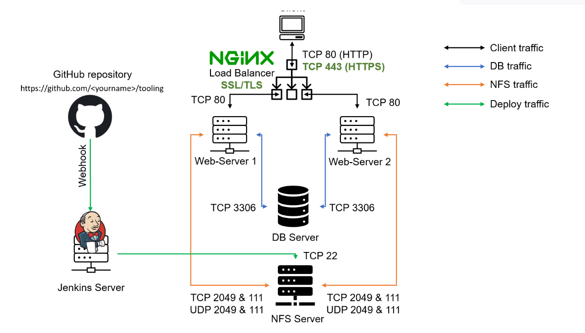

##  PROJECT 10: Load Balancer Solution With Nginx and SSL/TLS

[Resources](https://www.youtube.com/watch?v=59kBqVF4H4s&t=674s)

> Task
- This project consists of two parts:

    * Configure Nginx as a Load Balancer
    * Register a new domain name and configure secured connection using SSL/TLS certificates

    

    > Step 1: CONFIGURE NGINX AS A LOAD BALANCER