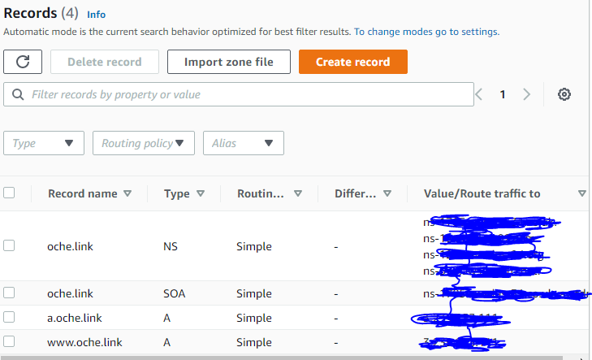
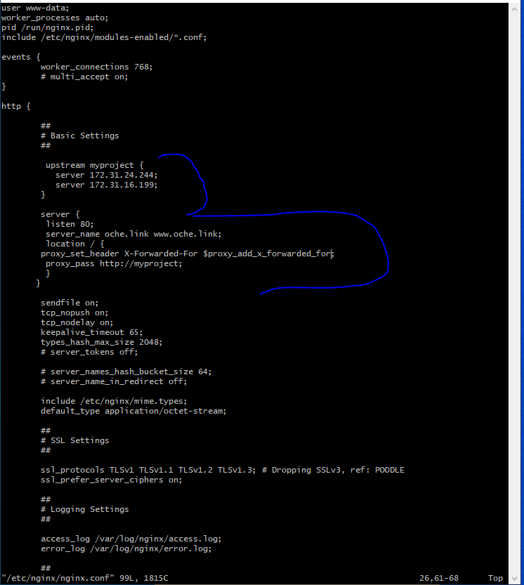
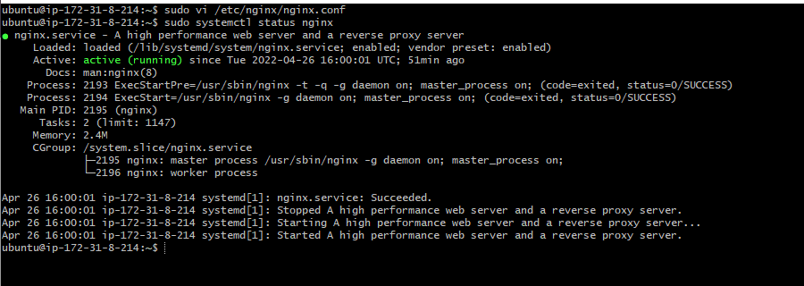
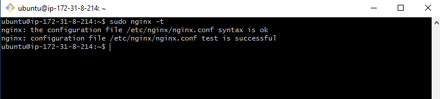
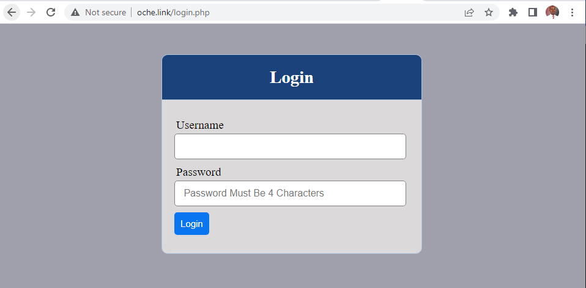

##  PROJECT 10: Load Balancer Solution With Nginx and SSL/TLS

[Resources](https://www.youtube.com/watch?v=59kBqVF4H4s&t=674s)

> Task
- This project consists of two parts:

    * Configure Nginx as a Load Balancer
    * Register a new domain name and configure secured connection using SSL/TLS certificates

    

 > Step 1: CONFIGURE NGINX AS A LOAD BALANCER
 - Create an EC2 VM based on Ubuntu Server 20.04 LTS and name it Nginx LB (do not forget to open TCP port 80 for HTTP connections, also open TCP port 443 – this port is used for secured HTTPS connections)

- Register a new domain
- Go to the AWS portal and look for Route 53
- Click create hosted zone
    * In the domain name, add the domain you register above
    * Select public
    * create
    * If you register your domain outside AWS, ensure to create the DNS records the for connectivity
    - Update /etc/hosts file for local DNS with Web Servers’ names (e.g. Web1 and Web2) and their local IP addresses
- Install and configure Nginx as a load balancer to point traffic to the resolvable DNS names of the webservers
2. Create A Record for the domain name
    * Copy of the public IP address of the load balancer created above
    * In Create records, past the IP Address in the value tab
2. Create www Record for the domain name
    * Copy of the public IP address of the load balancerr created above
    * In Create records, past the IP Address in the value tab
 
 

- At this point, connection is created between load balancer and the Route 53

- Update and Install Ngnix
```
sudo apt update
sudo apt install nginx

```
- Open the default nginx configuration file
* sudo vi /etc/nginx/nginx.conf
```
insert following configuration into http section

 upstream myproject {
    server Web1 weight=5;
    server Web2 weight=5;
  }

server {
    listen 80;
    server_name www.domain.com;
    location / {
      proxy_pass http://myproject;
    }
  }

#comment out this line
#       include /etc/nginx/sites-enabled/*;

```
- Configure Nginx to recognize your new domain name
    * Update your nginx.conf with server_name www.your-domain-name.com instead of server_name www.domain.com

    


- Restart Nginx and make sure the service is up and running
```
sudo systemctl restart nginx
  sudo systemctl status nginx

```
 

- Remove the default file so the reverse proxy will be rediected to the newconfiguration file

- Change directory to Ngnix site enabled
```
cd /etc/nginx/sites-enabled/
```

```
sudo rm -rf default
```
- Check if Nginx is successfully configured
```
sudo nginx -t
```
 


- Link loade balancer config file with the site enabled

```
sudo ln -s ../sites-available/load_balancer.conf .
ls
ll
```

- Lunch the domian and it should redirect to the webs erver: www.oche.link/login.php

 


- Install [certbot](https://certbot.eff.org/) and request for an SSL/TLS certificate

  * Make sure snapd service is active and running
  ```
  sudo systemctl status snapd
  ```
  * Install certbot
  ```
  sudo snap install --classic certbot
  ```
  * Request your certificate
  ```
  sudo ln -s /snap/bin/certbot /usr/bin/certbot
  sudo certbot --nginx
  ```
- Reload Nginx
    * sudo nginx -t && sudo nginx -s reload
- Setup SSl/TLS
- Test secure access to your website by using https: https://www.oche.link

> [HTTP Load Balancing](https://docs.nginx.com/nginx/admin-guide/load-balancer/http-load-balancer/)

- Set up periodical renewal of your SSL/TLS certificate
    * You can test renewal command in dry-run mode
    ```
    sudo certbot renew --dry-run
    ```
    * Best pracice is to have a scheduled job that to run renew command periodically. Let us configure a cronjob to run the command twice a day. To do so, lets edit the crontab file with the following command:
    ```
    crontab -e
    ```
    * Add the following 
    ```
    * */12 * * *   root /usr/bin/certbot renew > /dev/null 2>&1
    ```
   [online cron expression editor.](https://crontab.guru/)