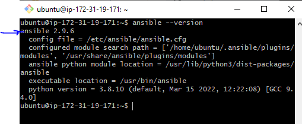
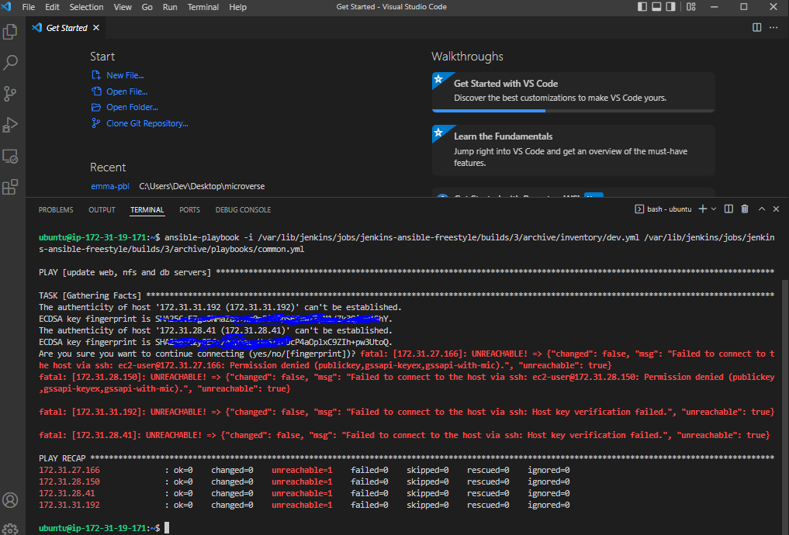

## ANSIBLE CONFIGURATION MANAGEMENT – AUTOMATE PROJECT 7 TO 10

[Resources](https://www.youtube.com/watch?v=uuhhOhWTrrs)

> Task
- Install and configure Ansible client to act as a Jump Server/Bastion Host
- Create a simple Ansible playbook to automate servers configuration
 

- Update Name tag on your Jenkins EC2 Instance to Jenkins-Ansible. We will use this server to run playbooks

 

 > STEP 1 - INSTALL AND CONFIGURE ANSIBLE ON EC2 INSTANCE

 - In your GitHub account create a new repository and name it ansible-config-mgt.

  

- [Instal Ansible](https://docs.ansible.com/ansible/latest/installation_guide/intro_installation.html)

```
 sudo apt update

 sudo apt install ansible
```

- Check Ansible version
```
ansible --version
```
 

- [Install Jenkins](https://pkg.jenkins.io/debian-stable/)
    ```
        wget -q -O - https://pkg.jenkins.io/debian-stable/jenkins.io.key | sudo apt-key add -
        sudo sh -c 'echo deb http://pkg.jenkins.io/debian-stable binary/ > /etc/apt/sources.list.d/jenkins.list'
        sudo apt-get update
        sudo apt-get install jenkins
    ```

      


-  Verify jenkins is up and running
    ```
        sudo systemctl status jenkins
    ```
    
- Perform Iniatial Jenkins Setup
    * From browser, access http://Jenkins-Server-Public-IP-Address-or-Public-DNS-Name:8080

    

    * Retrieve the adminstrator password from your server: sudo cat /var/lib/jenkins/secrets/initialAdminPassword

      

    * Enter the password in the administrator page above and click continue

    

    * Click Install suggested plugins
    * Create admin account after plugins installation is completed

      

    * Jenkins URL - http://34.229.141.79:8080/

    

    * save and continue

     
  

- Configure webhook to communicatw with Jenkins whenever changes are made
    * In the GitHub repo, go to the settings
    * Click Webhooks
    * Click add webhook
    * In the payload URL, add the Jenkins URL: https://x.x.x.x:8080/github-webhook/
    * In content type, select ""application/json
    * Under "Which events would you like to trigger webhook", select"Just the push event"
    * Leave active checked
    * Click Add

    

- Configure Jenkins build job to save your repository content every time you change it
    * Create a new Freestyle project ansible in Jenkins - jenkins-ansible-freestyle

      

    * Go to the "Source Code Management of the Ansible freestyle"
    * Select Git
    * Copy the Git repo URL for ansible-config-mgt and paste in the Repository URL
    * Select type the branch name

       

    * Under Build Triggers, select "GitHub hook trigger for GITScm polling"
    * Under "Post-build Actions", select "Archive the artifacts"
    * In the File to archive type two stars " ** "
    * click on Save

     

    * Go back to the Ansible freestyle project and click on "Build now"

     
- Test your setup by making some change in README.MD file in master branch and make sure that builds starts automatically

 

 


- Jenkins saves the files (build artifacts) in following folder
```
sudo ls /var/lib/jenkins/jobs/jenkins-ansible-freestyle/builds
```
> Note - Check your build console, your path may be different due to the project name

* It should display the number of builds

 


```
ls /var/lib/jenkins/jobs/jenkins-ansible-freestyle/builds/<build_number>/archive/
```
* It should display the file that changes were made. For this case is README.md
* To view the content of the file 

```
cd /var/lib/jenkins/jobs/jenkins-ansible-freestyle/builds/<build_number>/archive/
cat the_file_name e.g cat README.md
exit
```

> Step 2 – Prepare your development environment using Visual Studio Code
- Download and Install VS code
- Install Remote development extension
- Clone the ansible-config-mgt repo

> Step 3 - BEGIN ANSIBLE DEVELOPMENT
- In the ansible-config-mgt GitHub repository, create a new branch that will be used for development of a new feature.
    * Tip: Give your branches descriptive and comprehensive names, for example, if you use Jira or Trello as a project management tool – include ticket number (e.g. PRJ-145) in the name of your branch and add a topic and a brief description what this branch is about – a bugfix, hotfix, feature, release (e.g. feature/prj-145-lvm)
- Checkout the newly created feature branch to your local machine and start building your code and directory structure
- Create a directory (folder) and name it playbooks – it will be used to store all your playbook files.
- Create a directory (folder) and name it inventory – it will be used to keep your hosts organised.
- Within the playbooks folder, create your first playbook, and name it common.yml
- Within the inventory folder, create an inventory file (.yml) for each environment (Development, Staging Testing and Production) dev, staging, uat, and prod respectively.

> Step 4 – Set up an Ansible Inventory

- An Ansible inventory file defines the hosts and groups of hosts upon which commands, modules, and tasks in a playbook operate. Since our intention is to execute Linux commands on remote hosts, and ensure that it is the intended configuration on a particular server that occurs. It is important to have a way to organize our hosts in such an Inventory.

Save below inventory structure in the inventory/dev file to start configuring your development servers. 

```
 eval `ssh-agent -s`
 ssh-add <path-to-private-key>
```
Where path-to-private-key is the .pem key


- Confirm the key has been added

```
ssh-add -l
```


- Now, ssh into your Jenkins-Ansible server using ssh-agent

```
ssh -A ubuntu@public-ip

```


- Confirm the key has been added

```
ssh-add -l
```


- Notice, that your Load Balancer user is ubuntu and user for RHEL-based servers is ec2-user, and use the .pem configure above

- Spin up four RedHat servers and one Ubuntu
- Confirm the Ansible-server has ssh access to the other servers
```
ssh ubuntu@x.x.x.x

```

- Note ubuntu@x.x.x.x is the load balancer server. Check the rest servers too (Web, db, nfs)


- Update your inventory/dev.yml file with this snippet of code:

```

[nfs]
<NFS-Server-Private-IP-Address> ansible_ssh_user='ec2-user'

[webservers]
<Web-Server1-Private-IP-Address> ansible_ssh_user='ec2-user'
<Web-Server2-Private-IP-Address> ansible_ssh_user='ec2-user'

[db]
<Database-Private-IP-Address> ansible_ssh_user='ec2-user' 

[lb]
<Load-Balancer-Private-IP-Address> ansible_ssh_user='ubuntu'

```


> Step 5 – Create a Common Playbook
- It is time to start giving Ansible the instructions on what you needs to be performed on all servers listed in inventory/dev.

- In common.yml playbook you will write configuration for repeatable, re-usable, and multi-machine tasks that is common to systems within the infrastructure.
 * Update your playbooks/common.yml file with following code:

 ```
 ---
- name: update web, nfs and db servers
  hosts: webservers, nfs, db
  remote_user: ec2-user
  become: yes
  become_user: root
  tasks:
    - name: ensure wireshark is at the latest version
      yum:
        name: wireshark
        state: latest

- name: update LB server
  hosts: lb
  remote_user: ubuntu
  become: yes
  become_user: root
  tasks:
    - name: Update apt repo
      apt: 
        update_cache: yes

    - name: ensure wireshark is at the latest version
      apt:
        name: wireshark
        state: latest
```

> Step 6 – Update GIT with the latest code

- Commit your code into GitHub:
```
git status

git add <selected files>

git commit -m "commit message"

```
- Create a Pull request (PR)
- Wear a hat of another developer for a second, and act as a reviewer.
- If the reviewer is happy with your new feature development, merge the code to the master branch
- Head back on your terminal, checkout from the feature branch into the master, and pull down the latest changes.


- Once your code changes appear in master branch – Jenkins will do its job and save all the files (build artifacts) to /var/lib/jenkins/jobs/jenkins-ansible-freestyle/builds/build_number/archive/ directory on Jenkins-Ansible server. You can confirm


> Step 7 – Run first Ansible test
- Now, it is time to execute ansible-playbook command and verify if your playbook actually works:


```
ansible-playbook -i /var/lib/jenkins/jobs/jenkins-ansible-freestyle/builds/3/archive/inventory/dev.yml  /var/lib/jenkins/jobs/jenkins-ansible-freestyle/builds/3/archive/playbooks/common.yml

```



- You can go to each of the servers and check if wireshark has been installed by running
```
which wireshark
 or 
wireshark --version
```