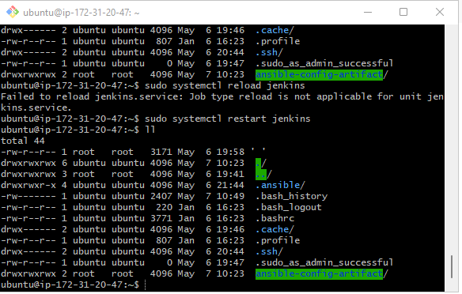
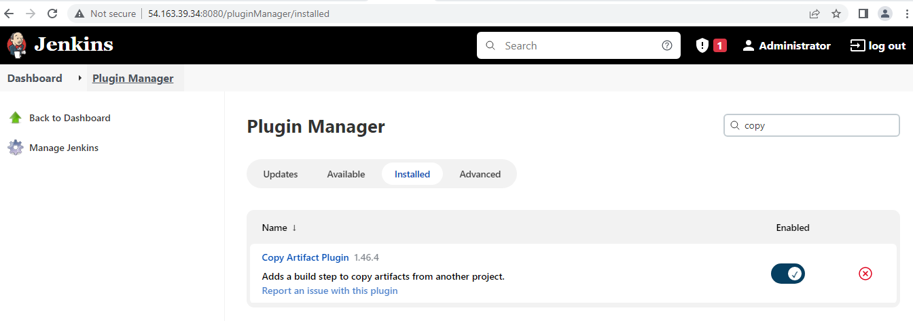
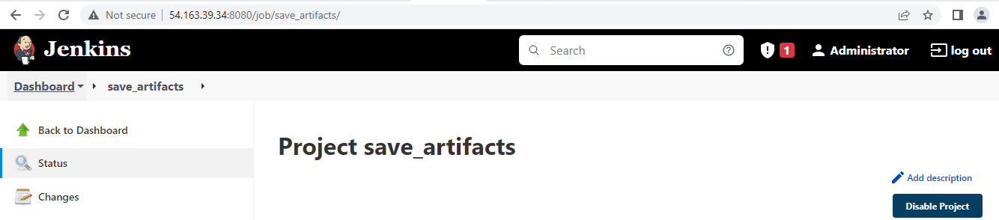
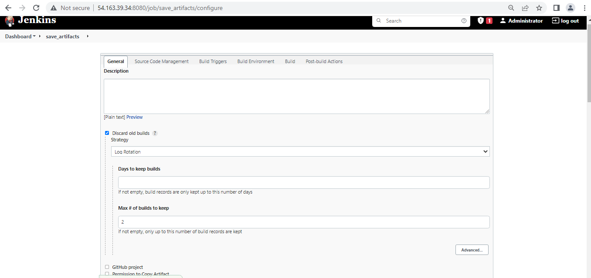
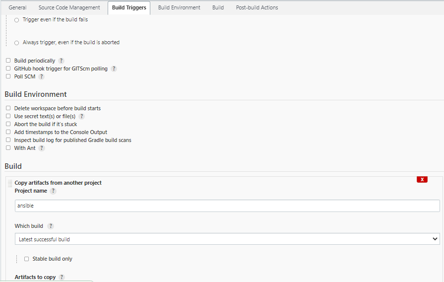
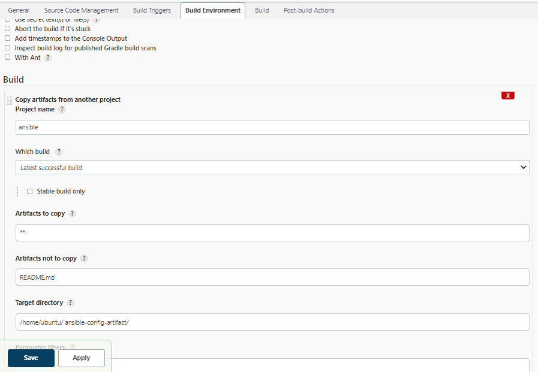
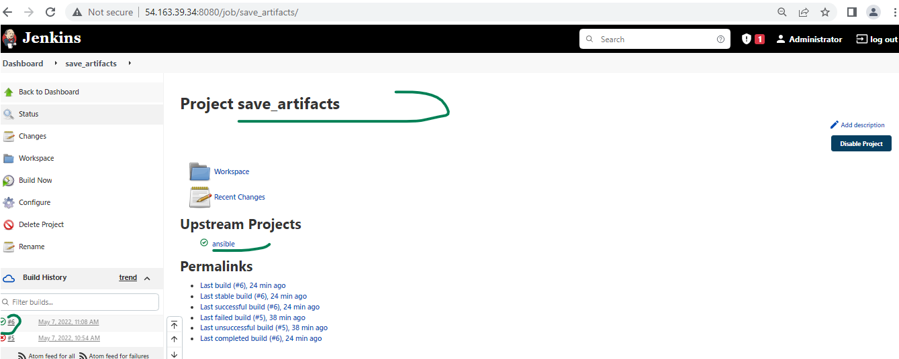
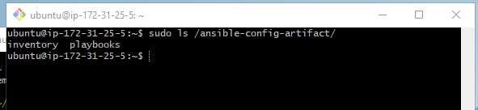
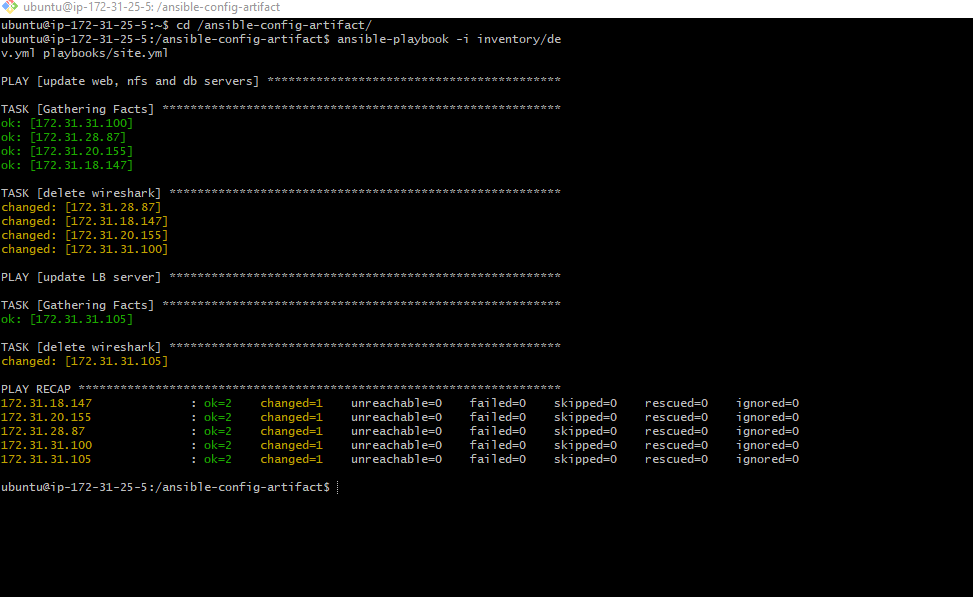

##  Project 12 Ansible Refactoring, Assignments & Imports

[For better understanding or Ansible artifacts re-use](https://docs.ansible.com/ansible/latest/user_guide/playbooks_reuse.html)

 > Use [project 11](https://github.com/Emmy-github-webdev/emma-pbl/blob/main/project11.md) infrastructure as a continuation of project 12.

> Step 1– Jenkins job enhancement
- Go to your Jenkins-Ansible server and create a new directory called _ansible-config-artifact_ – we will store there all artifacts after each build.

```
sudo mkdir /ansible-config-artifact
```

- Change permissions to this directory, so Jenkins could save files there 
```
sudo chmod 0777 /ansible-config-artifact
```

- Check the permission
```
ll

```



- Go to Jenkins web console -> Manage Jenkins -> Manage Plugins -> on Available tab search for Copy Artifact and install this plugin without restarting Jenkins



- Create a new Freestyle project (you have done it in Project 9) and name it save_artifacts.



- This project will be triggered by completion of your existing ansible project. Configure it accordingly:

  * Under General tab, select "Discard old builds"
  * A new input form will be open, add the max # of builds to keep
  * Under build triggers, select "Build after other projects are built"
  * In the input form that open, enter project to watch. In tis case we use the "Ansible" in project 11.
  * Select trigger only if the build is stable
  * Under "Build" select ""Copy artifacts from another project
  * In the input form that open, enter the project name, in this case "Ansible"
  * In the artifact copy, type "**"
  * In the target directory, enter the directory created above "/ansible-config-artifact"
  * save

  

  

  

  

- Test your set up by making some change in README.MD file inside your ansible-config-mgt repository (right inside master branch).

  

- If both Jenkins jobs have completed one after another – you shall see your files inside /ansible-config-artifact directory and it will be updated with every commit to your master branch.




> Step 2 – Refactor Ansible code by importing other playbooks into site.yml

- Most Ansible users learn the one-file approach first. However, breaking tasks up into different files is an excellent way to organize complex sets of tasks and reuse them.
- Let see code re-use in action by importing other playbooks.
1. Within playbooks folder, create a new file and name it site.yml – This file will now be considered as an entry point into the entire infrastructure configuration. Other playbooks will be included here as a reference. In other words, site.yml will become a parent to all other playbooks that will be developed. Including common.yml that you created previously. Dont worry, you will understand more what this means shortly.

2. Create a new folder in root of the repository and name it static-assignments. The static-assignments folder is where all other children playbooks will be stored. This is merely for easy organization of your work. It is not an Ansible specific concept, therefore you can choose how you want to organize your work. You will see why the folder name has a prefix of static very soon. For now, just follow along.

3. Move common.yml file into the newly created static-assignments folder.

4. Inside site.yml file, import common.yml playbook.
```
---
- hosts: all
   import_playbook: ../static-assignments/common.yml

```

The code above uses built in [import_playbook](https://docs.ansible.com/ansible/latest/collections/ansible/builtin/import_playbook_module.html) Ansible module.

- Your folder structure should look like this;

```
├── static-assignments
│   └── common.yml
├── inventory
    └── dev
    └── stage
    └── uat
    └── prod
└── playbooks
    └── site.yml
```
5. Run ansible-playbook command against the dev environment
> Since you need to apply some tasks to your dev servers and wireshark is already installed – you can go ahead and create another playbook under static-assignments and name it common-del.yml. In this playbook, configure deletion of wireshark utility.

```
---
- name: update web, nfs and db servers
  hosts: webservers, nfs, db
  remote_user: ec2-user
  become: yes
  become_user: root
  tasks:
  - name: delete wireshark
    yum:
      name: wireshark
      state: removed

- name: update LB server
  hosts: lb
  remote_user: ubuntu
  become: yes
  become_user: root
  tasks:
  - name: delete wireshark
    apt:
      name: wireshark-qt
      state: absent
      autoremove: yes
      purge: yes
      autoclean: yes

```

* update site.yml with - import_playbook: ../static-assignments/common-del.yml instead of common.yml and run it against dev servers:

```
cd /home/ubuntu/ansible-config-mgt/

ansible-playbook -i inventory/dev.yml playbooks/site.yaml

```




* Make sure that wireshark is deleted on all the servers by running wireshark --version


* Now you have learned how to use import_playbooks module and you have a ready solution to install/delete packages on multiple servers with just one command.

> Step 3 – Configure UAT Webservers with a role ‘Webserver’

1. Launch 2 fresh EC2 instances using RHEL 8 image, we will use them as our uat servers, so give them names accordingly – Web1-UAT and Web2-UAT.
2. To create a role, you must create a directory called roles/, relative to the playbook file or in /etc/ansible/ directory.
  * Use an Ansible utility called ansible-galaxy inside ansible-config-mgt/roles directory (you need to create roles directory upfront)
```
  mkdir roles
  cd roles
  ansible-galaxy init webserver
```
* Create the directory/files structure manually
* The entire folder structure should look like below, but if you create it manually – you can skip creating tests, files, and vars or remove them if you used ansible-galaxy
```
└── webserver
    ├── README.md
    ├── defaults
    │   └── main.yml
    ├── files
    ├── handlers
    │   └── main.yml
    ├── meta
    │   └── main.yml
    ├── tasks
    │   └── main.yml
    ├── templates
    ├── tests
    │   ├── inventory
    │   └── test.yml
    └── vars
        └── main.yml
```
* After removing unnecessary directories and files, the roles structure should look like this

```
└── webserver
    ├── README.md
    ├── defaults
    │   └── main.yml
    ├── handlers
    │   └── main.yml
    ├── meta
    │   └── main.yml
    ├── tasks
    │   └── main.yml
    └── templates
```
3. Update your inventory ansible-config-mgt/inventory/uat.yml file with IP addresses of your 2 UAT Web servers use ssh agent to connect Jenkins-Ansible instance

```
[uat-webservers]
<Web1-UAT-Server-Private-IP-Address> ansible_ssh_user='ec2-user' 

<Web2-UAT-Server-Private-IP-Address> ansible_ssh_user='ec2-user'
```
4. In /etc/ansible/ansible.cfg file uncomment roles_path string and provide a full path to your roles directory roles_path  = /ansible-config/roles, so Ansible could know where to find configured roles.
5. It is time to start adding some logic to the webserver role. Go into tasks directory, and within the main.yml file, start writing configuration tasks to do the following:
* Install and configure Apache (httpd service)
* Clone Tooling website from GitHub https://github.com/your-name/tooling.git.
* Ensure the tooling website code is deployed to /var/www/html on each of 2 UAT Web servers.
* Make sure httpd service is started
* Your main.yml may consist of following tasks:

```
---
- name: install apache
  become: true
  ansible.builtin.yum:
    name: "httpd"
    state: present

- name: install git
  become: true
  ansible.builtin.yum:
    name: "git"
    state: present

- name: clone a repo
  become: true
  ansible.builtin.git:
    repo: https://github.com/<your-name>/tooling.git
    dest: /var/www/html
    force: yes

- name: copy html content to one level up
  become: true
  command: cp -r /var/www/html/html/ /var/www/

- name: Start service httpd, if not started
  become: true
  ansible.builtin.service:
    name: httpd
    state: started

- name: recursively remove /var/www/html/html/ directory
  become: true
  ansible.builtin.file:
    path: /var/www/html/html
    state: absent
```

> Step 4 – Reference ‘Webserver’ role
1. Within the static-assignments folder, create a new assignment for uat-webservers uat-webservers.yml. This is where you will reference the role.
```
---
- hosts: uat-webservers
  roles:
     ../webserver
```
2. Remember that the entry point to our ansible configuration is the site.yml file. Therefore, you need to refer your uat-webservers.yml role inside site.yml.

* So, we should have this in site.yml
```
---
- hosts: all
  import_playbook: ../static-assignments/common.yml

- hosts: uat-webservers
  import_playbook: ../static-assignments/uat-webservers.yml
```

> Step 5 – Commit & Test
- Commit your changes, create a Pull Request and merge them to master branch, make sure webhook triggered two consequent Jenkins jobs, they ran successfully and copied all the files to your Jenkins-Ansible server into /ansible-config-mgt/ directory.
- Now run the playbook against your uat inventory and see what happens:
```
sudo ansible-playbook -i /ansible-config-artifact/inventory/uat.yml /ansible-config-artifact/playbooks/site.yml
```