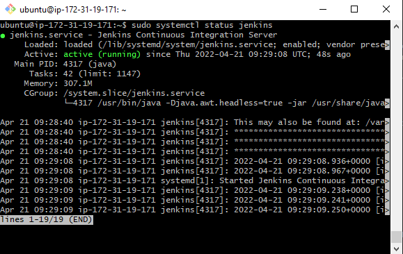
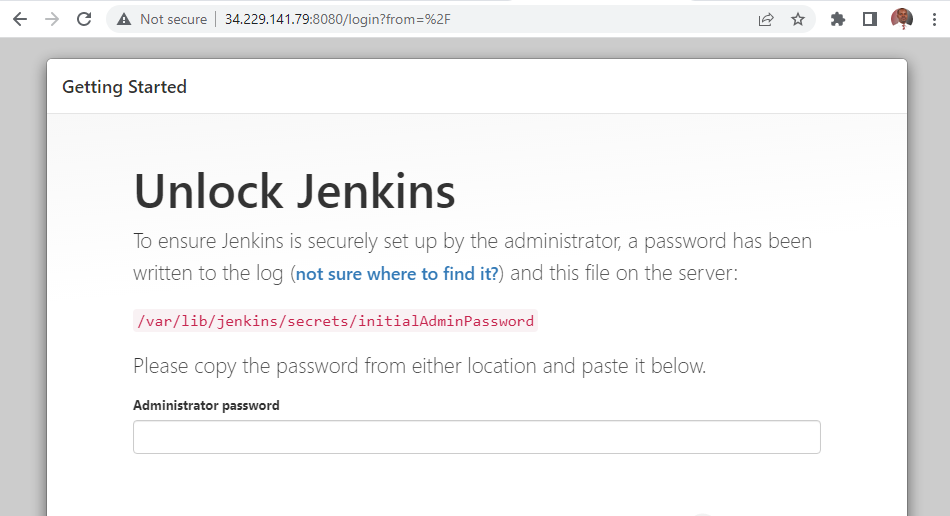
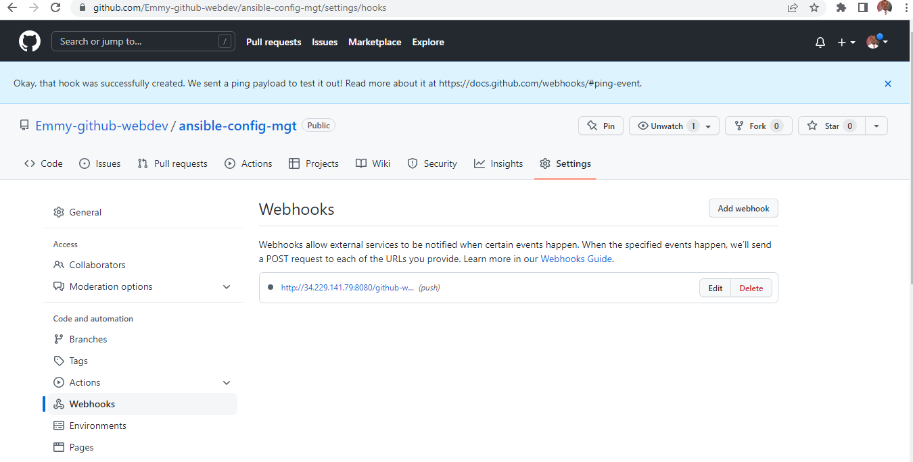
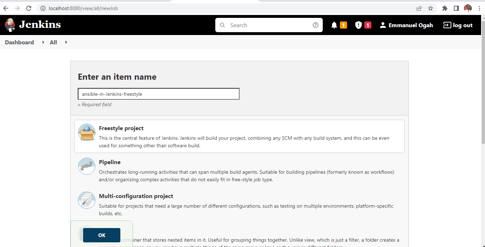
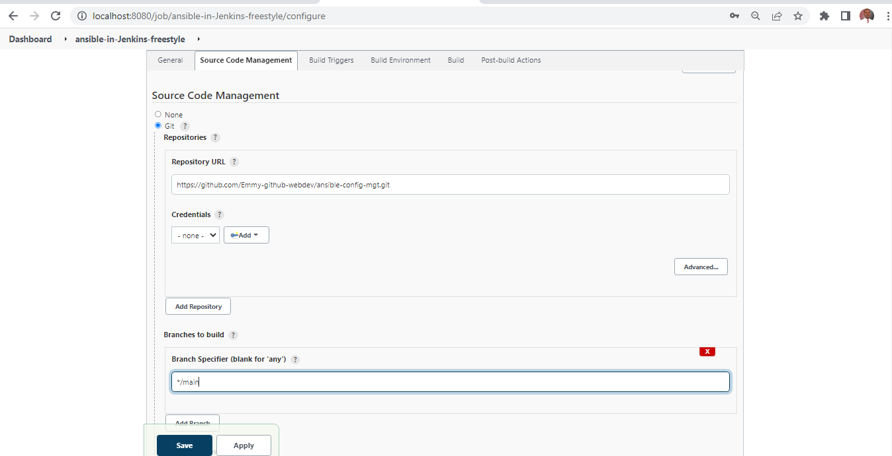

##  Project 12 Ansible Refactoring, Assignments & Imports

[For better understanding or Ansible artifacts re-use](https://docs.ansible.com/ansible/latest/user_guide/playbooks_reuse.html)

> Step 1 - Install Jenkins Server
1. Create an AWS EC2 server based on Ubuntu server 20.04 LTS and name it "Jenkins" with TCP port 8080 open in the inbound rule
2. Install[JDK](https://en.wikipedia.org/wiki/Java_Development_Kit)

[Download Jenkins](https://www.jenkins.io/download/)
   ```
    sudo apt update
    sudo apt install default-jdk-headless

   ```
3. Install Jenkins
    ```
        wget -q -O - https://pkg.jenkins.io/debian-stable/jenkins.io.key | sudo apt-key add -
        sudo sh -c 'echo deb http://pkg.jenkins.io/debian-stable binary/ > /etc/apt/sources.list.d/jenkins.list'
        sudo apt-get update
        sudo apt-get install jenkins
    ```
4. Verify jenkins is up and runningh
    ```
        sudo systemctl status jenkins
    ```
    
5. Perform Iniatial Jenkins Setup
    * From browser, access http://Jenkins-Server-Public-IP-Address-or-Public-DNS-Name:8080

    

    * Retrieve the adminstrator password from your server: sudo cat /var/lib/jenkins/secrets/initialAdminPassword

      

    * Enter the password in the administrator page above and click continue

    

    * Click Install suggested plugins
    * Create admin account after plugins installation is completed

      

    * Jenkins URL - http://34.229.141.79:8080/

    

    * save and continue

6. Change directory to where the .pem key is located locally and run the following command


```
 eval `ssh-agent -s`
 ssh-add -k <path-to-private-key>
```
Where path-to-private-key is the .pem key


- Confirm the key has been added

```
ssh-add -l
```


- Now, ssh into your Jenkins-Ansible server using ssh-agent

```
ssh -A ubuntu@public-ip

```


- Confirm the key has been added

```
ssh-add -l
```


- Configure webhook to communicatw with Jenkins whenever changes are made
    * In the GitHub repo, go to the settings
    * Click Webhooks
    * Click add webhook
    * In the payload URL, add the Jenkins URL: https://x.x.x.x:8080/github-webhook/
    * In content type, select ""application/json
    * Under "Which events would you like to trigger webhook", select"Just the push event"
    * Leave active checked
    * Click Add

    

> Step 2 – Jenkins job enhancement
- Go to your Jenkins-Ansible server and create a new directory called _ansible-config-artifact_ – we will store there all artifacts after each build.

```
sudo mkdir /home/ubuntu/ansible-config-artifact
```

- Change permissions to this directory, so Jenkins could save files there – chmod -R 0777 /home/ubuntu/ansible-config-artifact

- Go to Jenkins web console -> Manage Jenkins -> Manage Plugins -> on Available tab search for Copy Artifact and install this plugin without restarting Jenkins

- Configure Jenkins build job to save your repository content every time you change it
    * Create a new Freestyle project ansible in Jenkins - ansible

      

    * Go to the "Source Code Management of the Ansible freestyle"
    * Select Git
    * Copy the Git repo URL for ansible-config-mgt and paste in the Repository URL
    * Select type the branch name

       

    * Under Build Triggers, select "GitHub hook trigger for GITScm polling"
    * Under "Post-build Actions", select "Archive the artifacts"
    * In the File to archive type two stars " ** "
    * click on Save
    * click build now to confirm the build

     

 - This project will be triggered by completion of your existing ansible project. Configure it accordingly:
     * Create a new Freestyle project ansible in Jenkins - save_artifacts
     * Follow the image below for the configuration

      

- The main idea of save_artifacts project is to save artifacts into /home/ubuntu/ansible-config-artifact directory. To achieve this, create a Build step and choose Copy artifacts from other project, specify ansible as a source project and /home/ubuntu/ansible-config-artifact as a target directory.

  

- Test your set up by making some change in README.MD file inside your ansible-config-mgt repository (right inside master branch).
If both Jenkins jobs have completed one after another – you shall see your files inside /home/ubuntu/ansible-config-artifact directory and it will be updated with every commit to your master branch.