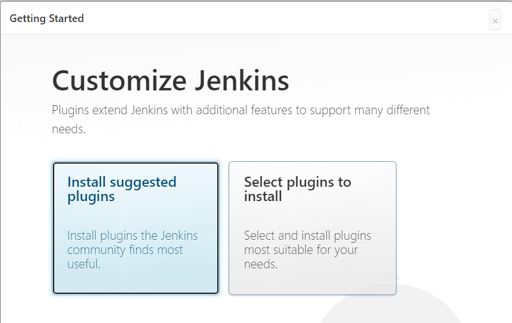
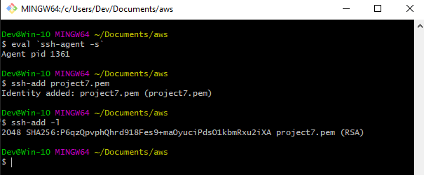
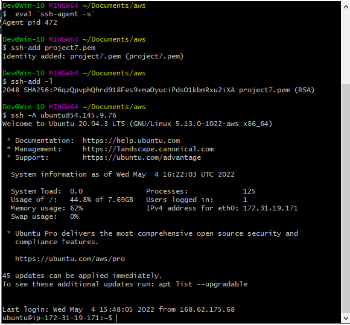

##  Project 12 Ansible Refactoring, Assignments & Imports

[For better understanding or Ansible artifacts re-use](https://docs.ansible.com/ansible/latest/user_guide/playbooks_reuse.html)

> Step 1 - Install Jenkins Server
1. Create an AWS EC2 server based on Ubuntu server 20.04 LTS and name it "Jenkins" with TCP port 8080 open in the inbound rule
2. Install[JDK](https://en.wikipedia.org/wiki/Java_Development_Kit)

[Download Jenkins](https://www.jenkins.io/download/)
   ```
    sudo apt update
    sudo apt install default-jdk-headless

   ```
3. Install Jenkins
    ```
        wget -q -O - https://pkg.jenkins.io/debian-stable/jenkins.io.key | sudo apt-key add -
        sudo sh -c 'echo deb http://pkg.jenkins.io/debian-stable binary/ > /etc/apt/sources.list.d/jenkins.list'
        sudo apt-get update
        sudo apt-get install jenkins
    ```
4. Verify jenkins is up and runningh
    ```
        sudo systemctl status jenkins
    ```
    
5. Perform Iniatial Jenkins Setup
    * From browser, access http://Jenkins-Server-Public-IP-Address-or-Public-DNS-Name:8080

    

    * Retrieve the adminstrator password from your server: sudo cat /var/lib/jenkins/secrets/initialAdminPassword

      

    * Enter the password in the administrator page above and click continue

    

    * Click Install suggested plugins
    * Create admin account after plugins installation is completed

      

    * Jenkins URL - http://34.229.141.79:8080/

    

    * save and continue

6. Change directory to where the .pem key is located locally and run the following command


```
 eval `ssh-agent -s`
 ssh-add -k <path-to-private-key>
```
Where path-to-private-key is the .pem key


- Confirm the key has been added

```
ssh-add -l
```


- Now, ssh into your Jenkins-Ansible server using ssh-agent

```
ssh -A ubuntu@public-ip

```



- Confirm the key has been added

```
ssh-add -l
```

