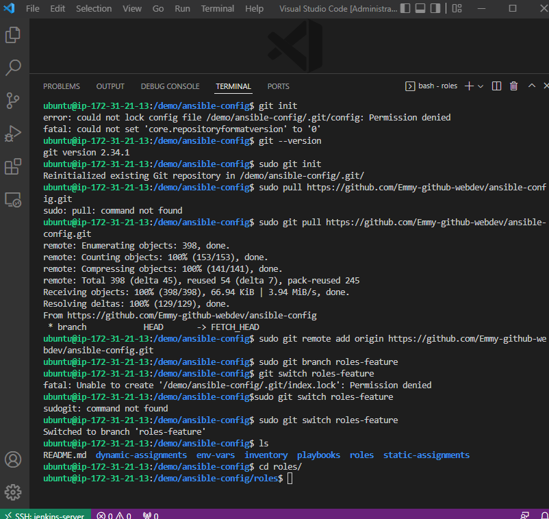
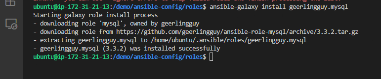
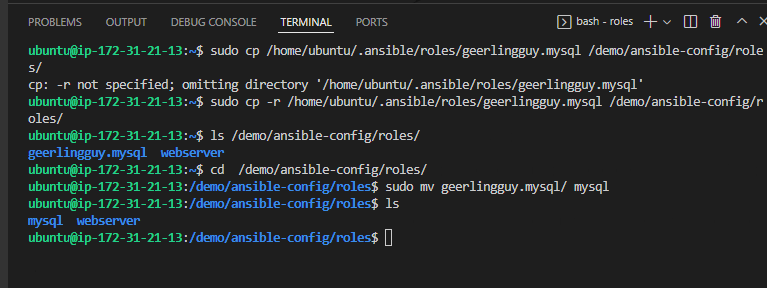
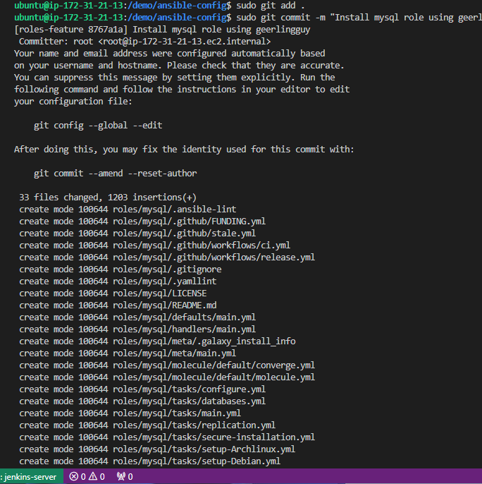

##  Ansible Dynamic Assignments (Include) and Community Roles

[Ansible Documentation](https://docs.ansible.com/)

### Ansible dependencies

```
- sudo apt-get install python3 python3-pip wget unzip git -y
- sudo python3 -m pip install --upgrade setuptools
- sudo python3 -m pip install --upgrade pip
- sudo python3 -m pip install PyMySQL
- sudo python3 -m pip install mysql-connector-python
- sudo python3 -m pip install psycopg2==2.7.5 --ignore-installed

```

> Introducing Dynamic Assignment Into Our structure
1. In your https://github.com/your-name/ansible-config GitHub repository (Project fro project 12) start a new branch and call it dynamic-assignments.
2. Create a new folder, name it dynamic-assignments. Then inside this folder, create a new file and name it env-vars.yml. We will instruct site.yml to include this playbook later. For now, let us keep building up the structure.
3. create a new folder env-vars, then for each environment, create new YAML files which we will use to set variables.
* The layout should now look like this below
```
├── dynamic-assignments
│   └── env-vars.yml
├── env-vars
    └── dev.yml
    └── stage.yml
    └── uat.yml
    └── prod.yml
├── inventory
    └── dev
    └── stage
    └── uat
    └── prod
├── playbooks
    └── site.yml
└── static-assignments
    └── common.yml
    └── webservers.yml
```
4. Now paste the instruction below into the env-vars.yml file.
```
---
- name: collate variables from env specific file, if it exists
  hosts: all
  tasks:
    - name: looping through list of available files
      include_vars: "{{ item }}"
      with_first_found:
        - files:
            - dev.yml
            - stage.yml
            - prod.yml
            - uat.yml
          paths:
            - "{{ playbook_dir }}/../env-vars"
      tags:
        - always
```
5. We made use of a special variables { playbook_dir } and { inventory_file }. { playbook_dir } will help Ansible to determine the location of the running playbook, and from there navigate to other path on the filesystem. { inventory_file } on the other hand will dynamically resolve to the name of the inventory file being used, then append .yml so that it picks up the required file within the env-vars folder.

6. We are including the variables using a loop. with_first_found implies that, looping through the list of files, the first one found is used. This is good so that we can always set default values in case an environment specific env file does not exist.

> Update site.yml with dynamic assignments
1. Update site.yml file to make use of the dynamic assignment. (At this point, we cannot test it yet. We are just setting the stage for what is yet to come. So hang on to your hats)
* site.yml should now look like this.

```
---
- hosts: all
- name: Include dynamic variables 
  tasks:
  import_playbook: ../static-assignments/common.yml 
  include: ../dynamic-assignments/env-vars.yml
  tags:
    - always

-  hosts: webservers
- name: Webserver assignment
  import_playbook: ../static-assignments/webservers.yml
```

_Community Roles_
- Now it is time to create a role for MySQL database – it should install the MySQL package, create a database and configure users. But why should we re-invent the wheel? There are tons of roles that have already been developed by other open source engineers out there. These roles are actually production ready, and dynamic to accomodate most of Linux flavours. With Ansible Galaxy again, we can simply download a ready to use ansible role, and keep going.

_Download Mysql Ansible Role_
- You can browse available community roles [here](https://galaxy.ansible.com/home)
- We will be using a [MySQL role developed by geerlingguy](https://galaxy.ansible.com/geerlingguy/mysql).

_Hint_: To preserve your your GitHub in actual state after you install a new role – make a commit and push to master your ‘ansible-config-mgt’ directory. Of course you must have git installed and configured on Jenkins-Ansible server and, for more convenient work with codes, you can configure Visual Studio Code to work with this directory. In this case, you will no longer need webhook and Jenkins jobs to update your codes on Jenkins-Ansible server, so you can disable it – we will be using Jenkins later for a better purpose.

- On Jenkins-Ansible server make sure that git is installed with git --version
 ```
 sudo apt-get update
 sudo apt-get install git
 ```


then go to ‘ansible-config’ directory and run
```
sudo git init
sudo git pull https://github.com/<your-name>/ansible-config-mgt.git
sudo git remote add origin https://github.com/<your-name>/
sudo ansible-config-mgt.git
sudo git branch roles-feature
sudo git switch roles-feature
```



- Install Mysql role
* Change directory to roles folser
* run
```
sudo ansible-galaxy install geerlingguy.mysql
```




* Remane geerylingguy to mysql
```
sudo mv geerlingguy.mysql/ mysql
```


* commit changes
```
git add .
git commit -m "Commit new role files into GitHub"
git push --set-upstream origin roles-feature
```



> Load Balancer roles
- We want to be able to choose which Load Balancer to use, Nginx or Apache, so we need to have two roles respectively:

1. Nginx
2. Apache

_Important Hints:_
- Since you cannot use both Nginx and Apache load balancer, you need to add a condition to enable either one – this is where you can make use of variables.

- Declare a variable in defaults/main.yml file inside the Nginx and Apache roles. Name each variables enable_nginx_lb and enable_apache_lb respectively.

- Set both values to false like this enable_nginx_lb: false and enable_apache_lb: false.

- Declare another variable in both roles load_balancer_is_required and set its value to false as well

- Update both assignment and site.yml files respectively
* loadbalancers.yml file

```
- hosts: lb
  roles:
    - { role: nginx, when: enable_nginx_lb and load_balancer_is_required }
    - { role: apache, when: enable_apache_lb and load_balancer_is_required }
```

* site.yml file

```
- name: Loadbalancers assignment
       hosts: lb
         - import_playbook: ../static-assignments/loadbalancers.yml
        when: load_balancer_is_required
```

* env-vars\uat.yml file 

```

enable_nginx_lb: true
load_balancer_is_required: true

```
