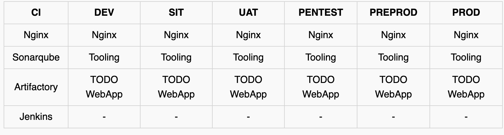

## EXPERIENCE CONTINUOUS INTEGRATION WITH JENKINS | ANSIBLE | ARTIFACTORY | SONARQUBE | PHP
_Executable file_ is a file created by a building stage of a compiled programming languages. Example are >Net, Java(.jar). The executable file contains the neccessary dependencies, all the code embedded, which application needs to run and work successfully.

<br>

Some other programming languages such as **PHP**, **Javascript**, or **Python** work differently without being built into an executable file. _This languages are called interpreteed_. We can package the entire code and all it's dependencies into an archive such as **.tar**, **.gz**, or **.zip**, so that it can be easily unpacked on a respective environment servers.

### [Difference between compiled VS interpreted programming languages](https://www.freecodecamp.org/news/compiled-versus-interpreted-languages/)

<br>

In a compiled language, the target machine directly translates the program. In an interpreted language, the source code is not directly translated by the target machine. Instead, a different program known as interpreter, reads, and execute the code.

### What is Continuous Integration?

CI is a practice of merging all developers's working copies to a shared mainline (e.g Git Repository or some other version) per day.

_Artifact:_ is the by-product produced during the software development process. It  may consist of the project sources code, dependencies, binaries or resources, and could be presented in different layout depending on the technology. Artifacts are usualy stored in a repository like jFrog Artifactory,.

#### Continuous Integration in The Real World

_To emphasize a typical CI Pipeline further, let us explore the diagram below a little deeper._


- **Version Control**: This is the stage where developers’ code gets committed and pushed after they have tested their work locally.
- **Build**: Depending on the type of language or technology used, we may need to build the codes into binary executable files (in case of compiled languages) or just package the codes together with all necessary dependencies into a deployable package (in case of interpreted languages).
- **Unit Test**: Unit tests that have been developed by the developers are tested. Depending on how the CI job is configured, the entire pipeline may fail if part of the tests fails, and developers will have to fix this failure before starting the pipeline again. A Job by the way, is a phase in the pipeline. Unit Test is a phase, therefore it can be considered a job on its own.
- **Deploy**: Once the tests are passed, the next phase is to deploy the compiled or packaged code into an artifact repository. This is where all the various versions of code including the latest will be stored. The CI tool will have to pick up the code from this location to proceed with the remaining parts of the pipeline.
- **Auto Test**: Apart from Unit testing, there are many other kinds of tests that are required to analyse the quality of code and determine how vulnerable the software will be to external or internal attacks. These tests must be automated, and there can be multiple environments created to fulfil different test requirements. For example, a server dedicated for Integration Testing will have the code deployed there to conduct integration tests. Once that passes, there can be other sub-layers in the testing phase in which the code will be deployed to, so as to conduct further tests. Such are User Acceptance Testing (UAT), and another can be Penetration Testing. These servers will be named according to what they have been designed to do in those environments. A UAT server is generally be used for UAT, SIT server is for Systems Integration Testing, PEN Server is for Penetration Testing and they can be named whatever the naming style or convention in which the team is used. An environment does not necessarily have to reside on one single server. In most cases it might be a stack as you have defined in your Ansible Inventory. All the servers in the inventory/dev are considered as Dev Environment. The same goes for inventory/stage (Staging Environment) inventory/preprod (Pre-production environment), inventory/prod (Production environment), etc. So, it is all down to naming convention as agreed and used company or team wide.
- **Deploy to production**: Once all the tests have been conducted and either the release manager or whoever has the authority to authorize the release to the production server is happy, he gives green light to hit the deploy button to ship the release to production environment. This is an Ideal Continuous Delivery Pipeline. If the entire pipeline was automated and no human is required to manually give the Go decision, then this would be considered as Continuous Deployment. Because the cycle will be repeated, and every time there is a code commit and push, it causes the pipeline to trigger, and the loop continues over and over again.
- **Measure and Validate**: This is where live users are interacting with the application and feedback is being collected for further improvements and bug fixes. There are many metrics that must be determined and observed here. We will quickly go through 13 metrics that MUST be considered.

#### Common Best Practices of CI/CD
_Before we move on to observability metrics – let us list down the principles that define a reliable and robust CI/CD pipeline:_

- Maintain a code repository
- Automate build process
- Make builds self-tested
- Everyone commits to the baseline every day
- Every commit to baseline should be built
- Every bug-fix commit should come with a test case
- Keep the build fast
- Test in a clone of production environment
- Make it easy to get the latest deliverables
- Everyone can see the results of the latest build
- Automate deployment (if you are confident enough in your CI/CD pipeline and willing to go for a fully automated Continuous Deployment)

### WHY ARE WE DOING EVERYTHING WE ARE DOING? – 13 DEVOPS SUCCESS METRICS
1. **Deployment frequency**: Tracking how often you do deployments is a good DevOps metric. Ultimately, the goal is to do more smaller deployments as often as possible. Reducing the size of deployments makes it easier to test and release. 
2.  **Lead time:** If the goal is to ship code quickly, this is a key DevOps metric. I would define lead time as the amount of time that occurs between starting on a work item until it is deployed. This helps you know that if you started on a new work item today, how long would it take on average until it gets to production.
3. **Customer tickets**: The best and worst indicator of application problems is customer support tickets and feedback. The last thing you want is your users reporting bugs or having problems with your software. Because of this, customer tickets also serve as a good indicator of application quality and performance problems.
4. **Percentage of passed automated tests**: To increase velocity, it is highly recommended that the development team makes extensive usage of unit and functional testing. Since DevOps relies heavily on automation, tracking how well automated tests work is a good DevOps metrics. It is good to know how often code changes break tests.
5. **Defect escape rate**: Do you know how many software defects are being found in production versus QA? If you want to ship code fast, you need to have confidence that you can find software defects before they get to production. Defect escape rate is a great DevOps metric to track how often those defects make it to production.
6. **Availability**: The last thing we ever want is for our application to be down. Depending on the type of application and how we deploy it, we may have a little downtime as part of scheduled maintenance. It is highly recommended to track this metric and all unplanned outages. Most software companies build status pages to track this. Such as this [Google Products Status Page](https://www.google.co.uk/appsstatus/dashboard/#hl=en-GB&v=status)
7. **Service level agreements**: Most companies have some service level agreement (SLA) that they promise to the customers. It is also important to track compliance with SLAs.
8. **Failed deployments**: We all hope this never happens, but how often do our deployments cause an outage or major issues for the users? Reversing a failed deployment is something we never want to do, but it is something you should always plan for. If you have issues with failed deployments, be sure to track this metric over time. This could also be seen as tracking *Mean Time To Failure (MTTF).
9.  **Error rates**: Tracking error rates within the application is super important. Not only they serve as an indicator of quality problems, but also ongoing performance and uptime related issues. In software development, errors are also known as exceptions, and proper exception handling is critical.
10.  **Application usage & traffic**: After a deployment, we want to see if the number of transactions or users accessing our system looks normal. If we suddenly have no traffic or a giant spike in traffic, something could be wrong. An attacker may be routing traffic elsewhere, or initiating a DDOS attack
11. **Application performance**: Before we even perform a deployment, we should configure monitoring tools like Retrace, DataDog, New Relic, or AppDynamics to look for performance problems, hidden errors, and other issues. During and after the deployment, we should also look for any changes in overall application performance and establish some benchmarks to know when things deviate from the norm.
12. **Mean time to detection (MTTD)**: When problems happen, it is important that we identify them quickly. The last thing we want is to have a major partial or complete system outage and not know about it. Having robust application monitoring and good observability tools in place will help us detect issues quickly. Once they are detected, we also must fix them quickly!
13. **Mean time to recovery (MTTR)**: This metric helps us track how long it takes to recover from failures. A key metric for the business is keeping failures to a minimum and being able to recover from them quickly. It is typically measured in hours and may refer to business hours, not calendar hours

### SIMULATING A TYPICAL CI/CD PIPELINE FOR A PHP BASED APPLICATION


### Set Up

_This project is partly a continuation of your Ansible work, so simply add and subtract based on the new setup in this project. It will require a lot of servers to simulate all the different environments from dev/ci all the way to production._

What we want to achieve, is having Nginx to serve as a [reverse proxy](https://en.wikipedia.org/wiki/Reverse_proxy) for our sites and tools. Each environment setup is represented in the below table and diagrams.
<br>

To get started, we will focus on these environments initially.

- *Ci*
- *Dev*
- *Pentest*

Both SIT – For System Integration Testing and UAT – User Acceptance Testing do not require a lot of extra installation or configuration. They are basically the webservers holding our applications. But Pentest – For Penetration testing is where we will conduct security related tests, so some other tools and specific configurations will be needed. In some cases, it will also be used for Performance and Load testing. Otherwise, that can also be a separate environment on its own. It all depends on decisions made by the company and the team running the show.




Other Environments from Lower To Higher


### DNS requirements

Make DNS entries to create a subdomain for each environment. Assuming your main domain is darey.io

<br>

You should have a subdomains list like this:

| Server    |  Domain |
|-----------|---------|
| Jenkins    | https://ci.infradev.darey.io |
| Sonarqube    |  https://sonar.infradev.darey.io |
| Artifactory    |  https://artifacts.infradev.darey.io |
| Production Tooling    |  https://tooling.darey.io |
| Pre-Prod Tooling    |  https://tooling.preprod.darey.io |
| Pentest Tooling    |  https://tooling.pentest.darey.io |
| UAT Tooling   |  https://tooling.uat.darey.io |
| SIT Tooling    |  https://tooling.sit.darey.io |
| Dev Tooling    |  https://tooling.dev.darey.io |
| Production TODO-WebApp    |  https://todo.darey.io |
| Pre-Prod TODO-WebApp    | https://todo.preprod.darey.io |
| Pentest TODO-WebApp   |  https://todo.pentest.darey.io|
| UAT TODO-WebApp   |  https://todo.uat.darey.io |
| SIT TODO-WebApp    |  https://todo.sit.darey.io |
| Dev TODO-WebApp    | https://todo.dev.darey.io |

<br>

#### Ansible Inventory should look like this

```
├── ci
├── dev
├── pentest
├── pre-prod
├── prod
├── sit
└── uat
```
<br>

**ci** inventory file

```
[jenkins]
<Jenkins-Private-IP-Address>

[nginx]
<Nginx-Private-IP-Address>

[sonarqube]
<SonarQube-Private-IP-Address>

[artifact_repository]
<Artifact_repository-Private-IP-Address>
```
<br>

**dev** Inventory file

```
[tooling]
<Tooling-Web-Server-Private-IP-Address>

[todo]
<Todo-Web-Server-Private-IP-Address>

[nginx]
<Nginx-Private-IP-Address>

[db:vars]
ansible_user=ec2-user
ansible_python_interpreter=/usr/bin/python

[db]
<DB-Server-Private-IP-Address>
```

<br>

**pentest** inventory file

```
[pentest:children]
pentest-todo
pentest-tooling

[pentest-todo]
<Pentest-for-Todo-Private-IP-Address>

[pentest-tooling]
<Pentest-for-Tooling-Private-IP-Address>
```

_**Observations**:_


- You will notice that in the pentest inventory file, we have introduced a new concept pentest:children This is because, we want to have a group called pentest which covers Ansible execution against both pentest-todo and pentest-tooling simultaneously. But at the same time, we want the flexibility to run specific Ansible tasks against an individual group.
- The db group has a slightly different configuration. It uses a RedHat/Centos Linux distro. Others are based on Ubuntu (in this case user is ubuntu). Therefore, the user required for connectivity and path to python interpreter are different. If all your environment is based on Ubuntu, you may not need this kind of set up. Totally up to you how you want to do this. Whatever works for you is absolutely fine in this scenario.
- This makes us to introduce another Ansible concept called group_vars. With group vars, we can declare and set variables for each group of servers created in the inventory file.

- For example, If there are variables we need to be common between both pentest-todo and pentest-tooling, rather than setting these variables in many places, we can simply use the group_vars for pentest. Since in the inventory file it has been created as pentest:children Ansible recognizes this and simply applies that variable to both children.

### ANSIBLE ROLES FOR CI ENVIRONMENT

Now go ahead and Add two more roles to ansible:
- [SonarQube](https://www.sonarqube.org/) - It is an automatic code review tool to detect bug, vulnerabilities. SonarQube can help you write cleaner and safer code.  platform developed by SonarSource for continuous inspection of code quality, it is used to perform automatic reviews with static analysis of code to detect bugs,

<br>

#### Why do we need SonarQube?
SonarQube is an open-sources

- [Artifactory](https://jfrog.com/artifactory/) - It is a product by jFrog that serves as a binary repository manager. [Watch the video](https://www.youtube.com/watch?v=upJS4R6SbgM)


### Configuring Ansible For Jenkins Deployment

In previous projects, you have been launching Ansible commands manually from a CLI. Now, with Jenkins, we will start running Ansible from Jenkins UI.

_To do this_

1. Navigate to Jenkins URL
2. Install & Open Blue Ocean Jenkins Plugin
3. Create a new pipeline
4. Select GitHub
5. Connect Jemkins with GitHub
6. Login to GitHub & Generate an Access Token
7. Copy Access Token
8. Paste the token and connect
9. Create a new Pipeline

_At this point you may not have a [Jenkinsfile](https://www.jenkins.io/doc/book/pipeline/jenkinsfile/) in the Ansible repository, so Blue Ocean will attempt to give you some guidance to create one. But we do not need that. We will rather create one ourselves. So, click on Administration to exit the Blue Ocean console._

- Here is our newly created pipeline. It takes the name of your GitHub repository.
- create our Jenkinsfile
  * Inside the Ansible project, create a new directory _deploy_ and start a new file _Jenkinsfile_ inside the directory.

  

  * Add the code snippet below to start building the _Jenkinsfile_ gradually. This pipeline currently has just one stage called _Build_ and the only thing we are doing is using the _shell script_ module to echo _Building Stage_

  ```
  pipeline {
    agent any

    stages {
      stage('Build') {
        steps {
          script {
            sh 'echo "Building Stage"'
          }
        }
      }
      }
  }

  ```
  * Now go back into the Ansible pipeline in Jenkins, and select configure

  * Scroll down to _Build Configuration_ section and specify the location of the Jenkinsfile at _deploy/Jenkinsfile_
  * Back to the pipeline again, this time click "_Build now_"
  * _This will trigger a build and you will be able to see the effect of our basic **Jenkinsfile** configuration by going through the console output of the build._

  * To really appreciate and feel the difference of Cloud Blue UI, it is recommended to try triggering the build again from Blue Ocean interface.
   1. Click on Blue Ocean
   2. Select your project
   3. Click on the play button against the branch
_Notice that this pipeline is a multibranch one. This means, if there were more than one branch in GitHub, Jenkins would have scanned the repository to discover them all and we would have been able to trigger a build for each branch._

#### Let us see this in action.

1. Create a new git branch and name it _feature/jenkinspipeline-stages_
2. Currently we only have the _Build_ stage. Let us add another stage called _Test_. Paste the code snippet below and push the new changes to GitHub.

```
pipeline {
    agent any

  stages {
    stage('Build') {
      steps {
        script {
          sh 'echo "Building Stage"'
        }
      }
    }

    stage('Test') {
      steps {
        script {
          sh 'echo "Testing Stage"'
        }
      }
    }
    }
}
```
3. To make your new branch show up in Jenkins, we need to tell Jenkins to scan the repository.
  * Click on the "Administration" button