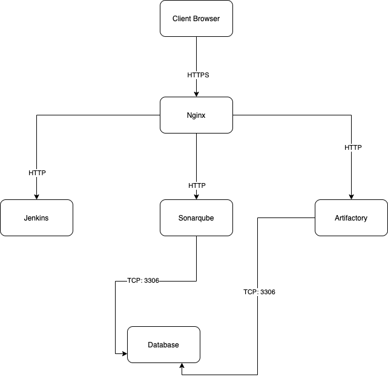
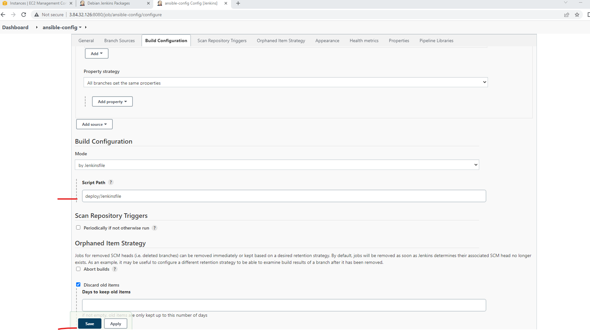

## EXPERIENCE CONTINUOUS INTEGRATION WITH JENKINS | ANSIBLE | ARTIFACTORY | SONARQUBE | PHP
_Executable file_ is a file created by a building stage of a compiled programming languages. Example are >Net, Java(.jar). The executable file contains the neccessary dependencies, all the code embedded, which application needs to run and work successfully.

<br>

Some other programming languages such as **PHP**, **Javascript**, or **Python** work differently without being built into an executable file. _This languages are called interpreteed_. We can package the entire code and all it's dependencies into an archive such as **.tar**, **.gz**, or **.zip**, so that it can be easily unpacked on a respective environment servers.

### [Difference between compiled VS interpreted programming languages](https://www.freecodecamp.org/news/compiled-versus-interpreted-languages/)

<br>

In a compiled language, the target machine directly translates the program. In an interpreted language, the source code is not directly translated by the target machine. Instead, a different program known as interpreter, reads, and execute the code.

### What is Continuous Integration?

CI is a practice of merging all developers's working copies to a shared mainline (e.g Git Repository or some other version) per day.

_Artifact:_ is the by-product produced during the software development process. It  may consist of the project sources code, dependencies, binaries or resources, and could be presented in different layout depending on the technology. Artifacts are usualy stored in a repository like jFrog Artifactory,.

#### Continuous Integration in The Real World

_To emphasize a typical CI Pipeline further, let us explore the diagram below a little deeper._


- **Version Control**: This is the stage where developers’ code gets committed and pushed after they have tested their work locally.
- **Build**: Depending on the type of language or technology used, we may need to build the codes into binary executable files (in case of compiled languages) or just package the codes together with all necessary dependencies into a deployable package (in case of interpreted languages).
- **Unit Test**: Unit tests that have been developed by the developers are tested. Depending on how the CI job is configured, the entire pipeline may fail if part of the tests fails, and developers will have to fix this failure before starting the pipeline again. A Job by the way, is a phase in the pipeline. Unit Test is a phase, therefore it can be considered a job on its own.
- **Deploy**: Once the tests are passed, the next phase is to deploy the compiled or packaged code into an artifact repository. This is where all the various versions of code including the latest will be stored. The CI tool will have to pick up the code from this location to proceed with the remaining parts of the pipeline.
- **Auto Test**: Apart from Unit testing, there are many other kinds of tests that are required to analyse the quality of code and determine how vulnerable the software will be to external or internal attacks. These tests must be automated, and there can be multiple environments created to fulfil different test requirements. For example, a server dedicated for Integration Testing will have the code deployed there to conduct integration tests. Once that passes, there can be other sub-layers in the testing phase in which the code will be deployed to, so as to conduct further tests. Such are User Acceptance Testing (UAT), and another can be Penetration Testing. These servers will be named according to what they have been designed to do in those environments. A UAT server is generally be used for UAT, SIT server is for Systems Integration Testing, PEN Server is for Penetration Testing and they can be named whatever the naming style or convention in which the team is used. An environment does not necessarily have to reside on one single server. In most cases it might be a stack as you have defined in your Ansible Inventory. All the servers in the inventory/dev are considered as Dev Environment. The same goes for inventory/stage (Staging Environment) inventory/preprod (Pre-production environment), inventory/prod (Production environment), etc. So, it is all down to naming convention as agreed and used company or team wide.
- **Deploy to production**: Once all the tests have been conducted and either the release manager or whoever has the authority to authorize the release to the production server is happy, he gives green light to hit the deploy button to ship the release to production environment. This is an Ideal Continuous Delivery Pipeline. If the entire pipeline was automated and no human is required to manually give the Go decision, then this would be considered as Continuous Deployment. Because the cycle will be repeated, and every time there is a code commit and push, it causes the pipeline to trigger, and the loop continues over and over again.
- **Measure and Validate**: This is where live users are interacting with the application and feedback is being collected for further improvements and bug fixes. There are many metrics that must be determined and observed here. We will quickly go through 13 metrics that MUST be considered.

#### Common Best Practices of CI/CD
_Before we move on to observability metrics – let us list down the principles that define a reliable and robust CI/CD pipeline:_

- Maintain a code repository
- Automate build process
- Make builds self-tested
- Everyone commits to the baseline every day
- Every commit to baseline should be built
- Every bug-fix commit should come with a test case
- Keep the build fast
- Test in a clone of production environment
- Make it easy to get the latest deliverables
- Everyone can see the results of the latest build
- Automate deployment (if you are confident enough in your CI/CD pipeline and willing to go for a fully automated Continuous Deployment)

### WHY ARE WE DOING EVERYTHING WE ARE DOING? – 13 DEVOPS SUCCESS METRICS
1. **Deployment frequency**: Tracking how often you do deployments is a good DevOps metric. Ultimately, the goal is to do more smaller deployments as often as possible. Reducing the size of deployments makes it easier to test and release. 
2.  **Lead time:** If the goal is to ship code quickly, this is a key DevOps metric. I would define lead time as the amount of time that occurs between starting on a work item until it is deployed. This helps you know that if you started on a new work item today, how long would it take on average until it gets to production.
3. **Customer tickets**: The best and worst indicator of application problems is customer support tickets and feedback. The last thing you want is your users reporting bugs or having problems with your software. Because of this, customer tickets also serve as a good indicator of application quality and performance problems.
4. **Percentage of passed automated tests**: To increase velocity, it is highly recommended that the development team makes extensive usage of unit and functional testing. Since DevOps relies heavily on automation, tracking how well automated tests work is a good DevOps metrics. It is good to know how often code changes break tests.
5. **Defect escape rate**: Do you know how many software defects are being found in production versus QA? If you want to ship code fast, you need to have confidence that you can find software defects before they get to production. Defect escape rate is a great DevOps metric to track how often those defects make it to production.
6. **Availability**: The last thing we ever want is for our application to be down. Depending on the type of application and how we deploy it, we may have a little downtime as part of scheduled maintenance. It is highly recommended to track this metric and all unplanned outages. Most software companies build status pages to track this. Such as this [Google Products Status Page](https://www.google.co.uk/appsstatus/dashboard/#hl=en-GB&v=status)
7. **Service level agreements**: Most companies have some service level agreement (SLA) that they promise to the customers. It is also important to track compliance with SLAs.
8. **Failed deployments**: We all hope this never happens, but how often do our deployments cause an outage or major issues for the users? Reversing a failed deployment is something we never want to do, but it is something you should always plan for. If you have issues with failed deployments, be sure to track this metric over time. This could also be seen as tracking *Mean Time To Failure (MTTF).
9.  **Error rates**: Tracking error rates within the application is super important. Not only they serve as an indicator of quality problems, but also ongoing performance and uptime related issues. In software development, errors are also known as exceptions, and proper exception handling is critical.
10.  **Application usage & traffic**: After a deployment, we want to see if the number of transactions or users accessing our system looks normal. If we suddenly have no traffic or a giant spike in traffic, something could be wrong. An attacker may be routing traffic elsewhere, or initiating a DDOS attack
11. **Application performance**: Before we even perform a deployment, we should configure monitoring tools like Retrace, DataDog, New Relic, or AppDynamics to look for performance problems, hidden errors, and other issues. During and after the deployment, we should also look for any changes in overall application performance and establish some benchmarks to know when things deviate from the norm.
12. **Mean time to detection (MTTD)**: When problems happen, it is important that we identify them quickly. The last thing we want is to have a major partial or complete system outage and not know about it. Having robust application monitoring and good observability tools in place will help us detect issues quickly. Once they are detected, we also must fix them quickly!
13. **Mean time to recovery (MTTR)**: This metric helps us track how long it takes to recover from failures. A key metric for the business is keeping failures to a minimum and being able to recover from them quickly. It is typically measured in hours and may refer to business hours, not calendar hours

### SIMULATING A TYPICAL CI/CD PIPELINE FOR A PHP BASED APPLICATION


### Set Up

_This project is partly a continuation of your Ansible work, so simply add and subtract based on the new setup in this project. It will require a lot of servers to simulate all the different environments from dev/ci all the way to production._

What we want to achieve, is having Nginx to serve as a [reverse proxy](https://en.wikipedia.org/wiki/Reverse_proxy) for our sites and tools. Each environment setup is represented in the below table and diagrams.
<br>

To get started, we will focus on these environments initially.

- *Ci*
- *Dev*
- *Pentest*

Both SIT – For System Integration Testing and UAT – User Acceptance Testing do not require a lot of extra installation or configuration. They are basically the webservers holding our applications. But Pentest – For Penetration testing is where we will conduct security related tests, so some other tools and specific configurations will be needed. In some cases, it will also be used for Performance and Load testing. Otherwise, that can also be a separate environment on its own. It all depends on decisions made by the company and the team running the show.




Other Environments from Lower To Higher


### DNS requirements

Make DNS entries to create a subdomain for each environment. Assuming your main domain is darey.io

<br>

You should have a subdomains list like this:

| Server    |  Domain |
|-----------|---------|
| Jenkins    | https://ci.infradev.darey.io |
| Sonarqube    |  https://sonar.infradev.darey.io |
| Artifactory    |  https://artifacts.infradev.darey.io |
| Production Tooling    |  https://tooling.darey.io |
| Pre-Prod Tooling    |  https://tooling.preprod.darey.io |
| Pentest Tooling    |  https://tooling.pentest.darey.io |
| UAT Tooling   |  https://tooling.uat.darey.io |
| SIT Tooling    |  https://tooling.sit.darey.io |
| Dev Tooling    |  https://tooling.dev.darey.io |
| Production TODO-WebApp    |  https://todo.darey.io |
| Pre-Prod TODO-WebApp    | https://todo.preprod.darey.io |
| Pentest TODO-WebApp   |  https://todo.pentest.darey.io|
| UAT TODO-WebApp   |  https://todo.uat.darey.io |
| SIT TODO-WebApp    |  https://todo.sit.darey.io |
| Dev TODO-WebApp    | https://todo.dev.darey.io |

<br>

#### Ansible Inventory should look like this

```
├── ci
├── dev
├── pentest
├── pre-prod
├── prod
├── sit
└── uat
```
<br>

**ci** inventory file

```
[jenkins]
<Jenkins-Private-IP-Address>

[nginx]
<Nginx-Private-IP-Address>

[sonarqube]
<SonarQube-Private-IP-Address>

[artifact_repository]
<Artifact_repository-Private-IP-Address>
```
<br>

**dev** Inventory file

```
[tooling]
<Tooling-Web-Server-Private-IP-Address>

[todo]
<Todo-Web-Server-Private-IP-Address>

[nginx]
<Nginx-Private-IP-Address>

[db:vars]
ansible_user=ec2-user
ansible_python_interpreter=/usr/bin/python

[db]
<DB-Server-Private-IP-Address>
```

<br>

**pentest** inventory file

```
[pentest:children]
pentest-todo
pentest-tooling

[pentest-todo]
<Pentest-for-Todo-Private-IP-Address>

[pentest-tooling]
<Pentest-for-Tooling-Private-IP-Address>
```

_**Observations**:_


- You will notice that in the pentest inventory file, we have introduced a new concept pentest:children This is because, we want to have a group called pentest which covers Ansible execution against both pentest-todo and pentest-tooling simultaneously. But at the same time, we want the flexibility to run specific Ansible tasks against an individual group.
- The db group has a slightly different configuration. It uses a RedHat/Centos Linux distro. Others are based on Ubuntu (in this case user is ubuntu). Therefore, the user required for connectivity and path to python interpreter are different. If all your environment is based on Ubuntu, you may not need this kind of set up. Totally up to you how you want to do this. Whatever works for you is absolutely fine in this scenario.
- This makes us to introduce another Ansible concept called group_vars. With group vars, we can declare and set variables for each group of servers created in the inventory file.

- For example, If there are variables we need to be common between both pentest-todo and pentest-tooling, rather than setting these variables in many places, we can simply use the group_vars for pentest. Since in the inventory file it has been created as pentest:children Ansible recognizes this and simply applies that variable to both children.

### ANSIBLE ROLES FOR CI ENVIRONMENT

Now go ahead and Add two more roles to ansible:
- [SonarQube](https://www.sonarqube.org/) - It is an automatic code review tool to detect bug, vulnerabilities. SonarQube can help you write cleaner and safer code.  platform developed by SonarSource for continuous inspection of code quality, it is used to perform automatic reviews with static analysis of code to detect bugs,

<br>

#### Why do we need SonarQube?
SonarQube is an open-sources

- [Artifactory](https://jfrog.com/artifactory/) - It is a product by jFrog that serves as a binary repository manager. [Watch the video](https://www.youtube.com/watch?v=upJS4R6SbgM)


### Configuring Ansible For Jenkins Deployment

In previous projects, you have been launching Ansible commands manually from a CLI. Now, with Jenkins, we will start running Ansible from Jenkins UI.

_To do this_

1. Navigate to Jenkins URL
2. Install & Open Blue Ocean Jenkins Plugin


3. Create a new pipeline


4. Select GitHub


5. Connect Jemkins with GitHub


6. Login to GitHub & Generate an Access Token


7. Copy Access Token

8. Paste the token and connect


9. Create a new Pipeline


_At this point you may not have a [Jenkinsfile](https://www.jenkins.io/doc/book/pipeline/jenkinsfile/) in the Ansible repository, so Blue Ocean will attempt to give you some guidance to create one. But we do not need that. We will rather create one ourselves. So, click on Administration to exit the Blue Ocean console._

- Here is our newly created pipeline. It takes the name of your GitHub repository.


- create our Jenkinsfile
  * Inside the Ansible project, create a new directory _deploy_ and start a new file _Jenkinsfile_ inside the directory.

  

  * Add the code snippet below to start building the _Jenkinsfile_ gradually. This pipeline currently has just one stage called _Build_ and the only thing we are doing is using the _shell script_ module to echo _Building Stage_

  ```
  pipeline {
    agent any

    stages {
      stage('Build') {
        steps {
          script {
            sh 'echo "Building Stage"'
          }
        }
      }
      }
  }

  ```
  * Now go back into the Ansible pipeline in Jenkins, and select configure

    

  * Scroll down to _Build Configuration_ section and specify the location of the Jenkinsfile at _deploy/Jenkinsfile_

    

    


  * Back to the pipeline again, this time click "_Build now_"

 

  


  * _This will trigger a build and you will be able to see the effect of our basic **Jenkinsfile** configuration by going through the console output of the build._

  * To really appreciate and feel the difference of Cloud Blue UI, it is recommended to try triggering the build again from Blue Ocean interface.
   1. Click on Blue Ocean
   2. Select your project

     


   3. Click on the play button against the branch
_Notice that this pipeline is a multibranch one. This means, if there were more than one branch in GitHub, Jenkins would have scanned the repository to discover them all and we would have been able to trigger a build for each branch._

#### Let us see this in action.

1. Create a new git branch and name it _feature/jenkinspipeline-stages_
2. Currently we only have the _Build_ stage. Let us add another stage called _Test_. Paste the code snippet below and push the new changes to GitHub.

```
pipeline {
    agent any

  stages {
    stage('Build') {
      steps {
        script {
          sh 'echo "Building Stage"'
        }
      }
    }

    stage('Test') {
      steps {
        script {
          sh 'echo "Testing Stage"'
        }
      }
    }
    }
}
```
3. To make your new branch show up in Jenkins, we need to tell Jenkins to scan the repository.
  * Click on the "Administration" button

  


  * Navigate to the Ansible project and click on "Scan repository now"

   

   


  * Refresh the page and both branches will start building automatically, You can go into Blue Ocean and see both branches there too.

  

  * In Blue Ocean, you can now see how the Jenkinsfile has caused a new step in the pipeline launch build for the new branch.
4. A QUICK TASK FOR YOU!
```
1. Create a pull request to merge the latest code into the main branch
2. After merging the PR, go back into your terminal and switch into the main branch.
3. Pull the latest change.
4. Create a new branch, add more stages into the Jenkins file to simulate below phases. (Just add an echo command like we have in build and test stages)
   1. Package 
   2. Deploy 
   3. Clean up
5. Verify in Blue Ocean that all the stages are working, then merge your feature branch to the main branch
6. Eventually, your main branch should have a successful pipeline like this in blue ocean
```

 

  

   

### RUNNING ANSIBLE PLAYBOOK FROM JENKINS

_Now that you have a broad overview of a typical Jenkins pipeline. Let us get the actual Ansible deployment to work by:_

1. Installing Ansible on Jenkins (Follow the previous steps)

[video](https://www.youtube.com/watch?v=PRpEbFZi7nI)
 
2. Installing _Ansible_ plugin in Jenkins UI
3. Configure the global tool configuration
  * Go to Jenkins portal
  * Click manage plugin
  * Select global tool configuration
  * Go down to the portion of Jenkins
    - Give it a name "ansible2"
    - Give the path to ansible e.h _/usr/bin. you can find this from Jenkins severby running this command on the termonal **which ansible**
  * save
4. Create new job
  * Give the job a name _ansibledemo_
  * Select pipeline and select okay
5. Creating _Jenkinsfile_ from scratch. (Delete all you currently have in there and start all over to get Ansible to run successfully)

* Update sit inventory with new servers

```
[tooling]
<SIT-Tooling-Web-Server-Private-IP-Address>

[todo]
<SIT-Todo-Web-Server-Private-IP-Address>

[nginx]
<SIT-Nginx-Private-IP-Address>

[db:vars]
ansible_user=ec2-user
ansible_python_interpreter=/usr/bin/python

[db]
<SIT-DB-Server-Private-IP-Address>
```

* Update _Jenkinsfile_ to introduce parameterization. Below is just one parameter. It has a default value in case if no value is specified at execution. It also has a description so that everyone is aware of its purpose.

```
pipeline {
    agent any

    parameters {
      string(name: 'inventory', defaultValue: 'dev',  description: 'This is the inventory file for the environment to deploy configuration')
    }
...
```

* In the Ansible execution section, remove the hardcoded inventory/dev and replace with `${inventory}

* Add another parameter. This time, introduce _tagging_ in Ansible. You can limit the Ansible execution to a specific role or playbook desired. Therefore, add an Ansible tag to run against _webserver_ only. Test this locally first to get the experience. Once you understand this, update_Jenkinsfile_ and run it from Jenkins.

### CI/CD PIPELINE FOR TODO APPLICATION

Our goal here is to deploy the application onto servers directly from _Artifactory_ rather than from git. [Configure Artifactory on Ubuntu 20.04](https://www.howtoforge.com/tutorial/ubuntu-jfrog/)

```
apt-get install gnupg2 -y

wget -qO - https://api.bintray.com/orgs/jfrog/keys/gpg/public.key | apt-key add -

# Next, add the JFrog Artifactory repository with the following command:

echo "deb https://jfrog.bintray.com/artifactory-debs bionic main" | tee /etc/apt/sources.list.d/jfrog.list

apt-get update -y
apt-get install jfrog-artifactory-oss -y

systemctl start artifactory
systemctl enable artifactory
systemctl status artifactory
```
> Phase 1 – Prepare Jenkins
1. Fork the repository below into your GitHub account
```
https://github.com/darey-devops/php-todo.git

```

2. On you Jenkins server, install PHP, its dependencies and Composer tool (Feel free to do this manually at first, then update your Ansible accordingly later)
```
sudo apt install -y zip libapache2-mod-php phploc php-{xml,bcmath,bz2,intl,gd,mbstring,mysql,zip}
```
3. Install Jenkins plugins
* [Plot plugin](https://plugins.jenkins.io/plot/)
* [Artifactory plugin](https://www.jfrog.com/confluence/display/JFROG/Jenkins+Artifactory+Plug-in)
  - We will use plot plugin to display tests reports, and code coverage information.
 - The Artifactory plugin will be used to easily upload code artifacts into an Artifactory server.

4. In Jenkins UI configure Artifactory

> Phase 2 – Integrate Artifactory repository with Jenkins

- Create a dummy Jenkinsfile in the repository
- Using Blue Ocean, create a multibranch Jenkins pipeline
- On the database server, create database and user

```
Create database homestead;
CREATE USER 'homestead'@'%' IDENTIFIED BY 'sePret^i';
GRANT ALL PRIVILEGES ON * . * TO 'homestead'@'%';
```

- Update the database connectivity requirements in the file _.env.sample_
- Update _Jenkinsfile_ with proper pipeline configuration

```
pipeline {
    agent any

  stages {

     stage("Initial cleanup") {
          steps {
            dir("${WORKSPACE}") {
              deleteDir()
            }
          }
        }

    stage('Checkout SCM') {
      steps {
            git branch: 'main', url: 'https://github.com/darey-devops/php-todo.git'
      }
    }

    stage('Prepare Dependencies') {
      steps {
             sh 'mv .env.sample .env'
             sh 'composer install'
             sh 'php artisan migrate'
             sh 'php artisan db:seed'
             sh 'php artisan key:generate'
      }
    }
  }
}
```

- Update the _Jenkinsfile_ to include Unit tests step
```
stage('Execute Unit Tests') {
steps {
        sh './vendor/bin/phpunit'
} 
```

> Phase 3 – Code Quality Analysis

For PHP the most commonly tool used for code quality analysis is [phploc](https://matthiasnoback.nl/2019/09/using-phploc-for-quick-code-quality-estimation-part-1/). [Read the article here for more](https://phpqa.io/projects/phploc.html)

- The data produced by phploc can be ploted onto graphs in Jenkins.
1. Add the code analysis step in _Jenkinsfile_. The output of the data will be saved in _build/logs/phploc.csv_ file.

```
stage('Code Analysis') {
  steps {
        sh 'phploc app/ --log-csv build/logs/phploc.csv'

  }
}
```

2. Plot the data using plot Jenkins plugin.
3. Bundle the application code for into an artifact (archived package) upload to Artifactory

```
stage ('Package Artifact') {
    steps {
            sh 'zip -qr php-todo.zip ${WORKSPACE}/*'
     }
    }
```

4. Publish the resulted artifact into Artifactory

```
stage ('Upload Artifact to Artifactory') {
          steps {
            script { 
                 def server = Artifactory.server 'artifactory-server'                 
                 def uploadSpec = """{
                    "files": [
                      {
                       "pattern": "php-todo.zip",
                       "target": "<name-of-artifact-repository>/php-todo",
                       "props": "type=zip;status=ready"

                       }
                    ]
                 }""" 

                 server.upload spec: uploadSpec
               }
            }

        }
```

5. Deploy the application to the _dev_ environment by launching Ansible pipeline
```
stage ('Deploy to Dev Environment') {
    steps {
    build job: 'ansible-project/main', parameters: [[$class: 'StringParameterValue', name: 'env', value: 'dev']], propagate: false, wait: true
    }
  }
```
- The _build job_ used in this step tells Jenkins to start another job. In this case it is the _ansible-project_ job, and we are targeting the _main_ branch. Hence, we have _ansible-project/main_. Since the Ansible project requires _parameters_ to be passed in, we have included this by specifying the parameters section. The name of the parameter is _env_ and its value is _dev_. Meaning, deploy to the Development environment.

### SONARQUBE INSTALLATION

> Install SonarQube on Ubuntu 20.04 With PostgreSQL as Backend Database
```
sudo sysctl -w vm.max_map_count=262144
sudo sysctl -w fs.file-max=65536
ulimit -n 65536
ulimit -u 4096
```

- To make a permanent change, edit the file /etc/security/limits.conf and append the below

```
sonarqube   -   nofile   65536
sonarqube   -   nproc    4096
```

- Before installing, let us update and upgrade system packages

```
sudo apt-get update
sudo apt-get upgrade
```

- Install [wget](https://www.gnu.org/software/wget/) and [unzip](https://linux.die.net/man/1/unzip) packages

```
sudo apt-get install wget unzip -y
```

- Install [OpenJDK](https://openjdk.java.net/) and [Java Runtime Environment (JRE) 11](https://docs.oracle.com/goldengate/1212/gg-winux/GDRAD/java.htm#BGBFJHAB)

```
 sudo apt-get install openjdk-11-jdk -y
 sudo apt-get install openjdk-11-jre -y
 ```

 - Set default JDK – To set default JDK or switch to OpenJDK enter below command:

 ```
 sudo update-alternatives --config java
 ```
 - Verify the set JAVA Version:
 ```
 java -version
 ```

  > Install and Setup PostgreSQL 10 Database for SonarQube

  ```
  sudo sh -c 'echo "deb http://apt.postgresql.org/pub/repos/apt/ `lsb_release -cs`-pgdg main" >> /etc/apt/sources.list.d/pgdg.list'
  wget -q https://www.postgresql.org/media/keys/ACCC4CF8.asc -O - | sudo apt-key add -

  # Install PostgreSQL Database Server

  sudo apt-get -y install postgresql postgresql-contrib

  # Start PostgreSQL Database Server

  sudo systemctl start postgresql

  sudo systemctl enable postgresql

  sudo passwd postgres

  su - postgres

  # Create a new user

  createuser sonar

  # Switch to the PostgreSQL shell
  psql

  # Set a password for the newly created user for SonarQube database

  ALTER USER sonar WITH ENCRYPTED password 'sonar';

  # Create a new database for PostgreSQL database by running:
  CREATE DATABASE sonarqube OWNER sonar;

  # Grant all privileges to sonar user on sonarqube Database.
  grant all privileges on DATABASE sonarqube to sonar;

  # Exit from the psql shell:

  \q

  # Switch back to the sudo user by running the exit command.
exit

  ```

- Install SonarQube on Ubuntu 20.04 LTS
 * Navigate to the _tmp_ directory to temporarily download the installation files

 ```
 cd /tmp && sudo wget https://binaries.sonarsource.com/Distribution/sonarqube/sonarqube-7.9.3.zip
 ```

 - Unzip the archive setup to _/opt directory_

 ```
 sudo unzip sonarqube-7.9.3.zip -d /opt
 ```

 - Move extracted setup to _/opt/sonarqube directory_
 ```
 sudo mv /opt/sonarqube-7.9.3 /opt/sonarqube
 ```

 > CONFIGURE SONARQUBE
<br>
 We cannot run SonarQube as a root user, if you run using root user it will stop automatically. The ideal approach will be to create a separate group and a user to run SonarQube
 <br>
 Create a group _sonar_

```
sudo groupadd sonar
```
- Now add a user with control over the _/opt/sonarqube_ directory
```
 sudo useradd -c "user to run SonarQube" -d /opt/sonarqube -g sonar sonar 
 sudo chown sonar:sonar /opt/sonarqube -R
 ```

 - Open SonarQube configuration file using your favourite text editor (e.g., nano or vim)

```
sudo vim /opt/sonarqube/conf/sonar.properties
```

- Find the following lines:

```
#sonar.jdbc.username=
#sonar.jdbc.password=

```
- Uncomment them and provide the values of PostgreSQL Database username and password:

- Edit the sonar script file and set RUN_AS_USER

```
sudo nano /opt/sonarqube/bin/linux-x86-64/sonar.sh

```

- Now, to start SonarQube we need to do following:

```
# Switch to sonar user
sudo su sonar

# Move to the script directory

cd /opt/sonarqube/bin/linux-x86-64/

# Run the script to start SonarQube
./sonar.sh start
```
- Expected output shall be as:
```
Starting SonarQube...

Started SonarQube
```
- Check SonarQube running status:

```
./sonar.sh status

```

- To check SonarQube logs, navigate to _/opt/sonarqube/logs/sonar.log_ directory

```
tail /opt/sonarqube/logs/sonar.log
```

> Configure SonarQube to run as a _systemd_ service

```
# Stop the currently running SonarQube service
cd /opt/sonarqube/bin/linux-x86-64/

# Run the script to start SonarQube

./sonar.sh stop

# Create a systemd service file for SonarQube to run as System Startup.

 sudo nano /etc/systemd/system/sonar.service
```

- Add the configuration below for _systemd_ to determine how to start, stop, check status, or restart the SonarQube service.

```
[Unit]
Description=SonarQube service
After=syslog.target network.target

[Service]
Type=forking

ExecStart=/opt/sonarqube/bin/linux-x86-64/sonar.sh start
ExecStop=/opt/sonarqube/bin/linux-x86-64/sonar.sh stop

User=sonar
Group=sonar
Restart=always

LimitNOFILE=65536
LimitNPROC=4096

[Install]
WantedBy=multi-user.target
```

- Save the file and control the service with systemctl
```
sudo systemctl start sonar
sudo systemctl enable sonar
sudo systemctl status sonar
```

- Access SonarQube
```
# To access SonarQube using browser, type server’s IP address followed by port 9000

http://server_IP:9000 OR http://localhost:9000
```

> CONFIGURE SONARQUBE AND JENKINS FOR QUALITY GATE

- In Jenkins, install [SonarScanner plugin](https://docs.sonarqube.org/latest/analysis/scan/sonarscanner-for-jenkins/)
- Navigate to configure system in Jenkins. Add SonarQube server as shown below:

```
 Manage Jenkins > Configure System
 ```
 - Generate authentication token in SonarQube

 ```
  User > My Account > Security > Generate Tokens
  ```

  - Configure Quality Gate Jenkins Webhook in SonarQube – The URL should point to your Jenkins server **http://{JENKINS_HOST}/sonarqube-webhook/**

  ```
  Administration > Configuration > Webhooks > Create
  ```
  - Setup SonarQube scanner from Jenkins – Global Tool Configuration
  ```
  Manage Jenkins > Global Tool Configuration
  ```
  - Update Jenkins Pipeline to include SonarQube scanning and Quality Gate
  _Below is the snippet for a Quality Gate stage in Jenkinsfile._

```
  stage('SonarQube Quality Gate') {
    environment {
        scannerHome = tool 'SonarQubeScanner'
    }
    steps {
        withSonarQubeEnv('sonarqube') {
            sh "${scannerHome}/bin/sonar-scanner"
        }

    }
}
```

- Configure sonar-scanner.properties – From the step above, Jenkins will install the scanner tool on the Linux server. You will need to go into the tools directory on the server to configure the properties file in which SonarQube will require to function during pipeline execution.

```
cd /var/lib/jenkins/tools/hudson.plugins.sonar.SonarRunnerInstallation/SonarQubeScanner/conf/
```

- Open sonar-scanner.properties file

```
sudo vi sonar-scanner.properties
```

- Add configuration related to php-todo project
```
sonar.host.url=http://<SonarQube-Server-IP-address>:9000
sonar.projectKey=php-todo
#----- Default source code encoding
sonar.sourceEncoding=UTF-8
sonar.php.exclusions=**/vendor/**
sonar.php.coverage.reportPaths=build/logs/clover.xml
sonar.php.tests.reportPath=build/logs/junit.xml
```

- To generate Jenkins code, navigate to the dashboard for the php-todo pipeline and click on the Pipeline Syntax menu item

```
Dashboard > php-todo > Pipeline Syntax 
```

- Click on Steps and select _withSonarQubeEnv_ – This appears in the list because of the previous SonarQube configurations you have done in Jenkins. Otherwise, it would not be there.

- Navigate to php-todo project in SonarQube

- If you click on php-todo project for further analysis, you will see that there is 6 hours’ worth of technical debt, code smells and security issues in the code.
<br>
_Let us update our Jenkinsfile to implement this:_

- First, we will include a When condition to run Quality Gate whenever the running branch is either develop, hotfix, release, main, or master

```
when { branch pattern: "^develop*|^hotfix*|^release*|^main*", comparator: "REGEXP"}
```

- Then we add a timeout step to wait for SonarQube to complete analysis and successfully finish the pipeline only when code quality is acceptable.
```
  timeout(time: 1, unit: 'MINUTES') {
        waitForQualityGate abortPipeline: true
    }
    ```

    - The complete stage will now look like this:

    ```
    stage('SonarQube Quality Gate') {
      when { branch pattern: "^develop*|^hotfix*|^release*|^main*", comparator: "REGEXP"}
        environment {
            scannerHome = tool 'SonarQubeScanner'
        }
        steps {
            withSonarQubeEnv('sonarqube') {
                sh "${scannerHome}/bin/sonar-scanner -Dproject.settings=sonar-project.properties"
            }
            timeout(time: 1, unit: 'MINUTES') {
                waitForQualityGate abortPipeline: true
            }
        }
    }
    ```