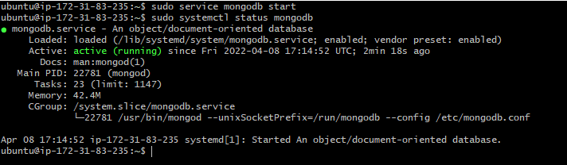

# MEAN STACK DEPLOYMENT TO UBUNTU IN AWS

> Task - In this assignment I implement a simple Book Register web form using MEAN stack

### Step 1: Install NodeJs

* Update ubuntu
- sudo apt update

* Upgrade ubuntu
- sudo apt upgrade

* Add certificates
- sudo apt -y install curl dirmngr apt-transport-https lsb-release ca-certificates
- curl -sL https://deb.nodesource.com/setup_12.x | sudo -E bash -

* Install NodeJS
- sudo apt install -y nodejs

### Step 2: Install MongoDB

- sudo apt-key adv --keyserver hkp://keyserver.ubuntu.com:80 --recv 0C49F3730359A14518585931BC711F9BA15703C6
- echo "deb [ arch=amd64 ] https://repo.mongodb.org/apt/ubuntu trusty/mongodb-org/3.4 multiverse" | sudo tee /etc/apt/sources.list.d/mongodb-org-3.4.list

* Install MongoDB
- sudo apt install -y mongodb

* Start The server
- sudo service mongodb start

* Verify that the service is up and running
- sudo systemctl status mongodb

* Upgrade node to version 14 or above
- curl -sL https://deb.nodesource.com/setup_14.x 565 | sudo -E bash -
- sudo apt-get install -y nodejs

* Install npm – Node package manager (You can jump this step since the step above already installed NPM).
- sudo apt install -y npm

* Install body-parser package
- sudo npm install body-parser

* Create a folder named ‘Books’
- mkdir Books && cd Books
* In the Books directory, Initialize npm project
- cd Books
- npm init

* Add server.js file
- touch server.js
* Open the server.js file and add the following
- vi server.js
- var express = require('express');
- var bodyParser = require('body-parser');
- var app = express();
- app.use(express.static(__dirname + '/public'));
- app.use(bodyParser.json());
- require('./apps/routes')(app);
- app.set('port', 3300);
- app.listen(app.get('port'), function() {
 -   console.log('Server up: http://localhost:' + app.get- ('port'));
- });