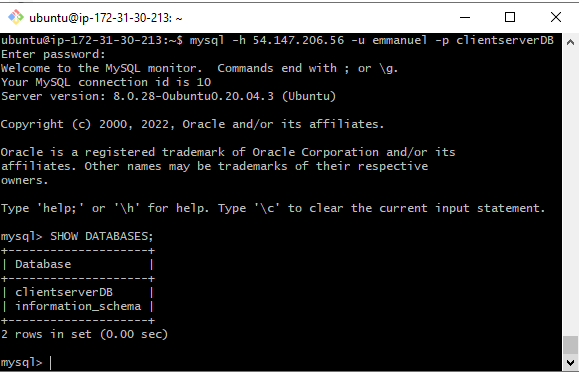

# CLIENT/SERVER ARCHITECTURE USING A MYSQL RELATIONAL DATABASE MANAGEMENT SYSTEM

* Create and configure two Linux-based virtual servers (EC2 instances in AWS).
- Server A name - `mysql server`
- Server B name - `mysql client`
* On mysql server Linux Server install MySQL Server software.
- [Install MySql client and server](https://phoenixnap.com/kb/install-mysql-ubuntu-20-04)
- Install MySql using apt
sudo apt install mysql-server
- Run a security script that comes pre-installed with MySQL
sudo mysql_secure_installation
- Test if you’re able to log in to the MySQL console by typing:
sudo mysql
- Connect Server remotely
mysql -h 54.147.206.56 -u emmanuel -p clientserverDB

- MySQL query to display database
mysql> SHOW DATABASES;

- Exit MySql console
exit