# WEB SOLUTION WITH WORDPRESS

[Resource](https://www.youtube.com/watch?v=fJnjuG-CK4g)

- Uw(9VjGmafSa8FDju2

> Three-tier Architecture
* Generally, web, or mobile solutions are implemented based on what is called the Three-tier Architecture.

Three-tier Architecture is a client-server software architecture pattern that comprise of 3 separate layers.

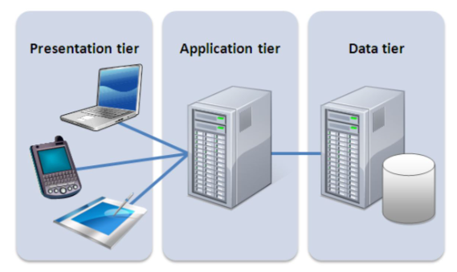

- Presentation Layer (PL): This is the user interface such as the client server or browser on your laptop.
- Business Layer (BL): This is the backend program that implements business logic. Application or Webserver
- Data Access or Management Layer (DAL): This is the layer for computer data storage and data access. Database Server or File System Server such as FTP server, or NFS Server

> Your 3-Tier Setup
- A Laptop or PC to serve as a client
- An EC2 Linux Server as a web server (This is where you will install WordPress)
- An EC2 Linux server as a database (DB) server
- Use RedHat OS for this project

* Step 1 — Prepare a Web Server

> Create AWS EBS and Mount EBS on EC2/LINUX

* Create 3 volumes

- login to your aws portal
- Under EBS(Elastic Block Store), select volumes
- click create volume in the reading pane
- select the espected information and create
- Select the created volume and right click to select attach
- Select the server you want to attach the EBS to
- Click attach
- login to the server and list all the blocks - lsblk
- Use df -h command to see all mounts and free space on your server

* Create partition in the 3 volumes
- List all the blocks - lsblk
- create partition on one of the disk - sudo gdisk /dev/xvdf
- Enter n to create new disk
- To use the entire disk space, press enter or type the disk space you want to use
- For Hex code enter - 8e00 to create Linux LVM
- Enter p to create partition
- Enter w to write and save the changes
- Repeat the same steps for volume 2 and 3
- Install lvm2 package using sudo yum install lvm2. Run sudo lvmdiskscan command to check for available partitions.
- Use pvcreate utility to mark each of 3 disks as physical volumes (PVs) to be used by LVM
- sudo pvcreate /dev/xvdf1
- sudo pvcreate /dev/xvdg1
- sudo pvcreate /dev/xvdh1
- Run sudo pvs to verify the physical volumes are created
- Use vgcreate utility to add all 3 PVs to a volume group (VG). Name the VG webdata-vg
- sudo vgcreate webdata-vg /dev/xvdh1 /dev/xvdg1 /dev/xvdf1
- Verify that your VG has been created successfully by running-  sudo vgs
* Use lvcreate utility to create 2 logical volumes. apps-lv (Use half of the PV size), and logs-lv Use the remaining space of the PV size. NOTE: apps-lv will be used to store data for the Website while, logs-lv will be used to store data for logs.
- sudo lvcreate -n apps-lv -L 14G webdata-vg
- sudo lvcreate -n logs-lv -L 14G webdata-vg
Verify that your Logical Volume has been created successfully by running sudo lvs

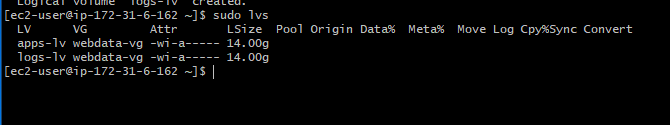

- check if it has file system - file -s /dev/webdata-vg(the EBS name)
- if it shows data, then the file system has not been create. Create it by 
- sudo mkfs -t ext4 /dev/webdata-vg/apps-lv
- sudo mkfs -t ext4 /dev/webdata-vg/logs-lv
- create a folder and point it to the drive 
* Create /var/www/html directory to store website files
- sudo mkdir -p /var/www/html
* Create /home/recovery/logs to store backup of log data
- sudo mount /dev/webdata-vg/apps-lv /var/www/html/
* Use rsync utility to backup all the files in the log directory /var/log into /home/recovery/logs (This is required before mounting the file system)
- sudo rsync -av /var/log/. /home/recovery/logs/
* Mount /var/log on logs-lv logical volume. (Note that all the existing data on /var/log will be deleted. That is why step 15 above is very
important)
- sudo mount /dev/webdata-vg/logs-lv /var/log
* Restore log files back into /var/log directory
- sudo rsync -av /home/recovery/logs/. /var/log

- sudo mkdir -p /home/recovery/logs
* Mount /var/www/html on apps-lv logical volume
- confirmit has been created - df -hT
- To have a pointer permently, 
- vim /etc/fstab
- Add a new line - /dev/sdf /newstorage ext4 defaults, nofail 0 0
- save the file
- Confirm everything is working fine - mount -a
- df -hT

> Update the `/etc/fstab` file

- The UUID of the device will be used to updfate the /etc/fstab file
- Run - sudo blkid
- Copy the following to notepad
- /dev/mapper/--: UUID="6846ad84---" BLOCK_SIZE="4096" TYPE="ext4"
- /dev/mapper/--: UUID="887f43ec-e7e3-4--" BLOCK_SIZE="4096" TYPE="ext4"
- Update the etc/fstab - sudo vim /etc/fstab

- Edit the mappers above as shown below and paste
- UUID=6846ad84-f8d2-4b40-b429-93fa920fb07b /var/www/html ext4 defaults, nofail 0 0
- UUID=887f43ec-e7e3-4cba-82f8-04a72b7d5d6a /var/log ext4 defaults 0 0

- run sudo mount -a to ensure there is no error

- Reload the Daemon - sudo systemctl daemon-reload
- Verify the database - df -h
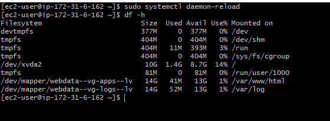

> Step 2 — Prepare the Database Server
- Launch a second RedHat EC2 instance that will have a role – ‘DB Server’
- Repeat the same steps as for the Web Server, but instead of apps-lv create db-lv and mount it to /db directory instead of /var/www/html/.

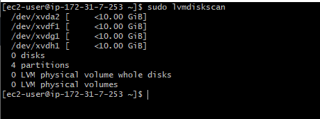

* Use lvcreate utility to create 2 logical volumes. apps-lv (Use half of the PV size), and logs-lv Use the remaining space of the PV size. NOTE: apps-lv will be used to store data for the Website while, logs-lv will be used to store data for logs.
- sudo lvcreate -n db-lv -L 14G webdata-vg
- sudo lvcreate -n logs-lv -L 14G webdata-vg

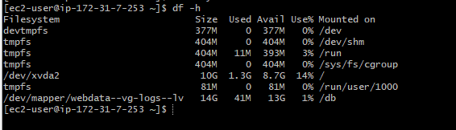

> Step 3 — Install WordPress on your Web Server EC2
- Update the repository - sudo yum -y update
- Install wget, Apache and it’s dependencies - sudo yum -y install wget httpd php php-mysqlnd php-fpm php-json
* Start Apache
- sudo systemctl enable httpd
- sudo systemctl start httpd
* To install PHP and it’s depemdencies
- sudo yum install https://dl.fedoraproject.org/pub/epel/epel-release-latest-8.noarch.rpm
- sudo yum install yum-utils http://rpms.remirepo.net/enterprise/remi-release-8.rpm
- sudo yum module list php
- sudo yum module reset php
- sudo yum module enable php:remi-7.4
- sudo yum install php php-opcache php-gd php-curl php-mysqlnd
- sudo systemctl start php-fpm
- sudo systemctl enable php-fpm
- sudo setsebool -P httpd_execmem 1
* Restart Apache
- sudo systemctl restart httpd
* Download wordpress and copy wordpress to var/www/html
- mkdir wordpress
- cd wordpress
- sudo wget http://wordpress.org/latest.tar.gz
- sudo tar xzvf latest.tar.gz
- sudo rm -rf latest.tar.gz
- sudo cp wordpress/wp-config-sample.php wordpress/wp-config.php
- sudo cp -R wordpress /var/www/html/
* Configure SELinux Policies
- sudo chown -R apache:apache /var/www/html/wordpress
- sudo chcon -t httpd_sys_rw_content_t /var/www/html/wordpress -R
- sudo setsebool -P httpd_can_network_connect=1
> Step 4 — Install MySQL on your DB Server EC2
- sudo yum update
- sudo yum install mysql-server
* Verify that the service is up and running by using sudo systemctl status mysqld, if it is not running, restart the service and enable it so it will be running even after reboot:
- sudo systemctl restart mysqld
- sudo systemctl enable mysqld

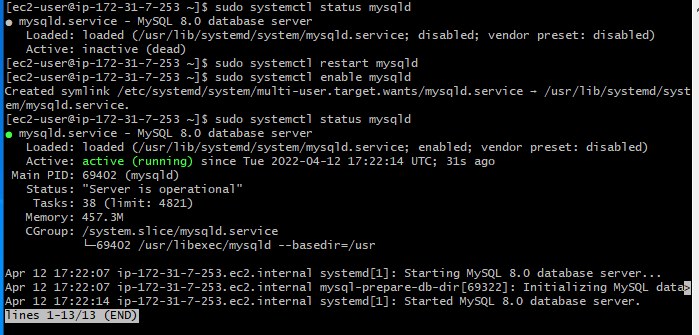

> Step 5 — Configure DB to work with WordPress
- sudo mysql
- CREATE DATABASE wordpress;
- CREATE USER 'Emmanuel'@'%' IDENTIFIED WITH mysql_native_password BY 'password';
- GRANT ALL ON wordpress.* TO 'Emmanuel'@'%';
- FLUSH PRIVILEGES;
- SHOW DATABASES;

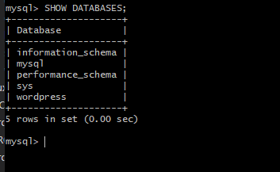

- exit
-  sudo vi /etc/my.cnf
- Add [mysqld]
- bind-address=0.0.0.0

> Step 6 — Configure WordPress to connect to remote database.
- Open MySQL port 3306 on DB Server EC2. For extra security, you shall allow access to the DB server ONLY from your Web Server’s IP address, so in the Inbound Rule configuration specify source as /32 
* Install MySQL client and test that you can connect from your Web Server to your DB server by using mysql-client
- sudo yum install mysql

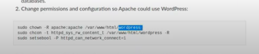

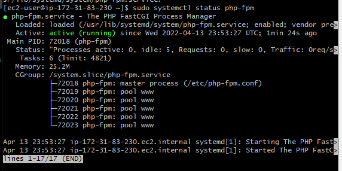

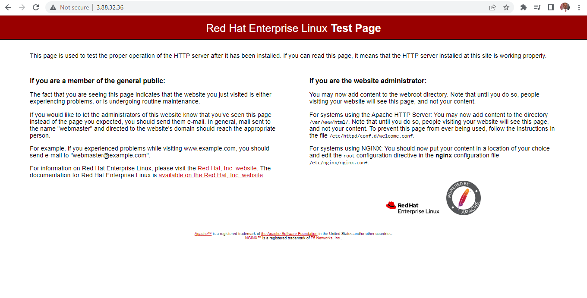

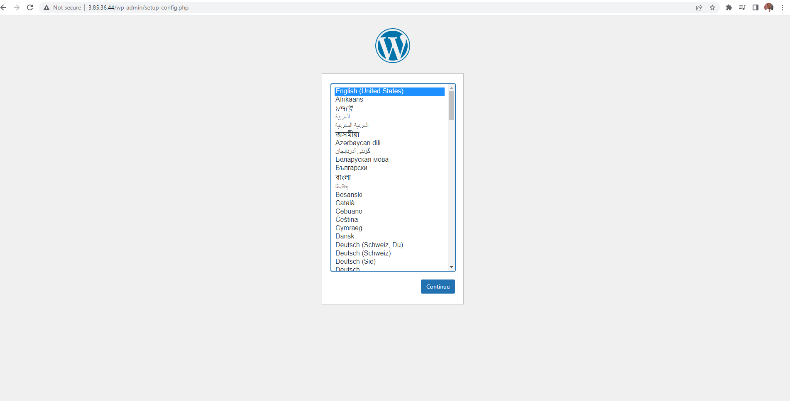
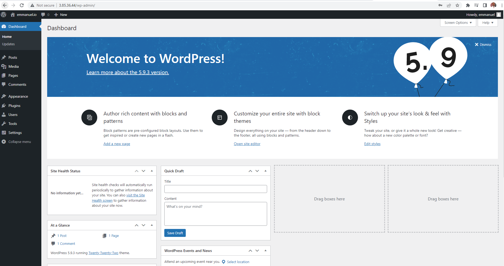

