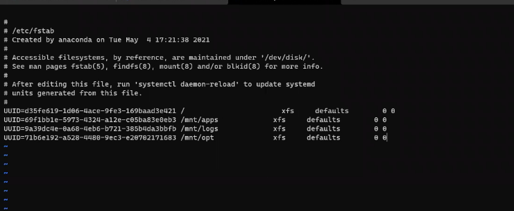
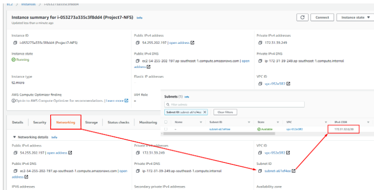
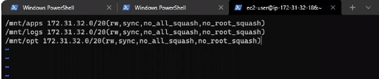
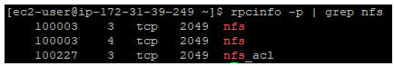

## DEVOPS TOOLING WEBSITE SOLUTION

[resources](https://us02web.zoom.us/rec/share/EbAd9iPszpOMtp-sCHLCnK3wP5g3py3fZ8fsiy7g-eKLstzToeDmybxgQQxCTKKe.OGxI7nm9U91B_RSv)
- Access Passcode: y?h0xEH4

The tools we want to use are well known and widely used by multiple DevOps teams, so we will introduce a single DevOps Tooling Solution that will consist of:

1. Jenkins – free and open source automation server used to build CI/CD pipelines.
2. Kubernetes – an open-source container-orchestration system for automating computer application deployment, scaling, and management.
3. Jfrog Artifactory – Universal Repository Manager supporting all major packaging formats, build tools and CI servers. Artifactory.
4. Rancher – an open source software platform that enables organizations to run and manage Docker and Kubernetes in production.
5. Grafana – a multi-platform open source analytics and interactive visualization web application.
6. Prometheus – An open-source monitoring system with a dimensional data model, flexible query language, efficient time series database and modern alerting approach.
7. Kibana – Kibana is a free and open user interface that lets you visualize your Elasticsearch data and navigate the Elastic Stack.

### Setup and technologies used in Project 7

As a member of a DevOps team, you will implement a tooling website solution which makes access to DevOps tools within the corporate infrastructure easily accessible.

_In this project you will implement a solution that consists of following components:_

1. Infrastructure: AWS
2. Webserver Linux: Red Hat Enterprise Linux 8
3. Database Server: Ubuntu 20.04 + MySQL
4. Storage Server: Red Hat Enterprise Linux 8 + NFS Server
5. Programming Language: PHP
6. Code Repository: GitHub

> Step 1 – Prepare NFS Server
1. Create a RedHat EC2 instance with the following 
    * All traffic
    * TCP ports 111
    * UDP ports 111
    * UDP ports 2049
    * 2 Volumes which will be 16 GB. That is 8 GB each

2. Lunch the server
3. Connect the server remotely from your machine.
4. Create Logical volume
    * list all the volumes: lsblk
    * Create partition for xvdb: gdisk /dev/xvdb
    * Create partition for xvdc: gdisk /dev/xvdc
    * Remember Hex code or Guid is 8e00
5. Install LVM2: sudo yum install lvm2
6. Create physical volume: sudo pvcreate /dev/xvdb1 /dev/xvdc1
7. Verify the creation: sudo pvs
8. Create volume group: sudo vgcreate nfs-vg /dev/xvdb1 /dev/xvdc1
9. Verify the creation: sudo vgs
10. Create logical volume
    * sudo lvcreate -n lv-apps -L 5G nfs-vg
    * sudo lvcreate -n lv-logs -L 5G nfs-vg
    * sudo lvcreate -n lv-opt -L 5G nfs-vg
11. Verify the creation: sudo lvs
12. Format the logical volumes
    * sudo mkfs.xfs /dev/nfs-vg/lv-apps
    * sudo mkfs.xfs /dev/nfs-vg/lv-logs
    * sudo mkfs.xfs /dev/nfs-vg/lv-opt
13. Create mount points
    * sudo mkdir /mnt/apps
    * sudo mkdir /mnt/logs
    * sudo mkdir /mnt/opt
14. Mount the logical volumes to the mounting points
    * sudo mount /dev/nfs-vg/lv-apps /mnt/apps/
    * sudo mount /dev/nfs-vg/lv-logs /mnt/logs/
    * sudo mount /dev/nfs-vg/lv-opt /mnt/opt/
    * confirm it has been created - df -hT
15. Update changes in the fstab
    * sudo blkid /dev/nfs-vg/*
    * Copy the UUIDs
    * sudo vi /etc/fstab
    * Paste the UUID in the fstab as shown below
    
    * Save and close the Vi
    * Verify the vi was set properly: sudo mount -a
16. Install NFS server, configure it to start on reboot and make sure it is u and running
    * sudo yum -y update
    * sudo yum install nfs-utils -y
    * sudo systemctl start nfs-server.service
    * sudo systemctl enable nfs-server.service
    * sudo systemctl status nfs-server.service
17. Make sure we set up permission that will allow our Web servers to read, write and execute files on NFS:
    * sudo chown -R nobody: /mnt/apps
    * sudo chown -R nobody: /mnt/logs
    * sudo chown -R nobody: /mnt/opt

    * sudo chmod -R 777 /mnt/apps
    * sudo chmod -R 777 /mnt/logs
    * sudo chmod -R 777 /mnt/opt
    * ll /mnt
    * sudo systemctl restart nfs-server.service
18. Export the mounts for webservers’ subnet cidr to connect as clients. For simplicity, you will install your all three Web Servers inside the same subnet, but in production set up you would probably want to separate each tier inside its own subnet for higher level of security.
To check your subnet cidr – open your EC2 details in AWS web console and locate ‘Networking’ tab and open a Subnet link:

19.  Configure access to NFS for clients within the same subnet (example of Subnet CIDR – 172.31.32.0/20 ):
    * sudo vi /etc/exports
    * Paste the subnet as shown below
    * /mnt/apps <Subnet-CIDR>(rw,sync,no_all_squash,no_root_squash)
    * /mnt/logs <Subnet-CIDR>(rw,sync,no_all_squash,no_root_squash)
    * /mnt/opt <Subnet-CIDR>(rw,sync,no_all_squash,no_root_squash)

    
    
    * sudo exportfs -arv
20. Check which port is used by NFS and open it using Security Groups (add new Inbound Rule)
    * rpcinfo -p | grep nfs
    
    * Add TCP port 2049 inbound role
    sudo systemctl restart nfs-server

> STEP 2 — CONFIGURE THE DATABASE SERVER
> Step 3 — Prepare the Web Servers
5. Install [Remi's respository](http://www.servermom.org/how-to-enable-remi-repo-on-centos-7-6-and-5/2790/), Apache and PHP

