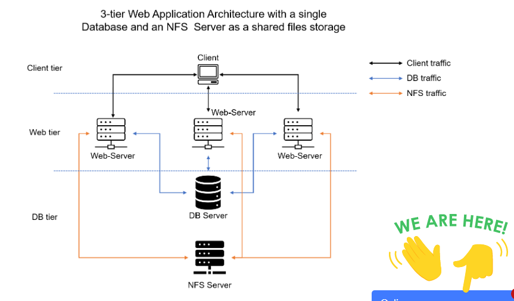

## DEVOPS TOOLING WEBSITE SOLUTION

[resources](https://us02web.zoom.us/rec/share/EbAd9iPszpOMtp-sCHLCnK3wP5g3py3fZ8fsiy7g-eKLstzToeDmybxgQQxCTKKe.OGxI7nm9U91B_RSv)
- Access Passcode: y?h0xEH4

The tools we want to use are well known and widely used by multiple DevOps teams, so we will introduce a single DevOps Tooling Solution that will consist of:

1. Jenkins – free and open source automation server used to build CI/CD pipelines.
2. Kubernetes – an open-source container-orchestration system for automating computer application deployment, scaling, and management.
3. Jfrog Artifactory – Universal Repository Manager supporting all major packaging formats, build tools and CI servers. Artifactory.
4. Rancher – an open source software platform that enables organizations to run and manage Docker and Kubernetes in production.
5. Grafana – a multi-platform open source analytics and interactive visualization web application.
6. Prometheus – An open-source monitoring system with a dimensional data model, flexible query language, efficient time series database and modern alerting approach.
7. Kibana – Kibana is a free and open user interface that lets you visualize your Elasticsearch data and navigate the Elastic Stack.

### Setup and technologies used in Project 7

As a member of a DevOps team, you will implement a tooling website solution which makes access to DevOps tools within the corporate infrastructure easily accessible.

_In this project you will implement a solution that consists of following components:_

1. Infrastructure: AWS
2. Webserver Linux: Red Hat Enterprise Linux 8
3. Database Server: Ubuntu 20.04 + MySQL
4. Storage Server: Red Hat Enterprise Linux 8 + NFS Server
5. Programming Language: PHP
6. Code Repository: GitHub

