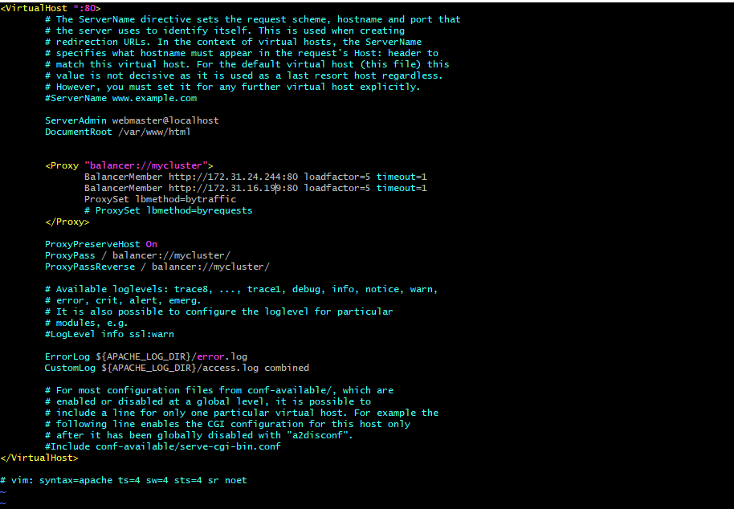

## PROJECT 8: Load Balancer Solution With Apache

[Resources](https://us02web.zoom.us/rec/share/_KBN1L8p-SxLasFT2CzL27d1AFQoZYYpN6lQLYGS3mlaVpaYoFQd2G3rD_AGHlfT.VjvwLtotuMIRVNQ_)
[Load Balancing](https://www.nginx.com/resources/glossary/load-balancing/)
[Layer 4 Load balancing](https://www.nginx.com/resources/glossary/layer-4-load-balancing/)
[Layer 7 Load Balancing](https://www.nginx.com/resources/glossary/layer-7-load-balancing/)

- In this project we will enhance our Tooling Website solution by adding a Load Balancer to disctribute traffic between Web Servers and allow users to access our website using a single URL. This uses horizontal scalability concept.

-  A Load Balancer (LB) distributes clients’ requests among underlying Web Servers and makes sure that the load is distributed in an optimal way.


> Task
_Deploy and configure an Apache Load Balancer for Tooling Website solution on a separate Ubuntu EC2 intance. Make sure that users can be served by Web servers through the Load Balancer._

> Prerequisites
- Make sure that you have following servers installed and configured within:

    * Two RHEL8 Web Servers
    * One MySQL DB Server (based on Ubuntu 20.04)
    * One RHEL8 NFS server

> CONFIGURE APACHE AS A LOAD BALANCER
- Create an Ubuntu Server 20.04 EC2 instance and name it Project-8-apache-lb with
    * TCP port 80 inbound rule
- Install Apache Load Balancer on Project-8-apache-lb server and configure it to point traffic coming to LB to both Web Servers:
```
#Install apache2
sudo apt update
sudo apt install apache2 -y
sudo apt-get install libxml2-dev

#Enable following modules:
sudo a2enmod rewrite
sudo a2enmod proxy
sudo a2enmod proxy_balancer
sudo a2enmod proxy_http
sudo a2enmod headers
sudo a2enmod lbmethod_bytraffic

#Restart apache2 service
sudo systemctl restart apache2

```
- Make sure apache2 is up and running 
    * sudo systemctl status apache2
- Configure load balancing
    * sudo vi /etc/apache2/sites-available/000-default.conf
    * #Add this configuration into this section <VirtualHost *:80>  </VirtualHost>
    ```
    <Proxy "balancer://mycluster">
               BalancerMember http://<WebServer1-Private-IP-Address>:80 loadfactor=5 timeout=1
               BalancerMember http://<WebServer2-Private-IP-Address>:80 loadfactor=5 timeout=1
               ProxySet lbmethod=bytraffic
               # ProxySet lbmethod=byrequests
        </Proxy>

        ProxyPreserveHost On
        ProxyPass / balancer://mycluster/
        ProxyPassReverse / balancer://mycluster/

    ```

    

    * #Restart apache server: sudo systemctl restart apache2
- Note: bytraffic balancing method will distribute incoming load between your Web Servers according to current traffic load. We can control in which proportion the traffic must be distributed by loadfactor parameter.

You can also study and try other methods, like: bybusyness, byrequests, heartbeat

- Verify that the configuration works – try to access your LB’s public IP address or Public DNS name from your browser:
    * http://Load-Balancer-Public-IP-Address-or-Public-DNS-Name/index.php

 

> Optional Step – Configure Local DNS Names Resolution
- Sometimes it is tedious to remember and switch between IP addresses, especially if you have a lot of servers under your management.
```
#Open this file on your LB server

sudo vi /etc/hosts

#Add 2 records into this file with Local IP address and arbitrary name for both of your Web Servers

<WebServer1-Private-IP-Address> Web1
<WebServer2-Private-IP-Address> Web2
```
- Update your LB config file with those names instead of IP addresses.
```
BalancerMember http://Web1:80 loadfactor=5 timeout=1
BalancerMember http://Web2:80 loadfactor=5 timeout=1
```
- You can try to curl your Web Servers from LB locally curl http://Web1 or curl http://Web2