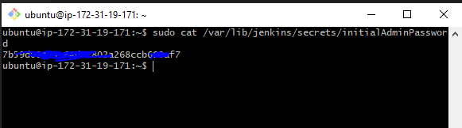
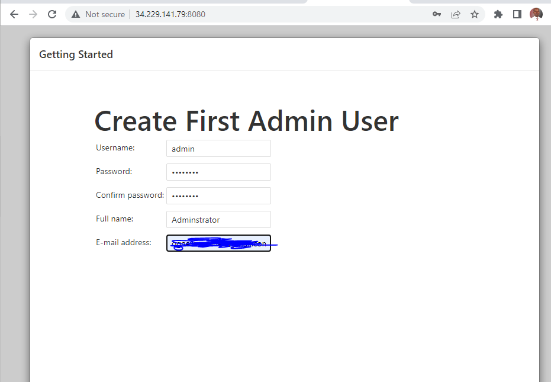
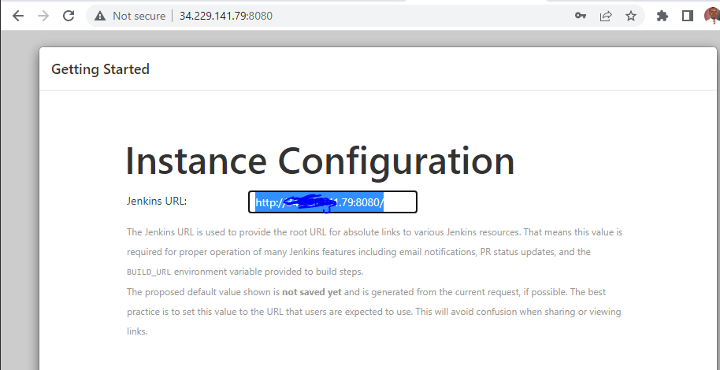

## TOOLING WEBSITE DEPLOYMENT AUTOMATION WITH CONTINUOUS INTEGRATION. INTRODUCTION TO JENKINS

[CI](https://circleci.com/continuous-integration/)
[Resource](https://www.youtube.com/watch?v=DqiK1M-cH0g)

- In this project we are going to start automating part of our routine tasks with a free and open source automation server – Jenkins. It is one of the mostl popular CI/CD tools, it was created by a former Sun Microsystems developer Kohsuke Kawaguchi and the project originally had a named "Hudson".
- Acording to Circle CI, Continuous integration (CI) is a software development strategy that increases the speed of development while ensuring the quality of the code that teams deploy.

> Task
- Enhance the architecture prepared in Project 8 by adding a Jenkins server, configure a job to automatically deploy source codes changes from Git to NFS server.

Here is how your updated architecture will look like upon competion of this project:


### Install and Configure Jenkins server

> Step 1 - Install Jenkins Server
1. Create an AWS EC2 server based on Ubuntu server 20.04 LTS and name it "Jenkins" with TCP port 8080 open in the inbound rule
2. Install[JDK](https://en.wikipedia.org/wiki/Java_Development_Kit)

[Download Jenkins](https://www.jenkins.io/download/)
   ```
    sudo apt update
    sudo apt install default-jdk-headless

   ```
3. Install Jenkins
    ```
        wget -q -O - https://pkg.jenkins.io/debian-stable/jenkins.io.key | sudo apt-key add -
        sudo sh -c 'echo deb http://pkg.jenkins.io/debian-stable binary/ > /etc/apt/sources.list.d/jenkins.list'
        sudo apt-get update
        sudo apt-get install jenkins
    ```
4. Verify jenkins is up and runningh
    ```
        sudo systemctl status jenkins
    ```
    
5. Perform Iniatial Jenkins Setup
    * From browser, access http://Jenkins-Server-Public-IP-Address-or-Public-DNS-Name:8080

    

    * Retrieve the adminstrator password from your server: sudo cat /var/lib/jenkins/secrets/initialAdminPassword

      

    * Enter the password in the administrator page above and click continue

    

    * Click Install suggested plugins
    * Create admin account after plugins installation is completed

      

    * Jenkins URL - http://34.229.141.79:8080/

    

    * save and continue

     

> Step 2 – Configure Jenkins to retrieve source codes from GitHub using Webhooks
- We will configure a simple Jenkins job/project that will be triggered by GitHub [webhooks](https://en.wikipedia.org/wiki/Webhook) and will execute a ‘build’ task to retrieve codes from GitHub and store it locally on Jenkins server.
- Enable webhooks in your GitHub repository settings
    * Click the repo and set the webhook settings below

     

    * Go to Jenkins web console, click "New Item" and create a "Freestyle project"

    

- To connect your GitHub repository, you will need to provide its URL, you can copy from the repository itself

 

 - In configuration of your Jenkins freestyle project choose Git repository, provide there the link to your Tooling GitHub repository and credentials (user/password) so Jenkins could access files in the repository.

 

 - Click on build now

     

 - Click "Configure" your job/project and add these
    * Configure triggering the job from GitHub webhook
    * Configure "Post-build Actions" to archive all the files – files resulted from a build are called "artifacts"

        
-  Make some change in any file in the GitHub repository (e.g. README.MD file) and push the changes to the master branch.

- You will see that a new build has been launched automatically (by webhook) and you can see its results – artifacts, saved on Jenkins server.


> Note: You have now configured an automated Jenkins job that receives files from GitHub by webhook trigger (this method is considered as ‘push’ because the changes are being ‘pushed’ and files transfer is initiated by GitHub). There are also other methods: trigger one job (downstreadm) from another (upstream), poll GitHub periodically and others. By default, the artifacts are stored on Jenkins server locally
```
    ls /var/lib/jenkins/jobs/tooling_github/builds/<build_number>/archive/

```
> Step 3 – Configure Jenkins to copy files to NFS server via SSH
- Now we have our artifacts saved locally on Jenkins server, the next step is to copy them to our NFS server to /mnt/apps directory.
    * Install "Publish Over SSH" plugin.


- Configure the job/project to copy artifacts over to NFS server.
    * On main dashboard select "Manage Jenkins" and choose "Configure System" menu item.

    * Scroll down to Publish over SSH plugin configuration section and configure it to be able to connect to your NFS server:

    * Provide a private key (content of .pem file that you use to connect to NFS server via SSH/Putty)
    * Arbitrary name(Leave blank if the connection do not need authentication)
    * Hostname – can be private IP address of your NFS server
    * Username – ec2-user (since NFS server is based on EC2 with RHEL 8)
    * Remote directory – /mnt/apps since our Web Servers use it as a mointing point to retrieve files from the NFS server
    * Test the configuration and make sure the connection returns Success. Remember, that TCP port 22 on NFS server must be open to receive SSH connections.
- Save the configuration, open your Jenkins job/project configuration page and add another one "Post-build Action"
- Configure it to send all files probuced by the build into our previouslys define remote directory. In our case we want to copy all files and directories – so we use **.


- Save this configuration and go ahead, change something in README.MD file in your GitHub Tooling repository.
- If you noticed this error below, run the following command on the NFS server
    ```
     sudo chown -R nobody: /mnt
     sudo chmod -R 777 /mnt

    ```


- Rebuild and there should be success


